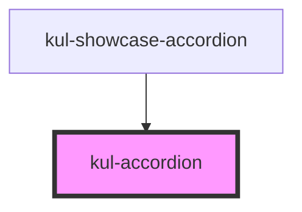

# kul-accordion

<!-- Auto Generated Below -->

## Properties

| Property    | Attribute    | Description                                                           | Type             | Default |
| ----------- | ------------ | --------------------------------------------------------------------- | ---------------- | ------- |
| `kulData`   | --           | Actual data of the accordion.                                         | `KulDataDataset` | `null`  |
| `kulRipple` | `kul-ripple` | When set to true, the pointerdown event will trigger a ripple effect. | `boolean`        | `true`  |
| `kulStyle`  | `kul-style`  | Custom style of the component.                                        | `string`         | `''`    |

## Events

| Event                 | Description              | Type                           |
| --------------------- | ------------------------ | ------------------------------ |
| `kul-accordion-event` | Describes event emitted. | `CustomEvent<KulEventPayload>` |

## Methods

### `getDebugInfo() => Promise<KulDebugComponentInfo>`

Fetches debug information of the component's current state.

#### Returns

Type: `Promise<KulDebugComponentInfo>`

A promise that resolves with the debug information object.

### `getProps(descriptions?: boolean) => Promise<GenericObject>`

Used to retrieve component's properties and descriptions.

#### Parameters

| Name           | Type      | Description                                           |
| -------------- | --------- | ----------------------------------------------------- |
| `descriptions` | `boolean` | - When true, includes descriptions for each property. |

#### Returns

Type: `Promise<GenericObject<unknown>>`

Promise resolved with an object containing the component's properties.

### `refresh() => Promise<void>`

This method is used to trigger a new render of the component.

#### Returns

Type: `Promise<void>`

### `toggleNode(id: string, e?: Event) => Promise<void>`

This method activates or deactivates an node.

#### Parameters

| Name | Type     | Description       |
| ---- | -------- | ----------------- |
| `id` | `string` | - Id of the node. |
| `e`  | `Event`  |                   |

#### Returns

Type: `Promise<void>`

## CSS Custom Properties

| Name                                     | Description                                                                                    |
| ---------------------------------------- | ---------------------------------------------------------------------------------------------- |
| `--kul-accordion-backdrop-filter`        | Sets the backdrop filter of the accordion. Defaults to blur(3.5px).                            |
| `--kul-accordion-background-color`       | Sets background of the component. Defaults to var(--kul-background-color).                     |
| `--kul-accordion-background-color-hover` | Sets background color of the hover effect. Defaults to rgba(var(--kul-text-color-rgb), 0.175). |
| `--kul-accordion-border`                 | Sets borders color of the accordion. Defaults to 1px solid var(--kul-border-color).            |
| `--kul-accordion-border-radius`          | Sets border radius of the first and last nodes of the accordion. Defaults to 4px.              |
| `--kul-accordion-color-hover`            | Sets text color of the hover effect. Defaults to var(--kul-text-color).                        |
| `--kul-accordion-dropdown-icon-color`    | Sets color of the dropdown icon. Defaults to var(--kul-text-color).                            |
| `--kul-accordion-font-family`            | Sets font family of the component. Defaults to var(--kul-font-family).                         |
| `--kul-accordion-font-size`              | Sets font size of the component. Defaults to var(--kul-font-size).                             |
| `--kul-accordion-padding`                | Sets padding of the accordion's nodes. Defaults to 1em 1.5em.                                  |
| `--kul-accordion-primary-color`          | Sets primary color of the component. Defaults to var(--kul-primary-color).                     |
| `--kul-accordion-primary-color-rgb`      | Sets primary color RGB values of the component. Defaults to var(--kul-primary-color-rgb).      |
| `--kul-accordion-text-color`             | Sets text color of the component. Defaults to var(--kul-text-color).                           |
| `--kul-accordion-text-on-primary-color`  | Sets text on primary color of the component. Defaults to var(--kul-text-on-primary-color).     |
| `--kul-accordion-transition`             | Sets transition duration for color and background-color. Defaults to 80ms.                     |

## Dependencies

### Used by

 - [kul-showcase-accordion](../kul-showcase/components/accordion)

### Graph

----------------------------------------------

*Built with [StencilJS](https://stenciljs.com/)*
