# kul-badge

<!-- Auto Generated Below -->

## Properties

| Property   | Attribute   | Description                                     | Type                | Default |
| ---------- | ----------- | ----------------------------------------------- | ------------------- | ------- |
| `kulData`  | --          | The actual data of the article.                 | `KulArticleDataset` | `null`  |
| `kulStyle` | `kul-style` | Enables customization of the component's style. | `string`            | `''`    |

## Events

| Event               | Description              | Type                           |
| ------------------- | ------------------------ | ------------------------------ |
| `kul-article-event` | Describes event emitted. | `CustomEvent<KulEventPayload>` |

## Methods

### `getDebugInfo() => Promise<KulDebugComponentInfo>`

Retrieves the debug information reflecting the current state of the component.

#### Returns

Type: `Promise<KulDebugComponentInfo>`

A promise that resolves to a KulDebugComponentInfo object containing debug information.

### `getProps(descriptions?: boolean) => Promise<GenericObject>`

Retrieves the properties of the component, with optional descriptions.

#### Parameters

| Name           | Type      | Description                                                                          |
| -------------- | --------- | ------------------------------------------------------------------------------------ |
| `descriptions` | `boolean` | - If true, returns properties with descriptions; otherwise, returns properties only. |

#### Returns

Type: `Promise<GenericObject<unknown>>`

A promise that resolves to an object where each key is a property name, optionally with its description.

### `refresh() => Promise<void>`

Triggers a re-render of the component to reflect any state changes.

#### Returns

Type: `Promise<void>`

## CSS Custom Properties

| Name                                | Description                                                                    |
| ----------------------------------- | ------------------------------------------------------------------------------ |
| `--kul-article-content-color`       | Sets the color for .content elements. Defaults to var(--kul-text-color)        |
| `--kul-article-content-font-family` | Sets the font family for .content elements. Defaults to var(--kul-font-family) |
| `--kul-article-content-font-size`   | Sets the font size for .content elements. Defaults to var(--kul-font-size)     |
| `--kul-article-h3-color`            | Sets the color for <h3> elements. Defaults to var(--kul-text-color)            |
| `--kul-article-h3-font-family`      | Sets the font family for <h3> elements. Defaults to var(--kul-font-family)     |
| `--kul-article-h3-font-size`        | Sets the font size for <h3> elements. Defaults to 1.5em                        |
| `--kul-article-margin`              | Sets the margin of the article tag. Defaults to automatic.                     |
| `--kul-article-max-width`           | Sets the max-width of the article tag. Defaults to 1200px.                     |
| `--kul-article-padding`             | Sets the padding of the article tag. Defaults to 40px.                         |

## Dependencies

### Used by

 - [kul-showcase](../kul-showcase)
 - [kul-showcase-article](../kul-showcase/components/article)
 - [kul-showcase-badge](../kul-showcase/components/badge)
 - [kul-showcase-button](../kul-showcase/components/button)
 - [kul-showcase-card](../kul-showcase/components/card)
 - [kul-showcase-chart](../kul-showcase/components/chart)
 - [kul-showcase-code](../kul-showcase/components/code)
 - [kul-showcase-debug](../kul-showcase/utilities/debug)
 - [kul-showcase-drawer](../kul-showcase/layout/drawer)
 - [kul-showcase-header](../kul-showcase/layout/header)
 - [kul-showcase-image](../kul-showcase/components/image)
 - [kul-showcase-kuldata](../kul-showcase/framework/data)
 - [kul-showcase-kulmanager](../kul-showcase/framework/manager)
 - [kul-showcase-lazy](../kul-showcase/components/lazy)
 - [kul-showcase-list](../kul-showcase/components/list)
 - [kul-showcase-photoframe](../kul-showcase/components/photoframe)
 - [kul-showcase-spinner](../kul-showcase/components/spinner)
 - [kul-showcase-splash](../kul-showcase/components/splash)
 - [kul-showcase-switch](../kul-showcase/components/switch)
 - [kul-showcase-tabbar](../kul-showcase/components/tabbar)
 - [kul-showcase-textfield](../kul-showcase/components/textfield)
 - [kul-showcase-toast](../kul-showcase/components/toast)
 - [kul-showcase-tree](../kul-showcase/components/tree)
 - [kul-showcase-upload](../kul-showcase/components/upload)

### Graph

```mermaid
graph TD;
  kul-showcase --> kul-article
  kul-showcase-article --> kul-article
  kul-showcase-badge --> kul-article
  kul-showcase-button --> kul-article
  kul-showcase-card --> kul-article
  kul-showcase-chart --> kul-article
  kul-showcase-code --> kul-article
  kul-showcase-debug --> kul-article
  kul-showcase-drawer --> kul-article
  kul-showcase-header --> kul-article
  kul-showcase-image --> kul-article
  kul-showcase-kuldata --> kul-article
  kul-showcase-kulmanager --> kul-article
  kul-showcase-lazy --> kul-article
  kul-showcase-list --> kul-article
  kul-showcase-photoframe --> kul-article
  kul-showcase-spinner --> kul-article
  kul-showcase-splash --> kul-article
  kul-showcase-switch --> kul-article
  kul-showcase-tabbar --> kul-article
  kul-showcase-textfield --> kul-article
  kul-showcase-toast --> kul-article
  kul-showcase-tree --> kul-article
  kul-showcase-upload --> kul-article
  style kul-article fill:#f9f,stroke:#333,stroke-width:4px
```

----------------------------------------------

*Built with [StencilJS](https://stenciljs.com/)*
