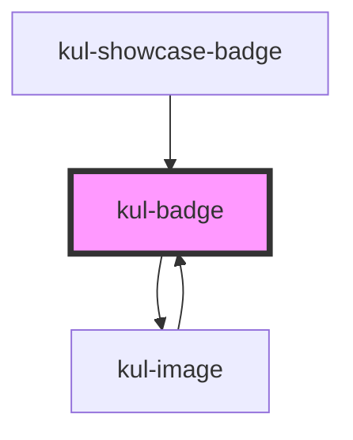

# kul-badge

<!-- Auto Generated Below -->

## Properties

| Property        | Attribute   | Description                                        | Type                     | Default |
| --------------- | ----------- | -------------------------------------------------- | ------------------------ | ------- |
| `kulImageProps` | --          | The props of the image displayed inside the badge. | `KulImagePropsInterface` | `null`  |
| `kulLabel`      | `kul-label` | The text displayed inside the badge.               | `string`                 | `''`    |
| `kulStyle`      | `kul-style` | Custom style of the component.                     | `string`                 | `''`    |

## Events

| Event             | Description                                                         | Type                           |
| ----------------- | ------------------------------------------------------------------- | ------------------------------ |
| `kul-badge-event` | Describes event emitted for various button interactions like click. | `CustomEvent<KulEventPayload>` |

## Methods

### `getDebugInfo() => Promise<KulDebugComponentInfo>`

Fetches debug information of the component's current state.

#### Returns

Type: `Promise<KulDebugComponentInfo>`

A promise that resolves with the debug information object.

### `getProps(descriptions?: boolean) => Promise<GenericObject>`

Used to retrieve component's props values.

#### Parameters

| Name           | Type      | Description                                                                            |
| -------------- | --------- | -------------------------------------------------------------------------------------- |
| `descriptions` | `boolean` | - When provided and true, the result will be the list of props with their description. |

#### Returns

Type: `Promise<GenericObject<unknown>>`

List of props as object, each key will be a prop.

### `refresh() => Promise<void>`

This method is used to trigger a new render of the component.

#### Returns

Type: `Promise<void>`

### `setProps(props: GenericObject) => Promise<void>`

Sets the props to the component.

#### Parameters

| Name    | Type                     | Description                                                  |
| ------- | ------------------------ | ------------------------------------------------------------ |
| `props` | `GenericObject<unknown>` | - Object containing props that will be set to the component. |

#### Returns

Type: `Promise<void>`

## CSS Custom Properties

| Name                                | Description                              |
| ----------------------------------- | ---------------------------------------- |
| `--kul-badge-border-radius`         | Sets border radius of the badge.         |
| `--kul-badge-font-family`           | Sets font family of the badge.           |
| `--kul-badge-font-size`             | Sets font size of the badge.             |
| `--kul-badge-min-size`              | Sets minimum size of the badge.          |
| `--kul-badge-padding`               | Sets padding of the badge.               |
| `--kul-badge-primary-color`         | Sets primary color of the badge.         |
| `--kul-badge-text-on-primary-color` | Sets text on primary color of the badge. |

## Dependencies

### Used by

 - [kul-image](../kul-image)
 - [kul-showcase-badge](../kul-showcase/examples/badge)

### Depends on

- [kul-image](../kul-image)

### Graph

----------------------------------------------

*Built with [StencilJS](https://stenciljs.com/)*
