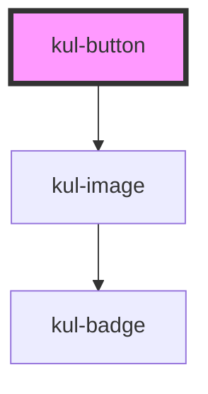

# kul-button

<!-- Auto Generated Below -->

## Properties

| Property       | Attribute       | Description                                                                                                                 | Type                                                       | Default    |
| -------------- | --------------- | --------------------------------------------------------------------------------------------------------------------------- | ---------------------------------------------------------- | ---------- |
| `buttonType`   | `button-type`   | Sets the type of the button.                                                                                                | `string`                                                   | `''`       |
| `checked`      | `checked`       | When set to true, the icon button state will be on.                                                                         | `boolean`                                                  | `false`    |
| `customStyle`  | `custom-style`  | Custom style of the component.                                                                                              | `string`                                                   | `''`       |
| `disabled`     | `disabled`      | Defaults at false. When set to true, the component is disabled.                                                             | `boolean`                                                  | `false`    |
| `icon`         | `icon`          | When set, the button will show this icon.                                                                                   | `string`                                                   | `''`       |
| `iconOff`      | `icon-off`      | When set, the icon button off state will show this icon. Otherwise, an outlined version of the icon prop will be displayed. | `string`                                                   | `''`       |
| `label`        | `label`         | When set, the button will show this text.                                                                                   | `string`                                                   | `''`       |
| `showSpinner`  | `show-spinner`  | When set to true, the button show a spinner received in slot.                                                               | `boolean`                                                  | `false`    |
| `styling`      | `styling`       | Defines the style of the button. This property controls the visual appearance of the button.                                | `"flat" \| "floating" \| "icon" \| "outlined" \| "raised"` | `'raised'` |
| `toggable`     | `toggable`      | When set to true, the icon button will be toggable on/off.                                                                  | `boolean`                                                  | `false`    |
| `trailingIcon` | `trailing-icon` | When set, the icon will be shown after the text.                                                                            | `boolean`                                                  | `false`    |

## Events

| Event              | Description                                                                      | Type                                 |
| ------------------ | -------------------------------------------------------------------------------- | ------------------------------------ |
| `kul-button-event` | Describes event emitted for various button interactions like click, focus, blur. | `CustomEvent<KulButtonEventPayload>` |

## Methods

### `getProps(descriptions?: boolean) => Promise<GenericObject>`

Used to retrieve component's properties and descriptions.

#### Parameters

| Name           | Type      | Description                                           |
| -------------- | --------- | ----------------------------------------------------- |
| `descriptions` | `boolean` | - When true, includes descriptions for each property. |

#### Returns

Type: `Promise<GenericObject<unknown>>`

Promise resolved with an object containing the component's properties.

### `getValue() => Promise<KulButtonStates>`

Used to retrieve component's current state.

#### Returns

Type: `Promise<KulButtonStates>`

Promise resolved with the current state of the component.

### `refresh() => Promise<void>`

This method is used to trigger a new render of the component.

#### Returns

Type: `Promise<void>`

### `setProps(this: GenericObject) => Promise<void>`

Sets the this to the component.

#### Returns

Type: `Promise<void>`

### `setValue(value: KulButtonStates) => Promise<void>`

Sets the component's state.

#### Parameters

| Name    | Type            | Description                                 |
| ------- | --------------- | ------------------------------------------- |
| `value` | `"off" \| "on"` | - The new state to be set on the component. |

#### Returns

Type: `Promise<void>`

## CSS Custom Properties

| Name                                 | Description                                                                           |
| ------------------------------------ | ------------------------------------------------------------------------------------- |
| `--kul-button-border-radius`         | Sets border radius of the button.                                                     |
| `--kul-button-disabled-color`        | Sets disabled color of the button.                                                    |
| `--kul-button-font-family`           | Sets font family of the button.                                                       |
| `--kul-button-font-size`             | Sets font size of the button.                                                         |
| `--kul-button-font-weight`           | Sets font weight of the button.                                                       |
| `--kul-button-height`                | Sets height of the button.                                                            |
| `--kul-button-padding`               | Sets padding of the button.                                                           |
| `--kul-button-primary-color`         | Sets the primary color of the button.                                                 |
| `--kul-button-primary-color-h`       | Sets the primary color Hue value of the button (used for focus/hover effects).        |
| `--kul-button-primary-color-l`       | Sets the primary color Lightness value of the button (used for focus/hover effects).  |
| `--kul-button-primary-color-rgb`     | Sets the primary color RGB values of the button (used for shaders).                   |
| `--kul-button-primary-color-s`       | Sets the primary color Saturation value of the button (used for focus/hover effects). |
| `--kul-button-text-on-primary-color` | Sets text and icon color for raised buttons.                                          |
| `--kul-button-text-transform`        | Set the label case, default is uppercase.                                             |

## Dependencies

### Depends on

- [kul-image](../kul-image)

### Graph

----------------------------------------------

*Built with [StencilJS](https://stenciljs.com/)*
