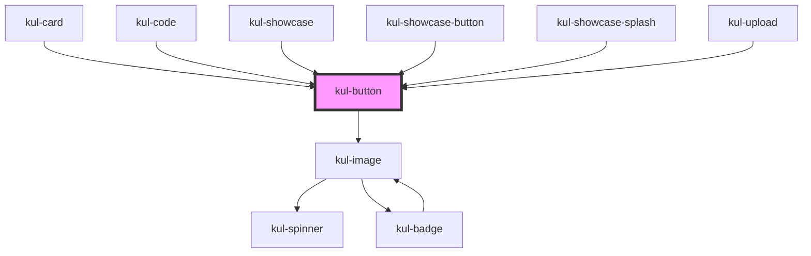

# kul-button

<!-- Auto Generated Below -->

## Properties

| Property          | Attribute           | Description                                                                                                                 | Type                                                       | Default    |
| ----------------- | ------------------- | --------------------------------------------------------------------------------------------------------------------------- | ---------------------------------------------------------- | ---------- |
| `kulDisabled`     | `kul-disabled`      | Defaults at false. When set to true, the component is disabled.                                                             | `boolean`                                                  | `false`    |
| `kulIcon`         | `kul-icon`          | When set, the button will show this icon.                                                                                   | `string`                                                   | `''`       |
| `kulIconOff`      | `kul-icon-off`      | When set, the icon button off state will show this icon. Otherwise, an outlined version of the icon prop will be displayed. | `string`                                                   | `''`       |
| `kulLabel`        | `kul-label`         | When set, the button will show this text.                                                                                   | `string`                                                   | `''`       |
| `kulRipple`       | `kul-ripple`        | When set to true, the pointerdown event will trigger a ripple effect.                                                       | `boolean`                                                  | `true`     |
| `kulShowSpinner`  | `kul-show-spinner`  | When set to true, the button show a spinner received in slot.                                                               | `boolean`                                                  | `false`    |
| `kulStyle`        | `kul-style`         | Custom style of the component.                                                                                              | `string`                                                   | `''`       |
| `kulStyling`      | `kul-styling`       | Defines the style of the button. This property controls the visual appearance of the button.                                | `"flat" \| "floating" \| "icon" \| "outlined" \| "raised"` | `'raised'` |
| `kulToggable`     | `kul-toggable`      | When set to true, the icon button will be toggable on/off.                                                                  | `boolean`                                                  | `false`    |
| `kulTrailingIcon` | `kul-trailing-icon` | When set, the icon will be shown after the text.                                                                            | `boolean`                                                  | `false`    |
| `kulType`         | `kul-type`          | Sets the type of the button.                                                                                                | `"button" \| "reset" \| "submit"`                          | `'button'` |
| `kulValue`        | `kul-value`         | When set to true, the icon button state will be on.                                                                         | `boolean`                                                  | `false`    |

## Events

| Event              | Description                                                                      | Type                                 |
| ------------------ | -------------------------------------------------------------------------------- | ------------------------------------ |
| `kul-button-event` | Describes event emitted for various button interactions like click, focus, blur. | `CustomEvent<KulButtonEventPayload>` |

## Methods

### `getDebugInfo() => Promise<KulDebugComponentInfo>`

Fetches debug information of the component's current state.

#### Returns

Type: `Promise<KulDebugComponentInfo>`

A promise that resolves with the debug information object.

### `getProps(descriptions?: boolean) => Promise<GenericObject>`

Used to retrieve component's properties and descriptions.

#### Parameters

| Name           | Type      | Description                                           |
| -------------- | --------- | ----------------------------------------------------- |
| `descriptions` | `boolean` | - When true, includes descriptions for each property. |

#### Returns

Type: `Promise<GenericObject<unknown>>`

Promise resolved with an object containing the component's properties.

### `getValue() => Promise<KulButtonStates>`

Used to retrieve component's current state.

#### Returns

Type: `Promise<KulButtonStates>`

Promise resolved with the current state of the component.

### `refresh() => Promise<void>`

This method is used to trigger a new render of the component.

#### Returns

Type: `Promise<void>`

### `setProps(props: GenericObject) => Promise<void>`

Sets the props to the component.

#### Parameters

| Name    | Type                     | Description                                                  |
| ------- | ------------------------ | ------------------------------------------------------------ |
| `props` | `GenericObject<unknown>` | - Object containing props that will be set to the component. |

#### Returns

Type: `Promise<void>`

### `setValue(value: KulButtonStates) => Promise<void>`

Sets the component's state.

#### Parameters

| Name    | Type            | Description                                 |
| ------- | --------------- | ------------------------------------------- |
| `value` | `"off" \| "on"` | - The new state to be set on the component. |

#### Returns

Type: `Promise<void>`

## CSS Custom Properties

| Name                                 | Description                                                                                                                   |
| ------------------------------------ | ----------------------------------------------------------------------------------------------------------------------------- |
| `--kul-button-backdrop-filter`       | Sets the backdrop filter of buttons. Defaults to blur(3.5px).                                                                 |
| `--kul-button-backdrop-filter-hover` | Sets the backdrop filter of buttons when hovering. Defaults to blur(5px).                                                     |
| `--kul-button-border-radius`         | Sets border radius of the button. Defaults to 4px.                                                                            |
| `--kul-button-disabled-color`        | Sets disabled color of the button. Defaults to var(--kul-disabled-color).                                                     |
| `--kul-button-font-family`           | Sets font family of the button. Defaults to var(--kul-font-family).                                                           |
| `--kul-button-font-size`             | Sets font size of the button. Defaults to var(--kul-font-size).                                                               |
| `--kul-button-font-weight`           | Sets font weight of the button. Defaults to 400.                                                                              |
| `--kul-button-height`                | Sets height of the button. Defaults to 3em.                                                                                   |
| `--kul-button-padding`               | Sets padding of the button. Defaults to 0 1.25em.                                                                             |
| `--kul-button-primary-color`         | Sets the primary color of the button. Defaults to var(--kul-primary-color).                                                   |
| `--kul-button-primary-color-h`       | Sets the primary color Hue value of the button (used for focus/hover effects). Defaults to var(--kul-primary-color-h).        |
| `--kul-button-primary-color-l`       | Sets the primary color Lightness value of the button (used for focus/hover effects). Defaults to var(--kul-primary-color-l).  |
| `--kul-button-primary-color-rgb`     | Sets the primary color RGB values of the button (used for shaders). Defaults to var(--kul-primary-color-rgb).                 |
| `--kul-button-primary-color-s`       | Sets the primary color Saturation value of the button (used for focus/hover effects). Defaults to var(--kul-primary-color-s). |
| `--kul-button-text-on-primary-color` | Sets text and icon color for raised buttons. Defaults to var(--kul-text-on-primary-color).                                    |
| `--kul-button-text-transform`        | Set the label case, default is uppercase. Defaults to uppercase.                                                              |
| `--kul-spinner-color`                | Sets the spinner color. Defaults to var(--kul-button-primary-color).                                                          |

## Dependencies

### Used by

 - [kul-card](../kul-card)
 - [kul-code](../kul-code)
 - [kul-showcase](../kul-showcase)
 - [kul-showcase-button](../kul-showcase/components/button)
 - [kul-showcase-splash](../kul-showcase/components/splash)
 - [kul-upload](../kul-upload)

### Depends on

- [kul-image](../kul-image)

### Graph

----------------------------------------------

*Built with [StencilJS](https://stenciljs.com/)*
