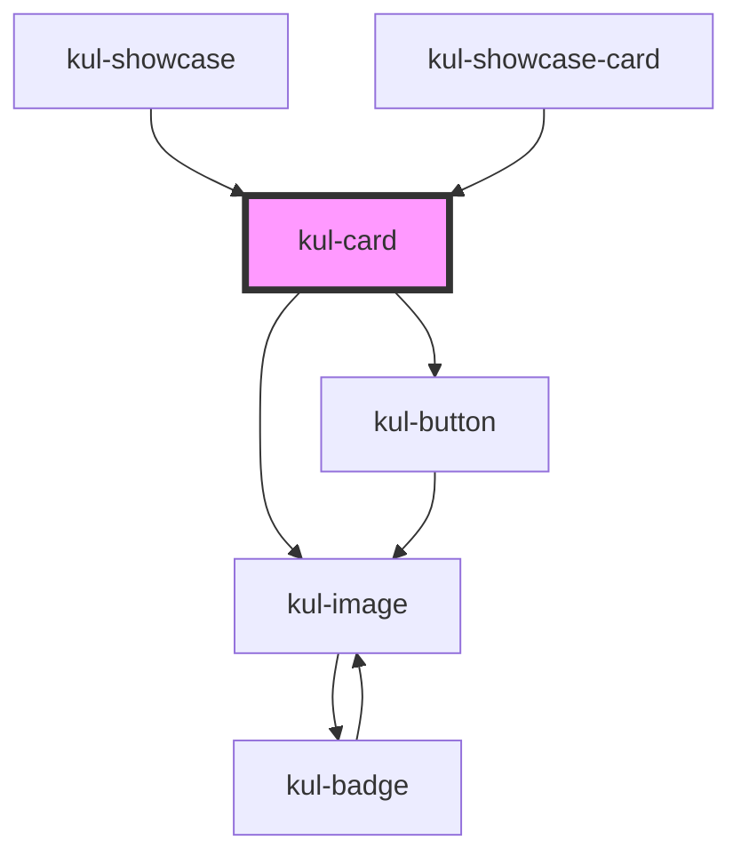

# kul-card

<!-- Auto Generated Below -->

## Properties

| Property          | Attribute           | Description                                                                               | Type             | Default      |
| ----------------- | ------------------- | ----------------------------------------------------------------------------------------- | ---------------- | ------------ |
| `kulData`         | --                  | The actual data of the card.                                                              | `KulDataDataset` | `null`       |
| `kulLayoutFamily` | `kul-layout-family` | Sets the type of the card.                                                                | `"standard"`     | `'standard'` |
| `kulLayoutNumber` | `kul-layout-number` | Sets the number of the layout.                                                            | `number`         | `1`          |
| `kulSizeX`        | `kul-size-x`        | The width of the card, defaults to 100%. Accepts any valid CSS format (px, %, vw, etc.).  | `string`         | `'100%'`     |
| `kulSizeY`        | `kul-size-y`        | The height of the card, defaults to 100%. Accepts any valid CSS format (px, %, vh, etc.). | `string`         | `'100%'`     |
| `kulStyle`        | `kul-style`         | Custom style of the component.                                                            | `string`         | `''`         |

## Events

| Event            | Description                       | Type                           |
| ---------------- | --------------------------------- | ------------------------------ |
| `kul-card-event` | Triggered when an event is fired. | `CustomEvent<KulEventPayload>` |

## Methods

### `getDebugInfo() => Promise<KulDebugComponentInfo>`

Fetches debug information of the component's current state.

#### Returns

Type: `Promise<KulDebugComponentInfo>`

A promise that resolves with the debug information object.

### `getProps(descriptions?: boolean) => Promise<GenericObject>`

Used to retrieve component's props values.

#### Parameters

| Name           | Type      | Description                                                                            |
| -------------- | --------- | -------------------------------------------------------------------------------------- |
| `descriptions` | `boolean` | - When provided and true, the result will be the list of props with their description. |

#### Returns

Type: `Promise<GenericObject<unknown>>`

List of props as object, each key will be a prop.

### `getShapes() => Promise<KulDataShapesMap>`

Used to retrieve component's shapes.

#### Returns

Type: `Promise<KulDataShapesMap>`

Map of shapes.

### `refresh() => Promise<void>`

This method is used to trigger a new render of the component.

#### Returns

Type: `Promise<void>`

### `setProps(props: GenericObject) => Promise<void>`

Sets the props to the component.

#### Parameters

| Name    | Type                     | Description                                                  |
| ------- | ------------------------ | ------------------------------------------------------------ |
| `props` | `GenericObject<unknown>` | - Object containing props that will be set to the component. |

#### Returns

Type: `Promise<void>`

## CSS Custom Properties

| Name                                     | Description                                         |
| ---------------------------------------- | --------------------------------------------------- |
| `--kul-card-backdrop`                    | Backdrop of the component when is visible.          |
| `--kul-card-ripple-color`                | Sets color of ripple effect (for Material layouts). |
| `--kul-card-scalable-box-shadow`         | Box shadow of the scalable layouts.                 |
| `--kul-card-scalable-starting-font-size` | Starting font size for scalable cards.              |
| `--kul-card-scalable-static-font-size`   | Static font size for scalable cards.                |

## Dependencies

### Used by

 - [kul-showcase](../kul-showcase)
 - [kul-showcase-card](../kul-showcase/examples/card)

### Depends on

- [kul-image](../kul-image)
- [kul-button](../kul-button)

### Graph

----------------------------------------------

*Built with [StencilJS](https://stenciljs.com/)*
