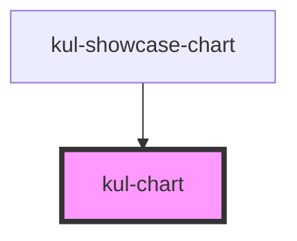

# kul-chart

<!-- Auto Generated Below -->

## Properties

| Property    | Attribute    | Description                                                                                                                                                                    | Type                                                                                                                                                                                                                                                                                                                                                                                                                                                                                                                                                                                                                                                                                                                                                                                                                                                                                                                           | Default    |
| ----------- | ------------ | ------------------------------------------------------------------------------------------------------------------------------------------------------------------------------ | ------------------------------------------------------------------------------------------------------------------------------------------------------------------------------------------------------------------------------------------------------------------------------------------------------------------------------------------------------------------------------------------------------------------------------------------------------------------------------------------------------------------------------------------------------------------------------------------------------------------------------------------------------------------------------------------------------------------------------------------------------------------------------------------------------------------------------------------------------------------------------------------------------------------------------ | ---------- |
| `kulAxis`   | `kul-axis`   | Sets the axis of the chart.                                                                                                                                                    | `string`                                                                                                                                                                                                                                                                                                                                                                                                                                                                                                                                                                                                                                                                                                                                                                                                                                                                                                                       | `''`       |
| `kulColors` | --           | Overrides theme's colors.                                                                                                                                                      | `string[]`                                                                                                                                                                                                                                                                                                                                                                                                                                                                                                                                                                                                                                                                                                                                                                                                                                                                                                                     | `[]`       |
| `kulData`   | --           | The actual data of the chart.                                                                                                                                                  | `KulDataDataset`                                                                                                                                                                                                                                                                                                                                                                                                                                                                                                                                                                                                                                                                                                                                                                                                                                                                                                               | `null`     |
| `kulLegend` | `kul-legend` | Sets the position of the legend. Supported values: bottom, left, right, top, hidden. Keep in mind that legend types are tied to chart types, some combinations might not work. | `"bottom" \| "hidden" \| "left" \| "right" \| "top"`                                                                                                                                                                                                                                                                                                                                                                                                                                                                                                                                                                                                                                                                                                                                                                                                                                                                           | `'bottom'` |
| `kulSeries` | --           | The data series to be displayed. They must be of the same type.                                                                                                                | `string[]`                                                                                                                                                                                                                                                                                                                                                                                                                                                                                                                                                                                                                                                                                                                                                                                                                                                                                                                     | `[]`       |
| `kulSizeX`  | `kul-size-x` | The width of the chart, defaults to 100%. Accepts any valid CSS format (px, %, vw, etc.).                                                                                      | `string`                                                                                                                                                                                                                                                                                                                                                                                                                                                                                                                                                                                                                                                                                                                                                                                                                                                                                                                       | `'100%'`   |
| `kulSizeY`  | `kul-size-y` | The height of the chart, defaults to 100%. Accepts any valid CSS format (px, %, vh, etc.).                                                                                     | `string`                                                                                                                                                                                                                                                                                                                                                                                                                                                                                                                                                                                                                                                                                                                                                                                                                                                                                                                       | `'100%'`   |
| `kulStyle`  | `kul-style`  | Custom style of the component.                                                                                                                                                 | `string`                                                                                                                                                                                                                                                                                                                                                                                                                                                                                                                                                                                                                                                                                                                                                                                                                                                                                                                       | `''`       |
| `kulTypes`  | --           | The type of the chart. Supported formats: Bar, Gaussian, Line, Pie, Map and Scatter.                                                                                           | `KulChartType[]`                                                                                                                                                                                                                                                                                                                                                                                                                                                                                                                                                                                                                                                                                                                                                                                                                                                                                                               | `['line']` |
| `kulXAxis`  | --           | Customization options for the x Axis.                                                                                                                                          | `AxisBaseOptionCommon & { gridIndex?: number; gridId?: string; position?: CartesianAxisPosition; offset?: number; categorySortInfo?: OrdinalSortInfo; } & { mainType?: "xAxis"; } \| CategoryAxisBaseOption & { gridIndex?: number; gridId?: string; position?: CartesianAxisPosition; offset?: number; categorySortInfo?: OrdinalSortInfo; } & { mainType?: "xAxis"; } \| LogAxisBaseOption & { gridIndex?: number; gridId?: string; position?: CartesianAxisPosition; offset?: number; categorySortInfo?: OrdinalSortInfo; } & { mainType?: "xAxis"; } \| TimeAxisBaseOption & { gridIndex?: number; gridId?: string; position?: CartesianAxisPosition; offset?: number; categorySortInfo?: OrdinalSortInfo; } & { mainType?: "xAxis"; } \| ValueAxisBaseOption & { gridIndex?: number; gridId?: string; position?: CartesianAxisPosition; offset?: number; categorySortInfo?: OrdinalSortInfo; } & { mainType?: "xAxis"; }` | `null`     |
| `kulYAxis`  | --           | Customization options for the y Axis.                                                                                                                                          | `AxisBaseOptionCommon & { gridIndex?: number; gridId?: string; position?: CartesianAxisPosition; offset?: number; categorySortInfo?: OrdinalSortInfo; } & { mainType?: "yAxis"; } \| CategoryAxisBaseOption & { gridIndex?: number; gridId?: string; position?: CartesianAxisPosition; offset?: number; categorySortInfo?: OrdinalSortInfo; } & { mainType?: "yAxis"; } \| LogAxisBaseOption & { gridIndex?: number; gridId?: string; position?: CartesianAxisPosition; offset?: number; categorySortInfo?: OrdinalSortInfo; } & { mainType?: "yAxis"; } \| TimeAxisBaseOption & { gridIndex?: number; gridId?: string; position?: CartesianAxisPosition; offset?: number; categorySortInfo?: OrdinalSortInfo; } & { mainType?: "yAxis"; } \| ValueAxisBaseOption & { gridIndex?: number; gridId?: string; position?: CartesianAxisPosition; offset?: number; categorySortInfo?: OrdinalSortInfo; } & { mainType?: "yAxis"; }` | `null`     |

## Events

| Event             | Description | Type                                |
| ----------------- | ----------- | ----------------------------------- |
| `kul-chart-event` |             | `CustomEvent<KulChartEventPayload>` |

## Methods

### `getDebugInfo() => Promise<KulDebugComponentInfo>`

Fetches debug information of the component's current state.

#### Returns

Type: `Promise<KulDebugComponentInfo>`

A promise that resolves with the debug information object.

### `getProps(descriptions?: boolean) => Promise<GenericObject>`

Used to retrieve component's props values.

#### Parameters

| Name           | Type      | Description                                                                            |
| -------------- | --------- | -------------------------------------------------------------------------------------- |
| `descriptions` | `boolean` | - When provided and true, the result will be the list of props with their description. |

#### Returns

Type: `Promise<GenericObject<unknown>>`

List of props as object, each key will be a prop.

### `refresh() => Promise<void>`

This method is used to trigger a new render of the component.

#### Returns

Type: `Promise<void>`

## Dependencies

### Used by

 - [kul-showcase-chart](../kul-showcase/components/chart)

### Graph

----------------------------------------------

*Built with [StencilJS](https://stenciljs.com/)*
