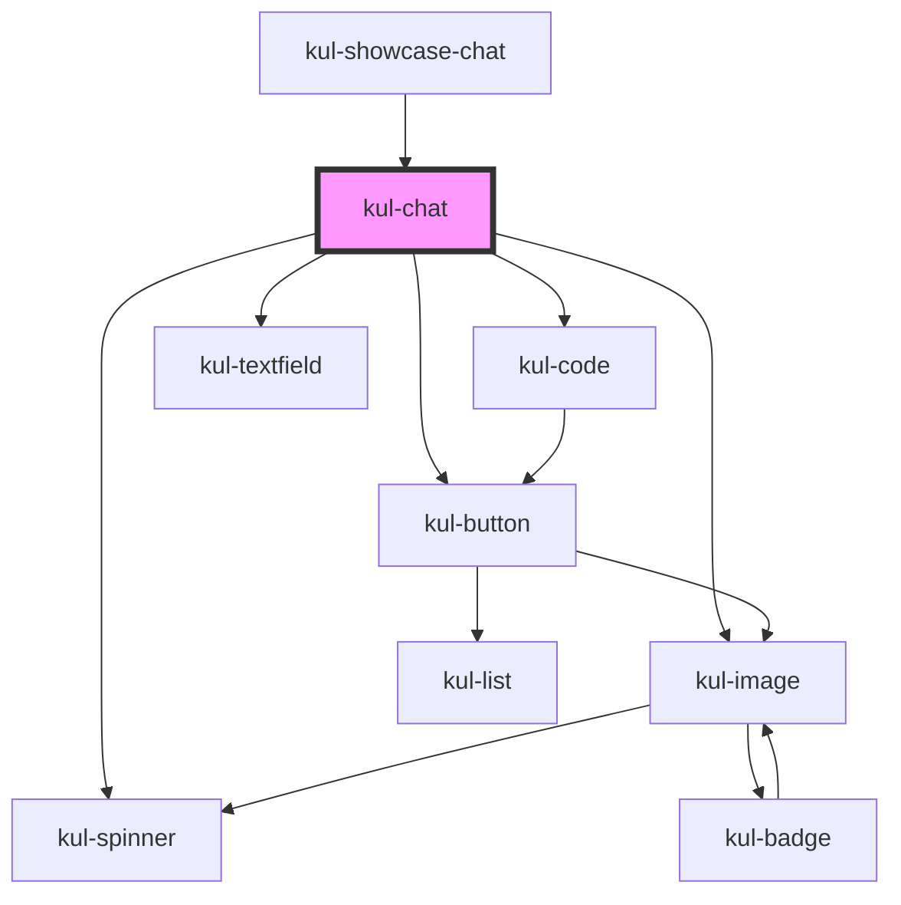

# kul-chat

<!-- Auto Generated Below -->

## Properties

| Property            | Attribute             | Description                                                 | Type     | Default |
| ------------------- | --------------------- | ----------------------------------------------------------- | -------- | ------- |
| `kulEndpointUrl`    | `kul-endpoint-url`    | Enables customization of the component's style.             | `string` | `''`    |
| `kulSttCallback`    | `kul-stt-callback`    | Callback invoked when the Speech to Text button is pressed. | `any`    | `null`  |
| `kulStyle`          | `kul-style`           | Enables customization of the component's style.             | `string` | `''`    |
| `kulSubmitCallback` | `kul-submit-callback` | Callback invoked when the submit button is pressed.         | `any`    | `null`  |

## Events

| Event            | Description              | Type                           |
| ---------------- | ------------------------ | ------------------------------ |
| `kul-chat-event` | Describes event emitted. | `CustomEvent<KulEventPayload>` |

## Methods

### `getDebugInfo() => Promise<KulDebugComponentInfo>`

Retrieves the debug information reflecting the current state of the component.

#### Returns

Type: `Promise<KulDebugComponentInfo>`

A promise that resolves to a KulDebugComponentInfo object containing debug information.

### `getProps(descriptions?: boolean) => Promise<GenericObject>`

Retrieves the properties of the component, with optional descriptions.

#### Parameters

| Name           | Type      | Description                                                                          |
| -------------- | --------- | ------------------------------------------------------------------------------------ |
| `descriptions` | `boolean` | - If true, returns properties with descriptions; otherwise, returns properties only. |

#### Returns

Type: `Promise<GenericObject<unknown>>`

A promise that resolves to an object where each key is a property name, optionally with its description.

### `refresh() => Promise<void>`

Triggers a re-render of the component to reflect any state changes.

#### Returns

Type: `Promise<void>`

## Dependencies

### Used by

 - [kul-showcase-chat](../kul-showcase/components/chat)

### Depends on

- [kul-button](../kul-button)
- [kul-spinner](../kul-spinner)
- [kul-image](../kul-image)
- [kul-code](../kul-code)
- [kul-textfield](../kul-textfield)

### Graph

----------------------------------------------

*Built with [StencilJS](https://stenciljs.com/)*
