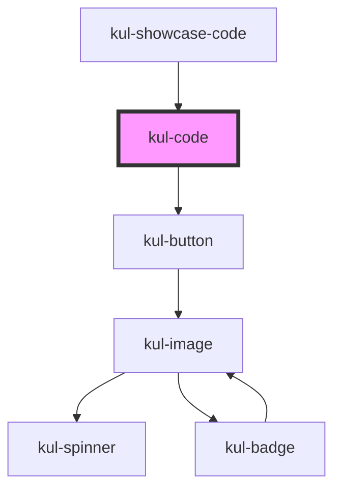

# kul-badge

<!-- Auto Generated Below -->

## Properties

| Property      | Attribute      | Description                                       | Type     | Default        |
| ------------- | -------------- | ------------------------------------------------- | -------- | -------------- |
| `kulLanguage` | `kul-language` | Sets the language of the snippet.                 | `string` | `'javascript'` |
| `kulStyle`    | `kul-style`    | Enables customization of the component's style.   | `string` | `''`           |
| `kulValue`    | `kul-value`    | String containing the snippet of code to display. | `string` | `''`           |

## Events

| Event            | Description              | Type                           |
| ---------------- | ------------------------ | ------------------------------ |
| `kul-code-event` | Describes event emitted. | `CustomEvent<KulEventPayload>` |

## Methods

### `getDebugInfo() => Promise<KulDebugComponentInfo>`

Retrieves the debug information reflecting the current state of the component.

#### Returns

Type: `Promise<KulDebugComponentInfo>`

A promise that resolves to a KulDebugComponentInfo object containing debug information.

### `getProps(descriptions?: boolean) => Promise<GenericObject>`

Retrieves the properties of the component, with optional descriptions.

#### Parameters

| Name           | Type      | Description                                                                          |
| -------------- | --------- | ------------------------------------------------------------------------------------ |
| `descriptions` | `boolean` | - If true, returns properties with descriptions; otherwise, returns properties only. |

#### Returns

Type: `Promise<GenericObject<unknown>>`

A promise that resolves to an object where each key is a property name, optionally with its description.

### `refresh() => Promise<void>`

Triggers a re-render of the component to reflect any state changes.

#### Returns

Type: `Promise<void>`

### `setProps(props: GenericObject) => Promise<void>`

Assigns a set of properties to the component, triggering updates if necessary.

#### Parameters

| Name    | Type                     | Description                                                   |
| ------- | ------------------------ | ------------------------------------------------------------- |
| `props` | `GenericObject<unknown>` | - An object containing properties to be set on the component. |

#### Returns

Type: `Promise<void>`

## CSS Custom Properties

| Name                                    | Description                                                                              |
| --------------------------------------- | ---------------------------------------------------------------------------------------- |
| `--kul-code-background-color`           | Sets the background color of the component.                                              |
| `--kul-code-font-family`                | Sets the font family of the component.                                                   |
| `--kul-code-header-background-color`    | Sets the background color of the header.                                                 |
| `--kul-code-header-color`               | Sets the color of the header.                                                            |
| `--kul-code-text-color`                 | Sets the color of the text.                                                              |
| `--kul-code-token-color-1`              | Sets the background color of: boolean, constant, deleted, number, property, symbol, tag. |
| `--kul-code-token-color-2`              | Sets the background color of: attr-name, builtin, char, inserted, selector, string.      |
| `--kul-code-token-color-3`              | Sets the background color of: atrule, attr-value, keyword.                               |
| `--kul-code-token-color-4`              | Sets the background color of: class-name, function.                                      |
| `--kul-code-token-color-5`              | Sets the background color of: important, regex, variable.                                |
| `--kul_code_selection_background_color` | Sets the background color of selected text.                                              |

## Dependencies

### Used by

 - [kul-showcase-code](../kul-showcase/components/code)

### Depends on

- [kul-button](../kul-button)

### Graph

----------------------------------------------

*Built with [StencilJS](https://stenciljs.com/)*
