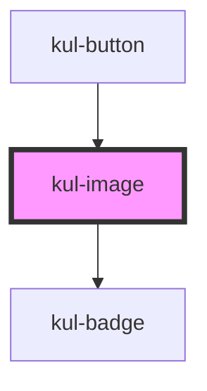

# kul-image

<!-- Auto Generated Below -->

## Properties

| Property      | Attribute      | Description                                                                                                                                                      | Type                     | Default                              |
| ------------- | -------------- | ---------------------------------------------------------------------------------------------------------------------------------------------------------------- | ------------------------ | ------------------------------------ |
| `badgeProps`  | --             | This property is used to attach a badge to the component.                                                                                                        | `KulBadgePropsInterface` | `null`                               |
| `color`       | `color`        | Specifies the color of the icon using a CSS variable. This property is used to set the color of the component's icon.                                            | `string`                 | ``var(${KulThemeColorValues.ICON})`` |
| `customStyle` | `custom-style` | Customizes the style of the component. This property allows you to apply a custom CSS style to the component.                                                    | `string`                 | `''`                                 |
| `resource`    | `resource`     | Defines the source URL of the image. This property is used to set the image resource that the component should display.                                          | `string`                 | `''`                                 |
| `showSpinner` | `show-spinner` | Controls the display of a loading indicator. When enabled, a spinner is shown until the image finishes loading. This property is not compatible with SVG images. | `boolean`                | `false`                              |
| `sizeX`       | `size-x`       | Sets the width of the icon. This property accepts any valid CSS measurement value (e.g., px, %, vh, etc.) and defaults to 100%.                                  | `string`                 | `'100%'`                             |
| `sizeY`       | `size-y`       | Sets the height of the icon. This property accepts any valid CSS measurement value (e.g., px, %, vh, etc.) and defaults to 100%.                                 | `string`                 | `'100%'`                             |

## Events

| Event             | Description                                                               | Type                           |
| ----------------- | ------------------------------------------------------------------------- | ------------------------------ |
| `kul-image-event` | Describes event emitted for various button interactions like click, load. | `CustomEvent<KulEventPayload>` |

## Methods

### `getProps(descriptions?: boolean) => Promise<GenericObject>`

Used to retrieve component's props values.

#### Parameters

| Name           | Type      | Description                                                                            |
| -------------- | --------- | -------------------------------------------------------------------------------------- |
| `descriptions` | `boolean` | - When provided and true, the result will be the list of props with their description. |

#### Returns

Type: `Promise<GenericObject<unknown>>`

List of props as object, each key will be a prop.

### `refresh() => Promise<void>`

This method is used to trigger a new render of the component.

#### Returns

Type: `Promise<void>`

### `setProps(props: GenericObject) => Promise<void>`

Sets the props to the component.

#### Parameters

| Name    | Type                     | Description                                                  |
| ------- | ------------------------ | ------------------------------------------------------------ |
| `props` | `GenericObject<unknown>` | - Object containing props that will be set to the component. |

#### Returns

Type: `Promise<void>`

## Dependencies

### Used by

 - [kul-button](../kul-button)

### Depends on

- [kul-badge](../kul-badge)

### Graph

----------------------------------------------

*Built with [StencilJS](https://stenciljs.com/)*
