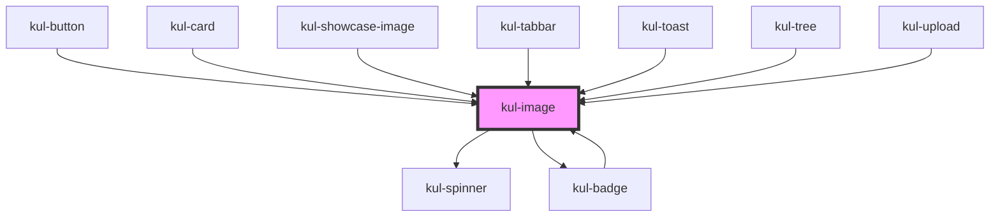

# kul-image

<!-- Auto Generated Below -->

## Properties

| Property         | Attribute          | Description                                                                                                                                                      | Type                     | Default                              |
| ---------------- | ------------------ | ---------------------------------------------------------------------------------------------------------------------------------------------------------------- | ------------------------ | ------------------------------------ |
| `kulBadgeProps`  | --                 | This property is used to attach a badge to the component.                                                                                                        | `KulBadgePropsInterface` | `null`                               |
| `kulColor`       | `kul-color`        | Specifies the color of the icon using a CSS variable. This property is used to set the color of the component's icon.                                            | `string`                 | ``var(${KulThemeColorValues.ICON})`` |
| `kulShowSpinner` | `kul-show-spinner` | Controls the display of a loading indicator. When enabled, a spinner is shown until the image finishes loading. This property is not compatible with SVG images. | `boolean`                | `false`                              |
| `kulSizeX`       | `kul-size-x`       | Sets the width of the icon. This property accepts any valid CSS measurement value (e.g., px, %, vh, etc.) and defaults to 100%.                                  | `string`                 | `'100%'`                             |
| `kulSizeY`       | `kul-size-y`       | Sets the height of the icon. This property accepts any valid CSS measurement value (e.g., px, %, vh, etc.) and defaults to 100%.                                 | `string`                 | `'100%'`                             |
| `kulStyle`       | `kul-style`        | Customizes the style of the component. This property allows you to apply a custom CSS style to the component.                                                    | `string`                 | `''`                                 |
| `kulValue`       | `kul-value`        | Defines the source URL of the image. This property is used to set the image resource that the component should display.                                          | `string`                 | `''`                                 |

## Events

| Event             | Description              | Type                           |
| ----------------- | ------------------------ | ------------------------------ |
| `kul-image-event` | Describes event emitted. | `CustomEvent<KulEventPayload>` |

## Methods

### `getDebugInfo() => Promise<KulDebugComponentInfo>`

Fetches debug information of the component's current state.

#### Returns

Type: `Promise<KulDebugComponentInfo>`

A promise that resolves with the debug information object.

### `getProps(descriptions?: boolean) => Promise<GenericObject>`

Used to retrieve component's props values.

#### Parameters

| Name           | Type      | Description                                                                            |
| -------------- | --------- | -------------------------------------------------------------------------------------- |
| `descriptions` | `boolean` | - When provided and true, the result will be the list of props with their description. |

#### Returns

Type: `Promise<GenericObject<unknown>>`

List of props as object, each key will be a prop.

### `refresh() => Promise<void>`

This method is used to trigger a new render of the component.

#### Returns

Type: `Promise<void>`

## Dependencies

### Used by

 - [kul-badge](../kul-badge)
 - [kul-button](../kul-button)
 - [kul-card](../kul-card)
 - [kul-showcase-image](../kul-showcase/components/image)
 - [kul-tabbar](../kul-tabbar)
 - [kul-toast](../kul-toast)
 - [kul-tree](../kul-tree)
 - [kul-upload](../kul-upload)

### Depends on

- [kul-spinner](../kul-spinner)
- [kul-badge](../kul-badge)

### Graph

----------------------------------------------

*Built with [StencilJS](https://stenciljs.com/)*
