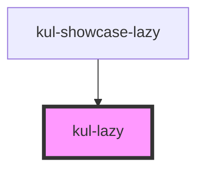

# kul-lazy

<!-- Auto Generated Below -->

## Properties

| Property             | Attribute              | Description                                                                                                                             | Type                              | Default  |
| -------------------- | ---------------------- | --------------------------------------------------------------------------------------------------------------------------------------- | --------------------------------- | -------- |
| `kulComponentName`   | `kul-component-name`   | Sets the tag name of the component to be lazy loaded.                                                                                   | `string`                          | `''`     |
| `kulComponentProps`  | --                     | Sets the data of the component to be lazy loaded.                                                                                       | `unknown`                         | `null`   |
| `kulRenderMode`      | `kul-render-mode`      | Decides when the sub-component should be rendered. By default when both the component props exist and the component is in the viewport. | `"both" \| "props" \| "viewport"` | `'both'` |
| `kulShowPlaceholder` | `kul-show-placeholder` | Displays an animated SVG placeholder until the component is loaded.                                                                     | `boolean`                         | `true`   |
| `kulStyle`           | `kul-style`            | Customizes the style of the component. This property allows you to apply a custom CSS style to the component.                           | `string`                          | `''`     |

## Events

| Event            | Description                       | Type                           |
| ---------------- | --------------------------------- | ------------------------------ |
| `kul-lazy-event` | Describes the component's events. | `CustomEvent<KulEventPayload>` |

## Methods

### `getComponent() => Promise<HTMLElement>`

Returns the HTMLElement of the component to lazy load.

#### Returns

Type: `Promise<HTMLElement>`

Lazy loaded component.

### `getDebugInfo() => Promise<KulDebugComponentInfo>`

Fetches debug information of the component's current state.

#### Returns

Type: `Promise<KulDebugComponentInfo>`

A promise that resolves with the debug information object.

### `getProps(descriptions?: boolean) => Promise<GenericObject>`

Used to retrieve component's props values.

#### Parameters

| Name           | Type      | Description                                                                            |
| -------------- | --------- | -------------------------------------------------------------------------------------- |
| `descriptions` | `boolean` | - When provided and true, the result will be the list of props with their description. |

#### Returns

Type: `Promise<GenericObject<unknown>>`

List of props as object, each key will be a prop.

### `refresh() => Promise<void>`

This method is used to trigger a new render of the component.

#### Returns

Type: `Promise<void>`

## CSS Custom Properties

| Name                           | Description                                                            |
| ------------------------------ | ---------------------------------------------------------------------- |
| `--kul-lazy-animation-time`    | Sets the duration of the animation. Defaults to 2s.                    |
| `--kul-lazy-height`            | Sets the height of the component and subcomponent. Defaults to 100%.   |
| `--kul-lazy-hor-alignment`     | Sets the horizontal alignment of the subcomponent. Defaults to center. |
| `--kul-lazy-placeholder-color` | Sets color of the placeholder icon. Defaults to var(--kul-icon-color). |
| `--kul-lazy-ver-alignment`     | Sets the vertical alignment of the subcomponent. Defaults to center.   |
| `--kul-lazy-width`             | Sets the width of the component and subcomponent. Defaults to 100%.    |

## Dependencies

### Used by

 - [kul-showcase-lazy](../kul-showcase/components/lazy)

### Graph

----------------------------------------------

*Built with [StencilJS](https://stenciljs.com/)*
