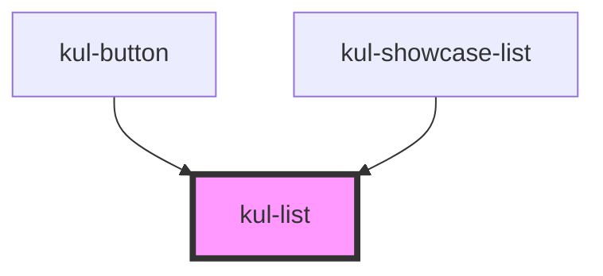

# kul-list

<!-- Auto Generated Below -->

## Properties

| Property             | Attribute              | Description                                                           | Type             | Default |
| -------------------- | ---------------------- | --------------------------------------------------------------------- | ---------------- | ------- |
| `kulData`            | --                     | The data of the list.                                                 | `KulDataDataset` | `null`  |
| `kulEnableDeletions` | `kul-enable-deletions` | Defines whether items can be removed from the list or not.            | `boolean`        | `false` |
| `kulNavigation`      | `kul-navigation`       | When true, enables items' navigation through arrow keys.              | `boolean`        | `true`  |
| `kulRipple`          | `kul-ripple`           | When set to true, the pointerdown event will trigger a ripple effect. | `boolean`        | `true`  |
| `kulSelectable`      | `kul-selectable`       | Defines whether items are selectable or not.                          | `boolean`        | `true`  |
| `kulStyle`           | `kul-style`            | Custom style of the component.                                        | `string`         | `''`    |

## Events

| Event            | Description              | Type                               |
| ---------------- | ------------------------ | ---------------------------------- |
| `kul-list-event` | Describes event emitted. | `CustomEvent<KulListEventPayload>` |

## Methods

### `focusNext() => Promise<void>`

Focuses the next element of the list.

#### Returns

Type: `Promise<void>`

### `focusPrevious() => Promise<void>`

Focuses the previous element of the list.

#### Returns

Type: `Promise<void>`

### `getDebugInfo() => Promise<KulDebugComponentInfo>`

Fetches debug information of the component's current state.

#### Returns

Type: `Promise<KulDebugComponentInfo>`

A promise that resolves with the debug information object.

### `getProps(descriptions?: boolean) => Promise<GenericObject>`

Used to retrieve component's props values.

#### Parameters

| Name           | Type      | Description                                                                            |
| -------------- | --------- | -------------------------------------------------------------------------------------- |
| `descriptions` | `boolean` | - When provided and true, the result will be the list of props with their description. |

#### Returns

Type: `Promise<GenericObject<unknown>>`

List of props as object, each key will be a prop.

### `getSelected() => Promise<KulDataNode>`

Returns the selected node.

#### Returns

Type: `Promise<KulDataNode>`

Selected node.

### `refresh() => Promise<void>`

This method is used to trigger a new render of the component.

#### Returns

Type: `Promise<void>`

### `selectNode(index?: number) => Promise<void>`

Calls handleSelection private method to select the given item.

#### Parameters

| Name    | Type     | Description                                                                                                                  |
| ------- | -------- | ---------------------------------------------------------------------------------------------------------------------------- |
| `index` | `number` | - Zero-based index of the item that must be selected, when not provided the list will attempt to select the focused element. |

#### Returns

Type: `Promise<void>`

## CSS Custom Properties

| Name                           | Description                                                                                                                     |
| ------------------------------ | ------------------------------------------------------------------------------------------------------------------------------- |
| `--kul-list-backdrop-filter`   | Sets the backdrop filter of the list. Defaults to blur(3.5px).                                                                  |
| `--kul-list-background-color`  | Sets the background color of the list. Defaults to rgba(var(--kul-background-color-rgb), 0.75).                                 |
| `--kul-list-font-family`       | Sets font family of the component. Defaults to the value of --kul-font-family.                                                  |
| `--kul-list-font-size`         | Sets font size of the component. Defaults to the value of --kul-font-size.                                                      |
| `--kul-list-font-weight`       | Sets font weight of the component. Defaults to 400.                                                                             |
| `--kul-list-group-item-height` | Sets height of each list item when the list contains radio buttons or checkboxes. Defaults to 3em.                              |
| `--kul-list-item-height`       | Sets height of each list item. Defaults to 2.5em.                                                                               |
| `--kul-list-item-padding`      | Sets the padding of each list item. Defaults to 0 0.75em.                                                                       |
| `--kul-list-primary-color`     | Sets the primary color of the component. Defaults to the value of --kul-primary-color.                                          |
| `--kul-list-primary-color-rgb` | Sets the RGB values of the primary color of the component (used for shaders). Defaults to the value of --kul-primary-color-rgb. |
| `--kul-list-text-color`        | Sets text color of the list. Defaults to the value of --kul-text-color.                                                         |
| `--kul-list-text-color-rgb`    | Sets the RGB values of text color. Defaults to the value of --kul-text-color-rgb.                                               |
| `--kul-list-transition`        | Transitions duration for text and background colors. Defaults to 125ms.                                                         |

## Dependencies

### Used by

 - [kul-button](../kul-button)
 - [kul-showcase-list](../kul-showcase/components/list)

### Graph

----------------------------------------------

*Built with [StencilJS](https://stenciljs.com/)*
