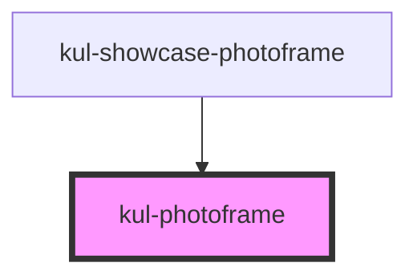

# kul-photoframe

<!-- Auto Generated Below -->

## Properties

| Property         | Attribute       | Description                                                              | Type                     | Default |
| ---------------- | --------------- | ------------------------------------------------------------------------ | ------------------------ | ------- |
| `kulPlaceholder` | --              | Html attributes of the picture before the component enters the viewport. | `GenericObject<unknown>` | `null`  |
| `kulStyle`       | `kul-style`     | Custom style of the component.                                           | `string`                 | `''`    |
| `kulThreshold`   | `kul-threshold` | Percentage of the component dimensions entering the viewport (0.1 => 1). | `number`                 | `0.25`  |
| `kulValue`       | --              | Html attributes of the picture after the component enters the viewport.  | `GenericObject<unknown>` | `null`  |

## Events

| Event                  | Description              | Type                                     |
| ---------------------- | ------------------------ | ---------------------------------------- |
| `kul-photoframe-event` | Describes event emitted. | `CustomEvent<KulPhotoframeEventPayload>` |

## Methods

### `getDebugInfo() => Promise<KulDebugComponentInfo>`

Fetches debug information of the component's current state.

#### Returns

Type: `Promise<KulDebugComponentInfo>`

A promise that resolves with the debug information object.

### `getProps(descriptions?: boolean) => Promise<GenericObject>`

Used to retrieve component's props values.

#### Parameters

| Name           | Type      | Description                                                                            |
| -------------- | --------- | -------------------------------------------------------------------------------------- |
| `descriptions` | `boolean` | - When provided and true, the result will be the list of props with their description. |

#### Returns

Type: `Promise<GenericObject<unknown>>`

List of props as object, each key will be a prop.

### `refresh() => Promise<void>`

This method is used to trigger a new render of the component.

#### Returns

Type: `Promise<void>`

## CSS Custom Properties

| Name                             | Description                                                                      |
| -------------------------------- | -------------------------------------------------------------------------------- |
| `--kup-photoframe-border`        | Sets the border of the component. Defaults to 1px inset var(--kup-border-color). |
| `--kup-photoframe-fade-out-time` | Sets the time of the placeholder's fade out transition. Defaults to 2000ms.      |

## Dependencies

### Used by

 - [kul-showcase-photoframe](../kul-showcase/components/photoframe)

### Graph

----------------------------------------------

*Built with [StencilJS](https://stenciljs.com/)*
