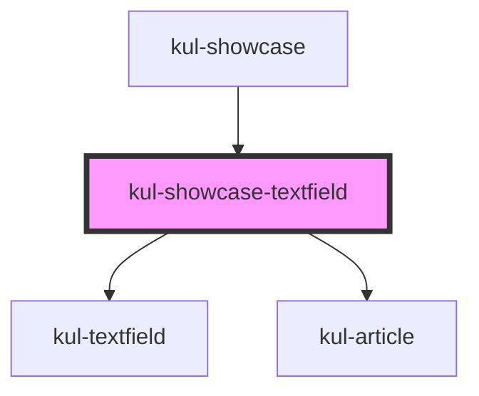

# kul-showcase-textfield

<!-- Auto Generated Below -->

## Shadow Parts

| Part             | Description |
| ---------------- | ----------- |
| `"comp-wrapper"` |             |
| `"description"`  |             |
| `"example"`      |             |
| `"grid"`         |             |

## Dependencies

### Used by

 - [kul-showcase](../..)

### Depends on

- [kul-textfield](../../../kul-textfield)
- [kul-article](../../../kul-article)

### Graph

----------------------------------------------

*Built with [StencilJS](https://stenciljs.com/)*
