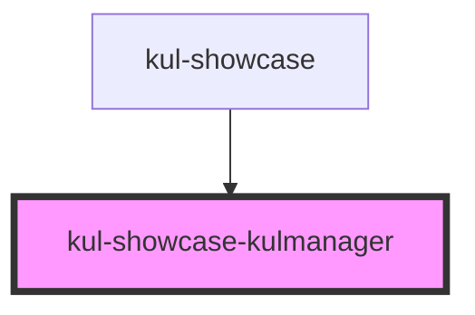

# kul-showcase-badge

<!-- Auto Generated Below -->

## Shadow Parts

| Part               | Description |
| ------------------ | ----------- |
| `"code-word"`      |             |
| `"text-container"` |             |
| `"text-paragraph"` |             |
| `"text-section"`   |             |
| `"text-wrapper"`   |             |

## Dependencies

### Used by

 - [kul-showcase](../..)

### Graph

----------------------------------------------

*Built with [StencilJS](https://stenciljs.com/)*
