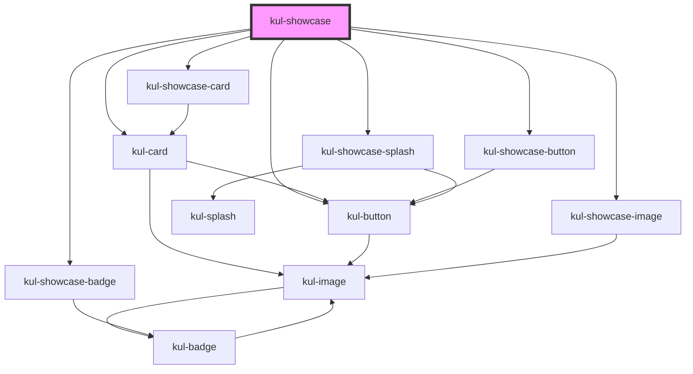

# kul-showcase

<!-- Auto Generated Below -->

## Properties

| Property   | Attribute   | Description                    | Type     | Default |
| ---------- | ----------- | ------------------------------ | -------- | ------- |
| `kulStyle` | `kul-style` | Custom style of the component. | `string` | `''`    |

## Events

| Event                | Description                                                         | Type                           |
| -------------------- | ------------------------------------------------------------------- | ------------------------------ |
| `kul-showcase-event` | Describes event emitted for various button interactions like click. | `CustomEvent<KulEventPayload>` |

## Methods

### `getDebugInfo() => Promise<KulDebugComponentInfo>`

Fetches debug information of the component's current state.

#### Returns

Type: `Promise<KulDebugComponentInfo>`

A promise that resolves with the debug information object.

### `getProps(descriptions?: boolean) => Promise<GenericObject>`

Used to retrieve component's props values.

#### Parameters

| Name           | Type      | Description                                                                            |
| -------------- | --------- | -------------------------------------------------------------------------------------- |
| `descriptions` | `boolean` | - When provided and true, the result will be the list of props with their description. |

#### Returns

Type: `Promise<GenericObject<unknown>>`

List of props as object, each key will be a prop.

### `refresh() => Promise<void>`

This method is used to trigger a new render of the component.

#### Returns

Type: `Promise<void>`

### `setProps(props: GenericObject) => Promise<void>`

Sets the props to the component.

#### Parameters

| Name    | Type                     | Description                                                  |
| ------- | ------------------------ | ------------------------------------------------------------ |
| `props` | `GenericObject<unknown>` | - Object containing props that will be set to the component. |

#### Returns

Type: `Promise<void>`

## Dependencies

### Depends on

- [kul-card](../kul-card)
- [kul-showcase-badge](./examples/badge)
- [kul-showcase-button](./examples/button)
- [kul-showcase-card](./examples/card)
- [kul-showcase-image](./examples/image)
- [kul-showcase-splash](./examples/splash)
- [kul-button](../kul-button)

### Graph

----------------------------------------------

*Built with [StencilJS](https://stenciljs.com/)*
