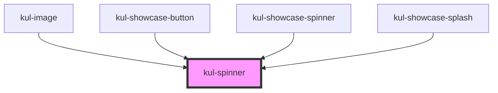

# kul-spinner

<!-- Auto Generated Below -->

## Properties

| Property          | Attribute           | Description                                                                                    | Type      | Default |
| ----------------- | ------------------- | ---------------------------------------------------------------------------------------------- | --------- | ------- |
| `kulActive`       | `kul-active`        | Specifies if the spinner is animating.                                                         | `boolean` | `false` |
| `kulBarVariant`   | `kul-bar-variant`   | Controls if the component displays as a bar or a spinner.                                      | `boolean` | `false` |
| `kulDimensions`   | `kul-dimensions`    | Defines the width and height of the spinner. In the bar variant, it specifies only the height. | `string`  | `''`    |
| `kulFader`        | `kul-fader`         | Applies a blending modal over the component to darken or lighten the view, based on the theme. | `boolean` | `false` |
| `kulFaderTimeout` | `kul-fader-timeout` | Duration needed for the fader to become active.                                                | `number`  | `3500`  |
| `kulFullScreen`   | `kul-full-screen`   | Fills the entire viewport when enabled.                                                        | `boolean` | `false` |
| `kulLayout`       | `kul-layout`        | Selects the spinner layout.                                                                    | `number`  | `1`     |
| `kulStyle`        | `kul-style`         | Sets a custom style for the component.                                                         | `string`  | `''`    |

## Events

| Event               | Description | Type                           |
| ------------------- | ----------- | ------------------------------ |
| `kul-spinner-event` |             | `CustomEvent<KulEventPayload>` |

## Methods

### `getDebugInfo() => Promise<KulDebugComponentInfo>`

Fetches debug information of the component's current state.

#### Returns

Type: `Promise<KulDebugComponentInfo>`

A promise that resolves with the debug information object.

### `getProps(descriptions?: boolean) => Promise<GenericObject>`

Used to retrieve component's props values.

#### Parameters

| Name           | Type      | Description                                                                            |
| -------------- | --------- | -------------------------------------------------------------------------------------- |
| `descriptions` | `boolean` | - When provided and true, the result will be the list of props with their description. |

#### Returns

Type: `Promise<GenericObject<unknown>>`

List of props as object, each key will be a prop.

### `refresh() => Promise<void>`

This method is used to trigger a new render of the component.

#### Returns

Type: `Promise<void>`

## CSS Custom Properties

| Name                         | Description                                                                          |
| ---------------------------- | ------------------------------------------------------------------------------------ |
| `--kul-spinner-border-color` | Sets the border color of the spinner component. Defaults to var(--kul-border-color). |

## Dependencies

### Used by

 - [kul-image](../kul-image)
 - [kul-showcase-button](../kul-showcase/components/button)
 - [kul-showcase-spinner](../kul-showcase/components/spinner)
 - [kul-showcase-splash](../kul-showcase/components/splash)

### Graph

----------------------------------------------

*Built with [StencilJS](https://stenciljs.com/)*
