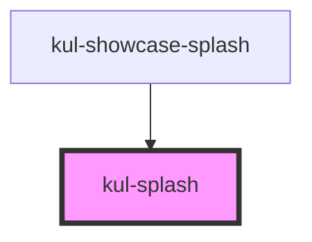

# kul-badge

<!-- Auto Generated Below -->

## Properties

| Property   | Attribute   | Description                                                                  | Type     | Default        |
| ---------- | ----------- | ---------------------------------------------------------------------------- | -------- | -------------- |
| `kulLabel` | `kul-label` | Initial text displayed within the component, typically shown during loading. | `string` | `'Loading...'` |
| `kulStyle` | `kul-style` | Enables customization of the component's style.                              | `string` | `''`           |

## Events

| Event              | Description              | Type                           |
| ------------------ | ------------------------ | ------------------------------ |
| `kul-splash-event` | Describes event emitted. | `CustomEvent<KulEventPayload>` |

## Methods

### `getDebugInfo() => Promise<KulDebugComponentInfo>`

Retrieves the debug information reflecting the current state of the component.

#### Returns

Type: `Promise<KulDebugComponentInfo>`

A promise that resolves to a KulDebugComponentInfo object containing debug information.

### `getProps(descriptions?: boolean) => Promise<GenericObject>`

Retrieves the properties of the component, with optional descriptions.

#### Parameters

| Name           | Type      | Description                                                                          |
| -------------- | --------- | ------------------------------------------------------------------------------------ |
| `descriptions` | `boolean` | - If true, returns properties with descriptions; otherwise, returns properties only. |

#### Returns

Type: `Promise<GenericObject<unknown>>`

A promise that resolves to an object where each key is a property name, optionally with its description.

### `refresh() => Promise<void>`

Triggers a re-render of the component to reflect any state changes.

#### Returns

Type: `Promise<void>`

### `unmount(ms?: number) => Promise<void>`

Initiates the unmount sequence, which removes the component from the DOM after a delay.

#### Parameters

| Name | Type     | Description              |
| ---- | -------- | ------------------------ |
| `ms` | `number` | - Number of milliseconds |

#### Returns

Type: `Promise<void>`

## CSS Custom Properties

| Name                            | Description                                                                     |
| ------------------------------- | ------------------------------------------------------------------------------- |
| `--kul-splash-background-color` | Sets the color of the spinner. Defaults to the value of --kul-background-color. |
| `--kul-splash-font-family`      | Sets the label's font family. Defaults to the value of --kul-font-family.       |
| `--kul-splash-font-size`        | Sets the label's font size. Defaults to the value of --kul-font-size.           |
| `--kul-splash-label-color`      | Sets the color of the label. Defaults to the value of --kul-text-color.         |
| `--kul-splash-widget-color`     | Sets the color of the widget. Defaults to the value of --kul-primary-color.     |

## Dependencies

### Used by

 - [kul-showcase-splash](../kul-showcase/components/splash)

### Graph

----------------------------------------------

*Built with [StencilJS](https://stenciljs.com/)*
