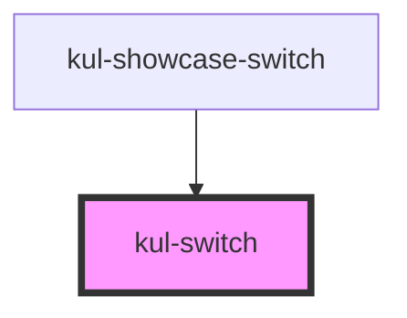

# kul-button

<!-- Auto Generated Below -->

## Properties

| Property          | Attribute           | Description                                                                            | Type      | Default |
| ----------------- | ------------------- | -------------------------------------------------------------------------------------- | --------- | ------- |
| `kulDisabled`     | `kul-disabled`      | Defaults at false. When set to true, the component is disabled.                        | `boolean` | `false` |
| `kulLabel`        | `kul-label`         | Defines text to display along with the switch.                                         | `string`  | `''`    |
| `kulLeadingLabel` | `kul-leading-label` | Defaults at false. When set to true, the label will be displayed before the component. | `boolean` | `false` |
| `kulRipple`       | `kul-ripple`        | When set to true, the pointerdown event will trigger a ripple effect.                  | `boolean` | `true`  |
| `kulStyle`        | `kul-style`         | Custom style of the component.                                                         | `string`  | `''`    |
| `kulValue`        | `kul-value`         | Sets the initial boolean state of the switch.                                          | `boolean` | `false` |

## Events

| Event              | Description                                                                      | Type                                 |
| ------------------ | -------------------------------------------------------------------------------- | ------------------------------------ |
| `kul-switch-event` | Describes event emitted for various switch interactions like click, focus, blur. | `CustomEvent<KulSwitchEventPayload>` |

## Methods

### `getDebugInfo() => Promise<KulDebugComponentInfo>`

Fetches debug information of the component's current state.

#### Returns

Type: `Promise<KulDebugComponentInfo>`

A promise that resolves with the debug information object.

### `getProps(descriptions?: boolean) => Promise<GenericObject>`

Used to retrieve component's properties and descriptions.

#### Parameters

| Name           | Type      | Description                                           |
| -------------- | --------- | ----------------------------------------------------- |
| `descriptions` | `boolean` | - When true, includes descriptions for each property. |

#### Returns

Type: `Promise<GenericObject<unknown>>`

Promise resolved with an object containing the component's properties.

### `getValue() => Promise<KulSwitchState>`

Used to retrieve component's current state.

#### Returns

Type: `Promise<KulSwitchState>`

Promise resolved with the current state of the component.

### `refresh() => Promise<void>`

This method is used to trigger a new render of the component.

#### Returns

Type: `Promise<void>`

### `setValue(value: KulSwitchState) => Promise<void>`

Sets the component's state.

#### Parameters

| Name    | Type            | Description                                 |
| ------- | --------------- | ------------------------------------------- |
| `value` | `"on" \| "off"` | - The new state to be set on the component. |

#### Returns

Type: `Promise<void>`

## CSS Custom Properties

| Name                             | Description                                                                               |
| -------------------------------- | ----------------------------------------------------------------------------------------- |
| `--kul-switch-font-family`       | Sets font family of the switch's label. Defaults to var(--kul-font-family).               |
| `--kul-switch-font-size`         | Sets font size of the switch's label. Defaults to var(--kul-font-size).                   |
| `--kul-switch-font-weight`       | Sets font weight of the switch's label. Defaults to 400.                                  |
| `--kul-switch-label-color`       | Sets text color of the switch's label. Defaults to var(--kul-text-color).                 |
| `--kul-switch-primary-color`     | Sets primary color of the component. Defaults to var(--kul-primary-color).                |
| `--kul-switch-primary-color-rgb` | Sets primary color RGB values of the component. Defaults to var(--kul-primary-color-rgb). |
| `--kul-switch-thumb-color`       | Sets thumb color. Defaults to var(--kul-border-color).                                    |

## Dependencies

### Used by

 - [kul-showcase-switch](../kul-showcase/components/switch)

### Graph

----------------------------------------------

*Built with [StencilJS](https://stenciljs.com/)*
