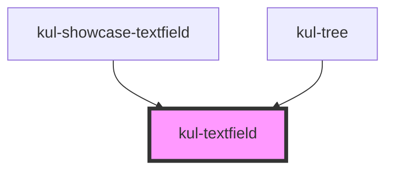

# kul-textfield

<!-- Auto Generated Below -->

## Properties

| Property            | Attribute           | Description                                                                                                                                                                                                                             | Type                                             | Default    |
| ------------------- | ------------------- | --------------------------------------------------------------------------------------------------------------------------------------------------------------------------------------------------------------------------------------- | ------------------------------------------------ | ---------- |
| `kulDisabled`       | `kul-disabled`      | Enables or disables the text field to prevent user interaction.                                                                                                                                                                         | `boolean`                                        | `false`    |
| `kulFullWidth`      | `kul-full-width`    | Applies a full-width styling to the text field, making it occupy all available horizontal space.                                                                                                                                        | `boolean`                                        | `false`    |
| `kulHelper`         | --                  | Specifies helper text to display alongside the text field. Helper text can provide additional context or instructions to the user.                                                                                                      | `KulTextfieldHelper`                             | `null`     |
| `kulHtmlAttributes` | --                  | Allows customization of the input or textarea element through additional HTML attributes. This can include attributes like 'readonly', 'placeholder', etc., to further customize the behavior or appearance of the input.               | `GenericObject<unknown>`                         | `{}`       |
| `kulIcon`           | `kul-icon`          | Defines the icon to be displayed within the text field. Icons can indicate actions such as search, clear, or provide visual cues related to the input's purpose.                                                                        | `string`                                         | `''`       |
| `kulLabel`          | `kul-label`         | Assigns a label to the text field, improving accessibility and providing context to the user about what kind of input is expected. Labels are especially important for screen readers and users navigating with keyboard-only controls. | `string`                                         | `''`       |
| `kulStyle`          | `kul-style`         | Accepts custom CSS styles to apply directly to the text field component. This allows for fine-grained control over the appearance of the component beyond predefined styling options.                                                   | `string`                                         | `''`       |
| `kulStyling`        | `kul-styling`       | Determines the overall styling theme of the text field, affecting its shape and border. Options include 'default', 'outlined', or 'textarea', each offering a distinct visual presentation.                                             | `"flat" \| "outlined" \| "raised" \| "textarea"` | `'raised'` |
| `kulTrailingIcon`   | `kul-trailing-icon` | Controls whether the icon should appear after the text input, typically used for action buttons like clear or search.                                                                                                                   | `boolean`                                        | `false`    |
| `kulValue`          | `kul-value`         | Initializes the text field with a default value when the component is first rendered. This can be used to pre-fill forms or set a starting point for user input.                                                                        | `string`                                         | `''`       |

## Events

| Event                 | Description              | Type                                    |
| --------------------- | ------------------------ | --------------------------------------- |
| `kul-textfield-event` | Describes event emitted. | `CustomEvent<KulTextfieldEventPayload>` |

## Methods

### `getDebugInfo() => Promise<KulDebugComponentInfo>`

Fetches debug information of the component's current state.

#### Returns

Type: `Promise<KulDebugComponentInfo>`

A promise that resolves with the debug information object.

### `getProps(descriptions?: boolean) => Promise<GenericObject>`

Used to retrieve component's props values.

#### Parameters

| Name           | Type      | Description                                                                            |
| -------------- | --------- | -------------------------------------------------------------------------------------- |
| `descriptions` | `boolean` | - When provided and true, the result will be the list of props with their description. |

#### Returns

Type: `Promise<GenericObject<unknown>>`

List of props as object, each key will be a prop.

### `refresh() => Promise<void>`

This method is used to trigger a new render of the component.

#### Returns

Type: `Promise<void>`

## CSS Custom Properties

| Name                                     | Description                                                                                                    |
| ---------------------------------------- | -------------------------------------------------------------------------------------------------------------- |
| `--kul-textfield-backdrop-filter`        | Sets the backdrop filter of the text field. Defaults to blur(3.5px).                                           |
| `--kul-textfield-backdrop-filter-hover`  | Sets the backdrop filter of the text field when hovering. Defaults to blur(5px).                               |
| `--kul-textfield-background-color`       | Sets the background color of the text field. Defaults to rgba(var(--kul-text-color-rgb), 0.125).               |
| `--kul-textfield-background-color-hover` | Sets the background color of the text field when hovering. Defaults to rgba(var(--kul-text-color-rgb), 0.125). |
| `--kul-textfield-input-color`            | Sets the color of the text field's input text. Defaults to var(--kul-text-color).                              |
| `--kul-textfield-input-color-rgb`        | Sets the rgb color of the text field's input text. Defaults to var(--kul-text-color-rgb).                      |
| `--kul-textfield-input-font-size`        | Sets the font size of the text field's value. Defaults to var(--kul-font-size).                                |
| `--kul-textfield-input-font-weight`      | Sets the font weight of the text field's input. Defaults to 400.                                               |
| `--kul-textfield-label-color`            | Sets the color of the text field's label. Defaults to rgba(var(--kul-text-color-rgb), 0.875).                  |
| `--kul-textfield-label-font-size`        | Sets the font size of the text field's label. Defaults to var(--kul-font-size).                                |
| `--kul-textfield-label-font-weight`      | Sets the font weight of the text field's label. Defaults to 400.                                               |
| `--kul-textfield-padding`                | Sets the padding of the text field. Defaults to 0 16px.                                                        |
| `--kul-textfield-primary-color`          | Sets the primary color of the text field. Defaults to var(--kul-primary-color).                                |

## Dependencies

### Used by

 - [kul-showcase-textfield](../kul-showcase/components/textfield)
 - [kul-tree](../kul-tree)

### Graph

----------------------------------------------

*Built with [StencilJS](https://stenciljs.com/)*
