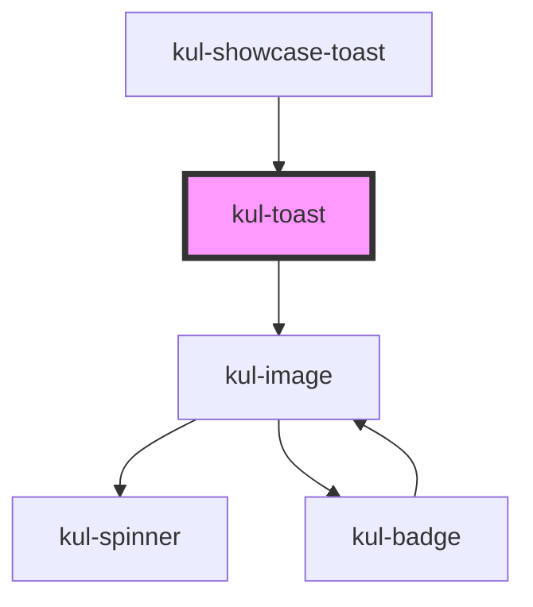

# kul-badge

<!-- Auto Generated Below -->

## Properties

| Property           | Attribute     | Description                                                                                                 | Type                     | Default                                                                                                                                                                                                                                                                                                 |
| ------------------ | ------------- | ----------------------------------------------------------------------------------------------------------- | ------------------------ | ------------------------------------------------------------------------------------------------------------------------------------------------------------------------------------------------------------------------------------------------------------------------------------------------------- |
| `kulCloseCallback` | --            | Callback invoked when the toast is closed.                                                                  | `() => void`             | `() => {         const e = new CustomEvent('close');         this.onKulEvent(e, 'close');         this.kulEvent.emit({             comp: this,             eventType: 'close',             id: this.rootElement.id,             originalEvent: e,         });         this.rootElement.remove();     }` |
| `kulCloseIcon`     | --            | Sets the props of the clickable icon used to close the toast.                                               | `KulImagePropsInterface` | `{         kulSizeX: '18px',         kulSizeY: '18px',         kulValue: 'clear',     }`                                                                                                                                                                                                                |
| `kulIcon`          | --            | Sets the props of an optional icon that will be displayed along with the message.                           | `KulImagePropsInterface` | `{         kulSizeX: '18px',         kulSizeY: '18px',         kulValue: 'info',     }`                                                                                                                                                                                                                 |
| `kulMessage`       | `kul-message` | Sets the message of the toast.                                                                              | `string`                 | `'Wow, such empty.'`                                                                                                                                                                                                                                                                                    |
| `kulStyle`         | `kul-style`   | Enables customization of the component's style.                                                             | `string`                 | `''`                                                                                                                                                                                                                                                                                                    |
| `kulTimer`         | `kul-timer`   | When kulTimer is set with a number, the toast will close itself after the specified amount of time (in ms). | `number`                 | `null`                                                                                                                                                                                                                                                                                                  |

## Events

| Event             | Description              | Type                           |
| ----------------- | ------------------------ | ------------------------------ |
| `kul-toast-event` | Describes event emitted. | `CustomEvent<KulEventPayload>` |

## Methods

### `getDebugInfo() => Promise<KulDebugComponentInfo>`

Retrieves the debug information reflecting the current state of the component.

#### Returns

Type: `Promise<KulDebugComponentInfo>`

A promise that resolves to a KulDebugComponentInfo object containing debug information.

### `getProps(descriptions?: boolean) => Promise<GenericObject>`

Retrieves the properties of the component, with optional descriptions.

#### Parameters

| Name           | Type      | Description                                                                          |
| -------------- | --------- | ------------------------------------------------------------------------------------ |
| `descriptions` | `boolean` | - If true, returns properties with descriptions; otherwise, returns properties only. |

#### Returns

Type: `Promise<GenericObject<unknown>>`

A promise that resolves to an object where each key is a property name, optionally with its description.

### `refresh() => Promise<void>`

Triggers a re-render of the component to reflect any state changes.

#### Returns

Type: `Promise<void>`

## CSS Custom Properties

| Name                        | Description                                                                                                                       |
| --------------------------- | --------------------------------------------------------------------------------------------------------------------------------- |
| `--kul-toast-accent-color`  | Sets the accent color of the toast, identified by a bar displayed on the top of the component. Defaults to var(--kul-info-color). |
| `--kul-toast-accent-height` | Sets the height of the accent color bar. Defaults to 4px.                                                                         |
| `--kul-toast-icon-opacity`  | Sets the opacity of the icon. Defaults to 0.625.                                                                                  |
| `--kul-toast-slidein-from`  | Sets the animation starting point. Defaults to translateX(100%).                                                                  |
| `--kul-toast-slidein-to`    | Sets the animation ending point. Defaults to translateX(0).                                                                       |

## Dependencies

### Used by

 - [kul-showcase-toast](../kul-showcase/components/toast)

### Depends on

- [kul-image](../kul-image)

### Graph

----------------------------------------------

*Built with [StencilJS](https://stenciljs.com/)*
