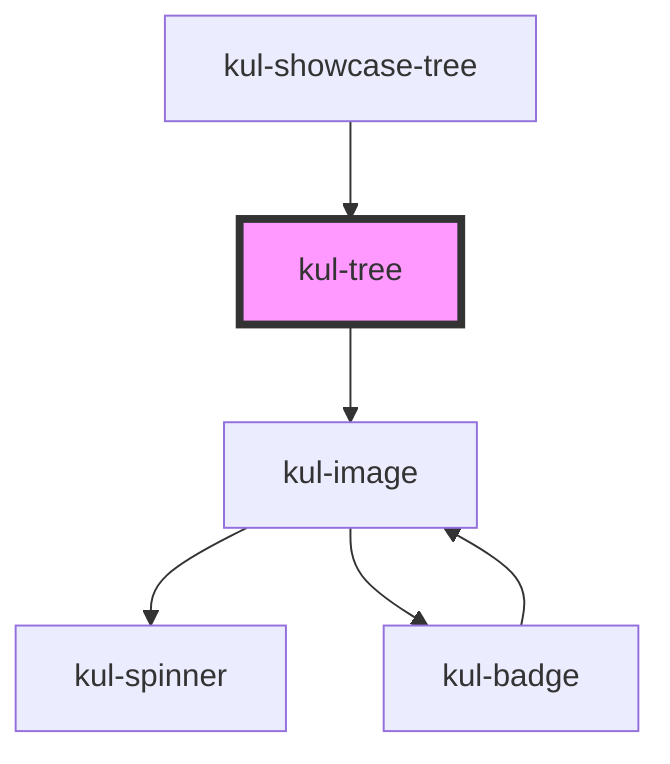

# kul-badge

<!-- Auto Generated Below -->

## Properties

| Property                  | Attribute                    | Description                                                                                                                            | Type             | Default     |
| ------------------------- | ---------------------------- | -------------------------------------------------------------------------------------------------------------------------------------- | ---------------- | ----------- |
| `kulData`                 | --                           | The actual data of the tree.                                                                                                           | `KulDataDataset` | `null`      |
| `kulInitialExpandedDepth` | `kul-initial-expanded-depth` | Sets the initial expanded nodes based on the specified depth. If the property is not provided, all nodes in the tree will be expanded. | `number`         | `undefined` |
| `kulRipple`               | `kul-ripple`                 | When set to true, the pointerdown event will trigger a ripple effect.                                                                  | `boolean`        | `true`      |
| `kulSelectable`           | `kul-selectable`             | When true, nodes can be selected.                                                                                                      | `boolean`        | `true`      |
| `kulStyle`                | `kul-style`                  | Enables customization of the component's style.                                                                                        | `string`         | `''`        |

## Events

| Event            | Description              | Type                           |
| ---------------- | ------------------------ | ------------------------------ |
| `kul-tree-event` | Describes event emitted. | `CustomEvent<KulEventPayload>` |

## Methods

### `getDebugInfo() => Promise<KulDebugComponentInfo>`

Retrieves the debug information reflecting the current state of the component.

#### Returns

Type: `Promise<KulDebugComponentInfo>`

A promise that resolves to a KulDebugComponentInfo object containing debug information.

### `getProps(descriptions?: boolean) => Promise<GenericObject>`

Retrieves the properties of the component, with optional descriptions.

#### Parameters

| Name           | Type      | Description                                                                          |
| -------------- | --------- | ------------------------------------------------------------------------------------ |
| `descriptions` | `boolean` | - If true, returns properties with descriptions; otherwise, returns properties only. |

#### Returns

Type: `Promise<GenericObject<unknown>>`

A promise that resolves to an object where each key is a property name, optionally with its description.

### `refresh() => Promise<void>`

Triggers a re-render of the component to reflect any state changes.

#### Returns

Type: `Promise<void>`

## CSS Custom Properties

| Name                                        | Description                                                                                            |
| ------------------------------------------- | ------------------------------------------------------------------------------------------------------ |
| `--kul-tree-backdrop-filter`                | Sets the backdrop filter of the tree. Defaults to blur(3.5px).                                         |
| `--kul-tree-node-background-color-hover`    | Sets the background color when hovering a node. Defaults to rgba(var(--kul-primary-color-rgb), 0.175). |
| `--kul-tree-node-background-color-selected` | Sets the background color of the selected node. Defaults to rgba(var(--kul-primary-color-rgb), 0.375). |
| `--kul-tree-node-padding`                   | Sets the padding of nodes. Defaults to 0 1em.                                                          |
| `--kul-tree-padding`                        | Sets the padding of the tree. Defaults to 0.                                                           |

## Dependencies

### Used by

 - [kul-showcase-tree](../kul-showcase/components/tree)

### Depends on

- [kul-image](../kul-image)

### Graph

----------------------------------------------

*Built with [StencilJS](https://stenciljs.com/)*
