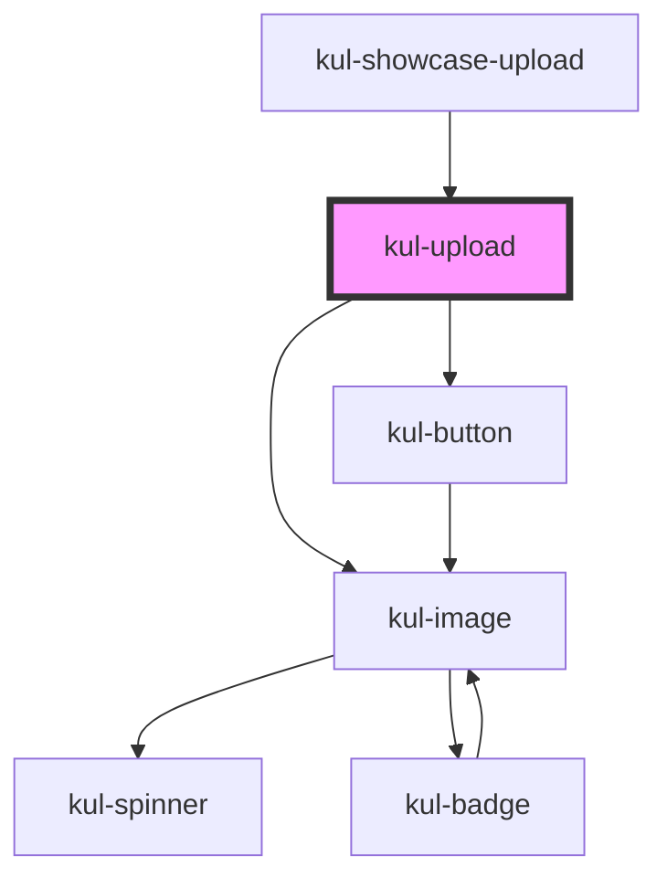

# kul-badge

<!-- Auto Generated Below -->

## Properties

| Property    | Attribute    | Description                                                           | Type      | Default |
| ----------- | ------------ | --------------------------------------------------------------------- | --------- | ------- |
| `kulRipple` | `kul-ripple` | When set to true, the pointerdown event will trigger a ripple effect. | `boolean` | `true`  |
| `kulStyle`  | `kul-style`  | Enables customization of the component's style.                       | `string`  | `''`    |
| `kulValue`  | `kul-value`  | Initializes the component with these files.                           | `any`     | `null`  |

## Events

| Event              | Description              | Type                                 |
| ------------------ | ------------------------ | ------------------------------------ |
| `kul-upload-event` | Describes event emitted. | `CustomEvent<KulUploadEventPayload>` |

## Methods

### `getDebugInfo() => Promise<KulDebugComponentInfo>`

Retrieves the debug information reflecting the current state of the component.

#### Returns

Type: `Promise<KulDebugComponentInfo>`

A promise that resolves to a KulDebugComponentInfo object containing debug information.

### `getProps(descriptions?: boolean) => Promise<GenericObject>`

Retrieves the properties of the component, with optional descriptions.

#### Parameters

| Name           | Type      | Description                                                                          |
| -------------- | --------- | ------------------------------------------------------------------------------------ |
| `descriptions` | `boolean` | - If true, returns properties with descriptions; otherwise, returns properties only. |

#### Returns

Type: `Promise<GenericObject<unknown>>`

A promise that resolves to an object where each key is a property name, optionally with its description.

### `getValue() => Promise<File[]>`

Returns the component's internal value.

#### Returns

Type: `Promise<File[]>`

### `refresh() => Promise<void>`

Triggers a re-render of the component to reflect any state changes.

#### Returns

Type: `Promise<void>`

### `setProps(props: GenericObject) => Promise<void>`

Assigns a set of properties to the component, triggering updates if necessary.

#### Parameters

| Name    | Type                     | Description                                                   |
| ------- | ------------------------ | ------------------------------------------------------------- |
| `props` | `GenericObject<unknown>` | - An object containing properties to be set on the component. |

#### Returns

Type: `Promise<void>`

## CSS Custom Properties

| Name                                 | Description                                                                                                              |
| ------------------------------------ | ------------------------------------------------------------------------------------------------------------------------ |
| `--kul_upload_backdrop_filter`       | Sets the backdrop filter for the upload component. Defaults to a blur effect of 5px.                                     |
| `--kul_upload_backdrop_filter_hover` | Sets the backdrop filter for the upload component on hover. Defaults to a blur effect of 10px.                           |
| `--kul_upload_border`                | Sets the border for the upload component. Defaults to a 1px solid border with a color defined by --kul-border-color-rgb. |
| `--kul_upload_border_radius`         | Sets the border radius for the upload component. Defaults to 4px.                                                        |
| `--kul_upload_button_height`         | Sets the height of the upload button. Defaults to 42px.                                                                  |
| `--kul_upload_button_text_transform` | Sets the text transformation for the upload button. Defaults to uppercase.                                               |
| `--kul_upload_grid_gap`              | Sets the grid gap for the upload component. Defaults to 20px.                                                            |
| `--kul_upload_info_height`           | Sets the height of the info section in the upload component. Defaults to 1fr.                                            |
| `--kul_upload_padding`               | Sets the padding for the upload component. Defaults to 1em.                                                              |

## Dependencies

### Used by

 - [kul-showcase-upload](../kul-showcase/components/upload)

### Depends on

- [kul-image](../kul-image)
- [kul-button](../kul-button)

### Graph

----------------------------------------------

*Built with [StencilJS](https://stenciljs.com/)*
