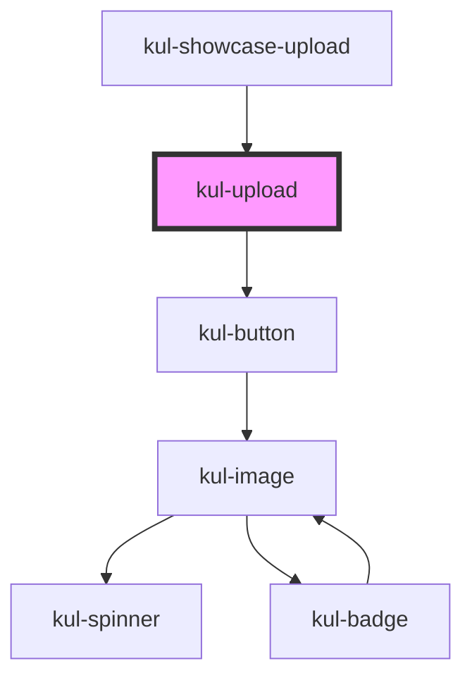

# kul-badge

<!-- Auto Generated Below -->

## Properties

| Property   | Attribute   | Description                                     | Type     | Default |
| ---------- | ----------- | ----------------------------------------------- | -------- | ------- |
| `kulStyle` | `kul-style` | Enables customization of the component's style. | `string` | `''`    |
| `kulValue` | `kul-value` | Initializes the component with these files.     | `any`    | `null`  |

## Events

| Event              | Description              | Type                                 |
| ------------------ | ------------------------ | ------------------------------------ |
| `kul-upload-event` | Describes event emitted. | `CustomEvent<KulUploadEventPayload>` |

## Methods

### `getDebugInfo() => Promise<KulDebugComponentInfo>`

Retrieves the debug information reflecting the current state of the component.

#### Returns

Type: `Promise<KulDebugComponentInfo>`

A promise that resolves to a KulDebugComponentInfo object containing debug information.

### `getProps(descriptions?: boolean) => Promise<GenericObject>`

Retrieves the properties of the component, with optional descriptions.

#### Parameters

| Name           | Type      | Description                                                                          |
| -------------- | --------- | ------------------------------------------------------------------------------------ |
| `descriptions` | `boolean` | - If true, returns properties with descriptions; otherwise, returns properties only. |

#### Returns

Type: `Promise<GenericObject<unknown>>`

A promise that resolves to an object where each key is a property name, optionally with its description.

### `refresh() => Promise<void>`

Triggers a re-render of the component to reflect any state changes.

#### Returns

Type: `Promise<void>`

### `setProps(props: GenericObject) => Promise<void>`

Assigns a set of properties to the component, triggering updates if necessary.

#### Parameters

| Name    | Type                     | Description                                                   |
| ------- | ------------------------ | ------------------------------------------------------------- |
| `props` | `GenericObject<unknown>` | - An object containing properties to be set on the component. |

#### Returns

Type: `Promise<void>`

## Dependencies

### Used by

 - [kul-showcase-upload](../kul-showcase/components/upload)

### Depends on

- [kul-button](../kul-button)

### Graph

----------------------------------------------

*Built with [StencilJS](https://stenciljs.com/)*
