# kup-accordion

<!-- Auto Generated Below -->

## Properties

| Property             | Attribute             | Description                                                                                                             | Type                                                                     | Default                            |
| -------------------- | --------------------- | ----------------------------------------------------------------------------------------------------------------------- | ------------------------------------------------------------------------ | ---------------------------------- |
| `customStyle`        | `custom-style`        | Custom style of the component.                                                                                          | `string`                                                                 | `''`                               |
| `data`               | --                    | Data of the accordion.                                                                                                  | `KupAccordionData`                                                       | `null`                             |
| `expansionMode`      | `expansion-mode`      | The mode of the expansion. If single you can't find more than one item expanded at a given time, if multiple you could. | `KupAccordionExpansionMode.MULTIPLE \| KupAccordionExpansionMode.SINGLE` | `KupAccordionExpansionMode.SINGLE` |
| `globalFilter`       | `global-filter`       | When set to true it activates the global filter.                                                                        | `boolean`                                                                | `false`                            |
| `globalFilterMode`   | `global-filter-mode`  | The mode of the global filter.                                                                                          | `KupGlobalFilterMode.HIGHLIGHT \| KupGlobalFilterMode.SIMPLE`            | `KupGlobalFilterMode.SIMPLE`       |
| `globalFilterValue`  | `global-filter-value` | The value of the global filter.                                                                                         | `string`                                                                 | `''`                               |
| `selectedItemsNames` | --                    | The names of the selected items.                                                                                        | `string[]`                                                               | `[]`                               |

## Events

| Event                             | Description                         | Type                                                     |
| --------------------------------- | ----------------------------------- | -------------------------------------------------------- |
| `kup-accordion-itemcollapsed`     | Fired when an item is collapsed.    | `CustomEvent<KupAccordionItemCollapsedEventPayload>`     |
| `kup-accordion-itemexpanded`      | Fired when an item is expanded.     | `CustomEvent<KupAccordionItemExpandedEventPayload>`      |
| `kup-accordion-itemselected`      | Fired when an item is selected.     | `CustomEvent<KupAccordionItemSelectedEventPayload>`      |
| `kup-accordion-treenodecollapsed` | Fired when a TreeNode is collapsed. | `CustomEvent<KupAccordionTreeNodeCollapsedEventPayload>` |
| `kup-accordion-treenodeexpanded`  | Fired when a TreeNode is expanded.  | `CustomEvent<KupAccordionTreeNodeExpandedEventPayload>`  |
| `kup-accordion-treenodeselected`  | Fired when a TreeNode is selected.  | `CustomEvent<KupAccordionTreeNodeSelectedEventPayload>`  |

## Methods

### `collapseAll() => Promise<void>`

This method collapse all items

#### Returns

Type: `Promise<void>`

### `expandAll() => Promise<void>`

This method expand all items

#### Returns

Type: `Promise<void>`

### `getProps(descriptions?: boolean) => Promise<GenericObject>`

Used to retrieve component's props values.

#### Returns

Type: `Promise<GenericObject>`

### `refresh() => Promise<void>`

This method is used to trigger a new render of the component.

#### Returns

Type: `Promise<void>`

### `setProps(props: GenericObject) => Promise<void>`

Sets the props to the component.

#### Returns

Type: `Promise<void>`

### `toggleItem(itemName: string) => Promise<void>`

This method activates or deactivates an item

#### Returns

Type: `Promise<void>`

## CSS Custom Properties

| Name                                     | Description                                                      |
| ---------------------------------------- | ---------------------------------------------------------------- |
| `--kup-accordion_background-color`       | Sets background of the component.                                |
| `--kup-accordion_border`                 | Sets borders color of the accordion.                             |
| `--kup-accordion_border-radius`          | Sets border radius of the first and last items of the accordion. |
| `--kup-accordion_dropdown-icon-color`    | Sets color of the dropdown icon.                                 |
| `--kup-accordion_font-family`            | Sets font family of the component.                               |
| `--kup-accordion_font-size`              | Sets font size of the component.                                 |
| `--kup-accordion_hover-background-color` | Sets background color of the hover effect.                       |
| `--kup-accordion_hover-color`            | Sets text color of the hover effect.                             |
| `--kup-accordion_padding`                | Sets padding of the accordion's items.                           |
| `--kup-accordion_selection-color`        | Sets background color of a selected item.                        |
| `--kup-accordion_text-color`             | Sets text color of the component.                                |
| `--kup-accordion_transition`             | Sets transition duration for color and background-color.         |

## Dependencies

### Depends on

- [kup-tree](../kup-tree)
- [kup-text-field](../kup-text-field)
- [kup-badge](../kup-badge)

### Graph

```mermaid
graph TD;
  kup-accordion --> kup-tree
  kup-accordion --> kup-text-field
  kup-accordion --> kup-badge
  kup-tree --> kup-card
  kup-tree --> kup-image
  kup-tree --> kup-button
  kup-tree --> kup-chart
  kup-tree --> kup-checkbox
  kup-tree --> kup-chip
  kup-tree --> kup-color-picker
  kup-tree --> kup-gauge
  kup-tree --> kup-progress-bar
  kup-tree --> kup-rating
  kup-tree --> kup-radio
  kup-tree --> kup-tooltip
  kup-tree --> kup-list
  kup-tree --> kup-text-field
  kup-card --> kup-chip
  kup-card --> kup-badge
  kup-card --> kup-autocomplete
  kup-card --> kup-button
  kup-card --> kup-checkbox
  kup-card --> kup-combobox
  kup-card --> kup-date-picker
  kup-card --> kup-text-field
  kup-card --> kup-time-picker
  kup-card --> kup-data-table
  kup-card --> kup-list
  kup-card --> kup-progress-bar
  kup-card --> kup-chart
  kup-card --> kup-spinner
  kup-card --> kup-tab-bar
  kup-card --> kup-tree
  kup-card --> kup-switch
  kup-chip --> kup-badge
  kup-badge --> kup-badge
  kup-autocomplete --> kup-list
  kup-list --> kup-radio
  kup-list --> kup-badge
  kup-button --> kup-badge
  kup-combobox --> kup-list
  kup-date-picker --> kup-text-field
  kup-date-picker --> kup-button
  kup-time-picker --> kup-text-field
  kup-time-picker --> kup-button
  kup-time-picker --> kup-list
  kup-data-table --> kup-card
  kup-data-table --> kup-checkbox
  kup-data-table --> kup-tooltip
  kup-data-table --> kup-list
  kup-data-table --> kup-date-picker
  kup-data-table --> kup-image
  kup-data-table --> kup-button
  kup-data-table --> kup-button-list
  kup-data-table --> kup-chart
  kup-data-table --> kup-color-picker
  kup-data-table --> kup-gauge
  kup-data-table --> kup-progress-bar
  kup-data-table --> kup-rating
  kup-data-table --> kup-radio
  kup-data-table --> kup-paginator
  kup-data-table --> kup-switch
  kup-data-table --> kup-combobox
  kup-data-table --> kup-badge
  kup-tooltip --> kup-button
  kup-tooltip --> kup-card
  kup-tooltip --> kup-tree
  kup-image --> kup-spinner
  kup-image --> kup-badge
  kup-button-list --> kup-dropdown-button
  kup-button-list --> kup-badge
  kup-dropdown-button --> kup-list
  kup-dropdown-button --> kup-badge
  kup-color-picker --> kup-text-field
  kup-paginator --> kup-combobox
  kup-paginator --> kup-badge
  kup-tab-bar --> kup-badge
  style kup-accordion fill:#f9f,stroke:#333,stroke-width:4px
```

----------------------------------------------

*Built with [StencilJS](https://stenciljs.com/)*
