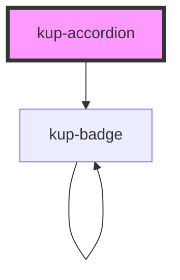

# kup-accordion

<!-- Auto Generated Below -->

## Properties

| Property      | Attribute      | Description                                                     | Type               | Default |
| ------------- | -------------- | --------------------------------------------------------------- | ------------------ | ------- |
| `customStyle` | `custom-style` | Custom style of the component.                                  | `string`           | `''`    |
| `data`        | --             | Data of the accordion.                                          | `KupAccordionData` | `null`  |
| `ripple`      | `ripple`       | When enabled displays Material's ripple effect on item headers. | `boolean`          | `true`  |

## Events

| Event                        | Description                     | Type                                                |
| ---------------------------- | ------------------------------- | --------------------------------------------------- |
| `kup-accordion-itemselected` | Fired when an item is selected. | `CustomEvent<KupAccordionItemSelectedEventPayload>` |

## Methods

### `collapseAll() => Promise<void>`

This method collapses all expandible items.

#### Returns

Type: `Promise<void>`

### `expandAll() => Promise<void>`

This method expands all expandible items.

#### Returns

Type: `Promise<void>`

### `getProps(descriptions?: boolean) => Promise<GenericObject>`

Used to retrieve component's props values.

#### Returns

Type: `Promise<GenericObject>`

List of props as object, each key will be a prop.

### `refresh() => Promise<void>`

This method is used to trigger a new render of the component.

#### Returns

Type: `Promise<void>`

### `setProps(props: GenericObject) => Promise<void>`

Sets the props to the component.

#### Returns

Type: `Promise<void>`

### `toggleItem(itemName: string) => Promise<void>`

This method activates or deactivates an item

#### Returns

Type: `Promise<void>`

## Dependencies

### Depends on

- [kup-badge](../kup-badge)

### Graph

----------------------------------------------

*Built with [StencilJS](https://stenciljs.com/)*
