# kup-autocomplete

<!-- Auto Generated Below -->

## Properties

| Property                  | Attribute                   | Description                                                                                                                              | Type                                                                                                                                                                | Default                          |
| ------------------------- | --------------------------- | ---------------------------------------------------------------------------------------------------------------------------------------- | ------------------------------------------------------------------------------------------------------------------------------------------------------------------- | -------------------------------- |
| `alert`                   | `alert`                     | Set alert message                                                                                                                        | `string`                                                                                                                                                            | `''`                             |
| `allowInconsistentValues` | `allow-inconsistent-values` | When true, the autocomplete fires the change event even when the value typed isn't included in the autocomplete list.                    | `boolean`                                                                                                                                                           | `true`                           |
| `customStyle`             | `custom-style`              | Custom style of the component.                                                                                                           | `string`                                                                                                                                                            | `''`                             |
| `data`                    | --                          | Props of the sub-components.                                                                                                             | `Object`                                                                                                                                                            | `undefined`                      |
| `disabled`                | `disabled`                  | Defaults at false. When set to true, the component is disabled.                                                                          | `boolean`                                                                                                                                                           | `false`                          |
| `displayMode`             | `display-mode`              | Sets how to show the selected item value. Suported values: "CodeOnly", "DescOnly", "Both" or "CodeAndDesc" and "DescAndCode".            | `ItemsDisplayMode.CODE \| ItemsDisplayMode.CODE_AND_DESC \| ItemsDisplayMode.CODE_AND_DESC_ALIAS \| ItemsDisplayMode.DESCRIPTION \| ItemsDisplayMode.DESC_AND_CODE` | `ItemsDisplayMode.DESCRIPTION`   |
| `error`                   | `error`                     | Set error message                                                                                                                        | `string`                                                                                                                                                            | `''`                             |
| `icon`                    | `icon`                      | When set, the text-field will show this icon.                                                                                            | `string`                                                                                                                                                            | `null`                           |
| `initialValue`            | `initial-value`             | Sets the initial value of the component.                                                                                                 | `string`                                                                                                                                                            | `''`                             |
| `initialValueDecode`      | `initial-value-decode`      | Sets the initial value decode of the component                                                                                           | `string`                                                                                                                                                            | `''`                             |
| `inputDelay`              | `input-delay`               | Input event emission delay in milliseconds.                                                                                              | `number`                                                                                                                                                            | `300`                            |
| `isClearable`             | `is-clearable`              | Enables a clear trailing icon.                                                                                                           | `boolean`                                                                                                                                                           | `false`                          |
| `label`                   | `label`                     | When set, its content will be shown as a label.                                                                                          | `string`                                                                                                                                                            | `null`                           |
| `leadingLabel`            | `leading-label`             | When set to true, the label will be on the left of the component.                                                                        | `boolean`                                                                                                                                                           | `false`                          |
| `legacyLook`              | `legacy-look`               | Allows legacyLook in ACP                                                                                                                 | `boolean`                                                                                                                                                           | `false`                          |
| `listDisplayMode`         | `list-display-mode`         | Sets how to show the selected item value. Suported values: "CodeOnly", "DescOnly", "Both" or "CodeAndDesc" and "DescAndCode".            | `ItemsDisplayMode.CODE \| ItemsDisplayMode.CODE_AND_DESC \| ItemsDisplayMode.CODE_AND_DESC_ALIAS \| ItemsDisplayMode.DESCRIPTION \| ItemsDisplayMode.DESC_AND_CODE` | `ItemsDisplayMode.CODE_AND_DESC` |
| `minimumChars`            | `minimum-chars`             | The minimum number of chars to trigger the autocomplete                                                                                  | `number`                                                                                                                                                            | `3`                              |
| `placeholder`             | `placeholder`               | Set custom placeholder / watermark for text field, if not set the default one will be taken on component load.                           | `string`                                                                                                                                                            | `null`                           |
| `readOnly`                | `read-only`                 | Sets the component to read only state, making it not editable, but interactable. Used in combobox component when it behaves as a select. | `boolean`                                                                                                                                                           | `false`                          |
| `selectMode`              | `select-mode`               | Sets how to return the selected item value. Suported values: "CodeOnly", "DescOnly", "Both" or "CodeAndDesc" and "DescAndCode".          | `ItemsDisplayMode.CODE \| ItemsDisplayMode.CODE_AND_DESC \| ItemsDisplayMode.CODE_AND_DESC_ALIAS \| ItemsDisplayMode.DESCRIPTION \| ItemsDisplayMode.DESC_AND_CODE` | `ItemsDisplayMode.CODE`          |
| `serverHandledFilter`     | `server-handled-filter`     | When true, the items filter is managed server side, otherwise items filter is done client side.                                          | `boolean`                                                                                                                                                           | `true`                           |
| `showDropDownIcon`        | `show-drop-down-icon`       | When true shows the drop-down icon, for open list.                                                                                       | `boolean`                                                                                                                                                           | `true`                           |
| `showMarker`              | `show-marker`               | When true shows a small marker on the component.                                                                                         | `boolean`                                                                                                                                                           | `false`                          |
| `size`                    | `size`                      | Sets the size of the input element                                                                                                       | `number`                                                                                                                                                            | `undefined`                      |
| `sizing`                  | `sizing`                    | Sets the type of the button                                                                                                              | `KupComponentSizing.EXTRA_LARGE \| KupComponentSizing.EXTRA_SMALL \| KupComponentSizing.LARGE \| KupComponentSizing.MEDIUM \| KupComponentSizing.SMALL`             | `KupComponentSizing.SMALL`       |
| `trailingIcon`            | `trailing-icon`             | When set, the icon will be shown after the text.                                                                                         | `boolean`                                                                                                                                                           | `false`                          |

## Events

| Event                        | Description | Type                                                |
| ---------------------------- | ----------- | --------------------------------------------------- |
| `kup-autocomplete-blur`      |             | `CustomEvent<KupAutocompleteEventPayload>`          |
| `kup-autocomplete-change`    |             | `CustomEvent<KupAutocompleteEventPayload>`          |
| `kup-autocomplete-click`     |             | `CustomEvent<KupAutocompleteEventPayload>`          |
| `kup-autocomplete-focus`     |             | `CustomEvent<KupAutocompleteEventPayload>`          |
| `kup-autocomplete-iconclick` |             | `CustomEvent<KupAutocompleteIconClickEventPayload>` |
| `kup-autocomplete-input`     |             | `CustomEvent<KupAutocompleteEventPayload>`          |
| `kup-autocomplete-itemclick` |             | `CustomEvent<KupAutocompleteEventPayload>`          |
| `kup-autocomplete-submit`    |             | `CustomEvent<KupAutocompleteEventPayload>`          |

## Methods

### `getProps(descriptions?: boolean) => Promise<GenericObject>`

Used to retrieve component's props values.

#### Parameters

| Name           | Type      | Description                                                                            |
| -------------- | --------- | -------------------------------------------------------------------------------------- |
| `descriptions` | `boolean` | - When provided and true, the result will be the list of props with their description. |

#### Returns

Type: `Promise<GenericObject>`

List of props as object, each key will be a prop.

### `getValue() => Promise<string>`

Used to retrieve the value of the component.

#### Returns

Type: `Promise<string>`

Value of the component.

### `refresh() => Promise<void>`

This method is used to trigger a new render of the component.

#### Returns

Type: `Promise<void>`

### `reset() => Promise<void>`

Calls closeList method (acts like a reset).

#### Returns

Type: `Promise<void>`

### `setFocus() => Promise<void>`

Sets the focus to the component.

#### Returns

Type: `Promise<void>`

### `setProps(props: GenericObject) => Promise<void>`

Sets the props to the component.

#### Parameters

| Name    | Type            | Description                                                  |
| ------- | --------------- | ------------------------------------------------------------ |
| `props` | `GenericObject` | - Object containing props that will be set to the component. |

#### Returns

Type: `Promise<void>`

### `setValue(value: string, valueDecode?: string) => Promise<void>`

Sets the value of the component.

#### Parameters

| Name          | Type     | Description               |
| ------------- | -------- | ------------------------- |
| `value`       | `string` | - Value of the component. |
| `valueDecode` | `string` |                           |

#### Returns

Type: `Promise<void>`

## Dependencies

### Used by

 - [kup-box](../kup-box)
 - [kup-card](../kup-card)
 - [kup-cell](../kup-cell)
 - [kup-data-table](../kup-data-table)
 - [kup-form](../kup-form)
 - [kup-image-list](../kup-image-list)
 - [kup-input-panel](../kup-input-panel)
 - [kup-toolbar](../kup-toolbar)
 - [kup-tree](../kup-tree)

### Depends on

- [kup-list](../kup-list)
- [kup-card](../kup-card)
- [kup-dialog](../kup-dialog)
- [kup-badge](../kup-badge)

### Graph

```mermaid
graph TD;
  kup-autocomplete --> kup-list
  kup-autocomplete --> kup-card
  kup-autocomplete --> kup-dialog
  kup-autocomplete --> kup-badge
  kup-list --> kup-list
  kup-list --> kup-radio
  kup-list --> kup-card
  kup-list --> kup-dialog
  kup-list --> kup-badge
  kup-radio --> kup-card
  kup-radio --> kup-dialog
  kup-radio --> kup-badge
  kup-card --> kup-autocomplete
  kup-image --> kup-card
  kup-image --> kup-image
  kup-image --> kup-dialog
  kup-image --> kup-spinner
  kup-image --> kup-badge
  kup-dialog --> kup-badge
  kup-dialog --> kup-card
  kup-dialog --> kup-dialog
  kup-badge --> kup-badge
  kup-badge --> kup-card
  kup-badge --> kup-dialog
  kup-spinner --> kup-card
  kup-spinner --> kup-dialog
  kup-chip --> kup-card
  kup-chip --> kup-dialog
  kup-chip --> kup-badge
  kup-text-field --> kup-card
  kup-text-field --> kup-dialog
  kup-text-field --> kup-badge
  kup-color-picker --> kup-card
  kup-color-picker --> kup-dialog
  kup-color-picker --> kup-badge
  kup-combobox --> kup-list
  kup-combobox --> kup-card
  kup-combobox --> kup-dialog
  kup-combobox --> kup-badge
  kup-date-picker --> kup-card
  kup-date-picker --> kup-dialog
  kup-date-picker --> kup-badge
  kup-file-upload --> kup-spinner
  kup-file-upload --> kup-card
  kup-file-upload --> kup-dialog
  kup-file-upload --> kup-badge
  kup-rating --> kup-card
  kup-rating --> kup-dialog
  kup-time-picker --> kup-card
  kup-time-picker --> kup-list
  kup-time-picker --> kup-dialog
  kup-time-picker --> kup-badge
  kup-button-list --> kup-dropdown-button
  kup-button-list --> kup-card
  kup-button-list --> kup-dialog
  kup-button-list --> kup-badge
  kup-dropdown-button --> kup-list
  kup-dropdown-button --> kup-card
  kup-dropdown-button --> kup-dialog
  kup-dropdown-button --> kup-badge
  kup-chart --> kup-card
  kup-chart --> kup-dialog
  kup-gauge --> kup-card
  kup-gauge --> kup-dialog
  kup-progress-bar --> kup-card
  kup-progress-bar --> kup-dialog
  kup-toolbar --> kup-autocomplete
  kup-button --> kup-card
  kup-button --> kup-dialog
  kup-button --> kup-badge
  kup-checkbox --> kup-card
  kup-checkbox --> kup-dialog
  kup-checkbox --> kup-badge
  kup-data-table --> kup-autocomplete
  kup-switch --> kup-card
  kup-switch --> kup-dialog
  kup-form --> kup-autocomplete
  kup-tree --> kup-autocomplete
  kup-tab-bar --> kup-toolbar
  kup-tab-bar --> kup-list
  kup-tab-bar --> kup-card
  kup-tab-bar --> kup-dialog
  kup-tab-bar --> kup-badge
  kup-box --> kup-autocomplete
  kup-cell --> kup-autocomplete
  kup-image-list --> kup-autocomplete
  kup-input-panel --> kup-autocomplete
  style kup-autocomplete fill:#f9f,stroke:#333,stroke-width:4px
```

----------------------------------------------

*Built with [StencilJS](https://stenciljs.com/)*
