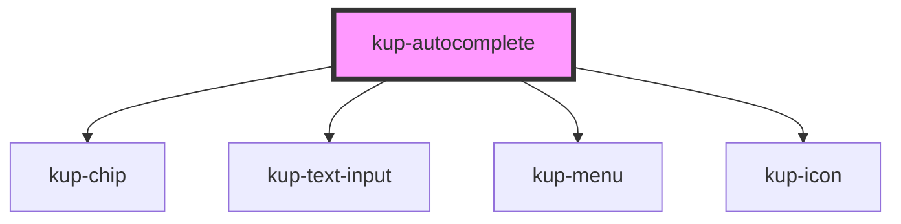

# kup-autocomplete

<!-- Auto Generated Below -->

## Properties

| Property            | Attribute            | Description                                                                                            | Type                                                                                                                  | Default                                                    |
| ------------------- | -------------------- | ------------------------------------------------------------------------------------------------------ | --------------------------------------------------------------------------------------------------------------------- | ---------------------------------------------------------- |
| `disabled`          | `disabled`           | Sets if the autocomplete should be enabled or not                                                      | `boolean`                                                                                                             | `false`                                                    |
| `displayMode`       | `display-mode`       | Selects how the autocomplete items must display their label and how they can be filtered for           | `AutocompleteDisplayMode.CODE \| AutocompleteDisplayMode.DESCRIPTION \| AutocompleteDisplayMode.DESCRIPTION_AND_CODE` | `AutocompleteDisplayMode.DESCRIPTION_AND_CODE`             |
| `items`             | --                   | Sets the checkbox to be disabled  Must have reflect into the attribute                                 | `KupAutocompleteOption[]`                                                                                             | `[]`                                                       |
| `limitResults`      | `limit-results`      |                                                                                                        | `number`                                                                                                              | `0`                                                        |
| `minimumChars`      | `minimum-chars`      | The minimum number of chars to trigger the autocomplete                                                | `number`                                                                                                              | `3`                                                        |
| `multipleSelection` | `multiple-selection` | Allows more than one option to be selected at the same time.                                           | `boolean`                                                                                                             | `false`                                                    |
| `noItemsLabel`      | `no-items-label`     | Label shown when there are no items found with a given filter                                          | `string`                                                                                                              | `'There are no items which\nmatch with the given filter.'` |
| `placeholder`       | `placeholder`        | The placeholder string to set to the input for the autocomplete                                        | `string`                                                                                                              | `'Choose'`                                                 |
| `showClearIcon`     | `show-clear-icon`    | Shows the icon to clear the input                                                                      | `boolean`                                                                                                             | `false`                                                    |
| `showDropdownIcon`  | `show-dropdown-icon` | Shows icon to force the dropdown menu to be opened                                                     | `boolean`                                                                                                             | `false`                                                    |
| `sortBy`            | `sort-by`            | If different than 'none', sorts displayed results accordingly to the order provided by sortOrder prop. | `AutocompleteSortBy.CODE \| AutocompleteSortBy.DESCRIPTION \| AutocompleteSortBy.NONE`                                | `AutocompleteSortBy.NONE`                                  |
| `sortOrder`         | `sort-order`         | Decides which type of sort must be applied to the list of rendered items.                              | `AutocompleteSortOrder.DECREASING \| AutocompleteSortOrder.INCREASING`                                                | `AutocompleteSortOrder.INCREASING`                         |

## Events

| Event                            | Description                                     | Type                                   |
| -------------------------------- | ----------------------------------------------- | -------------------------------------- |
| `kupAutocompleteSelectionUpdate` | Fired when the checkbox input changes its value | `CustomEvent<KupAutocompleteOption[]>` |

## Dependencies

### Depends on

- [kup-chip](..\kup-chip)
- [kup-text-input](..\kup-text-input)
- [kup-menu](..\kup-menu)
- [kup-icon](..\kup-icon)

### Graph

----------------------------------------------

*Built with [StencilJS](https://stenciljs.com/)*
