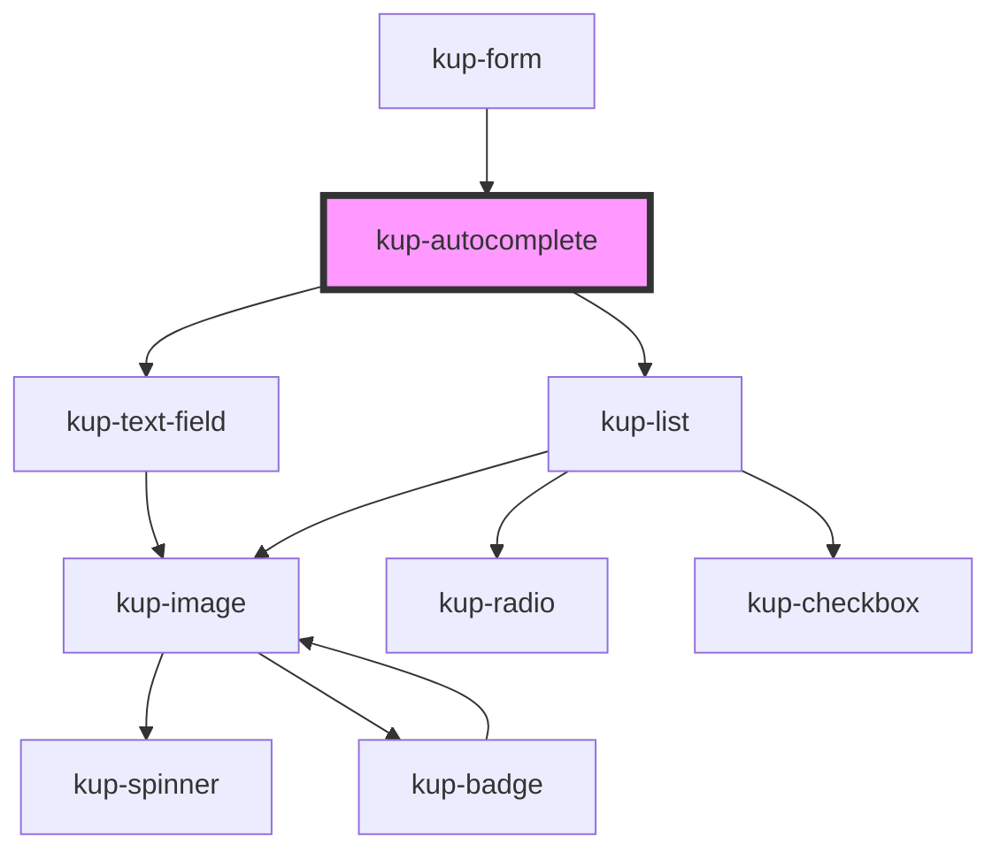

# kup-autocomplete

<!-- Auto Generated Below -->

## Properties

| Property                 | Attribute               | Description                                                                                                                                          | Type                                                                                                     | Default                 |
| ------------------------ | ----------------------- | ---------------------------------------------------------------------------------------------------------------------------------------------------- | -------------------------------------------------------------------------------------------------------- | ----------------------- |
| `callBackOnFilterUpdate` | --                      | Function that can be invoked when the filter is updated, but only if in serverHandledFilter mode. It returns the items filtered.                     | `(detail: { filter: string; matchesMinimumCharsRequired: boolean; el: EventTarget; }) => Promise<any[]>` | `undefined`             |
| `customStyle`            | `custom-style`          | Custom style of the component. For more information: https://ketchup.smeup.com/ketchup-showcase/#/customization                                      | `string`                                                                                                 | `undefined`             |
| `listData`               | --                      | Props of the list.                                                                                                                                   | `Object`                                                                                                 | `{}`                    |
| `minimumChars`           | `minimum-chars`         | The minimum number of chars to trigger the autocomplete                                                                                              | `number`                                                                                                 | `1`                     |
| `selectMode`             | `select-mode`           | Sets how the return the selected item value                                                                                                          | `ItemsDisplayMode.CODE \| ItemsDisplayMode.DESCRIPTION \| ItemsDisplayMode.DESCRIPTION_AND_CODE`         | `ItemsDisplayMode.CODE` |
| `serverHandledFilter`    | `server-handled-filter` | When true, it will emit events to inform the listener of the change of the current filter value. Also the component builtin filter will be disabled. | `boolean`                                                                                                | `false`                 |
| `textfieldData`          | --                      | Props of the text field.                                                                                                                             | `Object`                                                                                                 | `{}`                    |

## Events

| Event                          | Description    | Type                                                                     |
| ------------------------------ | -------------- | ------------------------------------------------------------------------ |
| `kupAutocompleteBlur`          | Event example. | `CustomEvent<{ value: any; }>`                                           |
| `kupAutocompleteChange`        |                | `CustomEvent<{ value: any; }>`                                           |
| `kupAutocompleteClick`         |                | `CustomEvent<{ value: any; }>`                                           |
| `kupAutocompleteFilterChanged` |                | `CustomEvent<{ filter: string; matchesMinimumCharsRequired: boolean; }>` |
| `kupAutocompleteFocus`         |                | `CustomEvent<{ value: any; }>`                                           |
| `kupAutocompleteIconClick`     |                | `CustomEvent<{ value: any; }>`                                           |
| `kupAutocompleteInput`         |                | `CustomEvent<{ value: any; }>`                                           |
| `kupAutocompleteItemClick`     |                | `CustomEvent<{ value: any; }>`                                           |

## Methods

### `refreshCustomStyle(customStyleTheme: string) => Promise<void>`

#### Returns

Type: `Promise<void>`

## Dependencies

### Used by

 - [kup-form](../kup-form)

### Depends on

- [kup-text-field](../kup-text-field)
- [kup-list](../kup-list)

### Graph

----------------------------------------------

*Built with [StencilJS](https://stenciljs.com/)*
