# kup-autocomplete

<!-- Auto Generated Below -->

## Properties

| Property                  | Attribute                   | Description                                                                                                           | Type                                                                                             | Default                        |
| ------------------------- | --------------------------- | --------------------------------------------------------------------------------------------------------------------- | ------------------------------------------------------------------------------------------------ | ------------------------------ |
| `allowInconsistentValues` | `allow-inconsistent-values` | When true, the autocomplete fires the change event even when the value typed isn't included in the autocomplete list. | `boolean`                                                                                        | `false`                        |
| `customStyle`             | `custom-style`              | Custom style of the component.                                                                                        | `string`                                                                                         | `''`                           |
| `data`                    | --                          | Props of the sub-components.                                                                                          | `Object`                                                                                         | `undefined`                    |
| `disabled`                | `disabled`                  | Defaults at false. When set to true, the component is disabled.                                                       | `boolean`                                                                                        | `false`                        |
| `displayMode`             | `display-mode`              | Sets how to show the selected item value. Suported values: "code", "description", "both".                             | `ItemsDisplayMode.CODE \| ItemsDisplayMode.DESCRIPTION \| ItemsDisplayMode.DESCRIPTION_AND_CODE` | `ItemsDisplayMode.DESCRIPTION` |
| `initialValue`            | `initial-value`             | Sets the initial value of the component.                                                                              | `string`                                                                                         | `''`                           |
| `inputDelay`              | `input-delay`               | Input event emission delay in milliseconds.                                                                           | `number`                                                                                         | `300`                          |
| `minimumChars`            | `minimum-chars`             | The minimum number of chars to trigger the autocomplete                                                               | `number`                                                                                         | `1`                            |
| `selectMode`              | `select-mode`               | Sets how to return the selected item value. Suported values: "code", "description", "both".                           | `ItemsDisplayMode.CODE \| ItemsDisplayMode.DESCRIPTION \| ItemsDisplayMode.DESCRIPTION_AND_CODE` | `ItemsDisplayMode.CODE`        |
| `serverHandledFilter`     | `server-handled-filter`     | When true, the items filter is managed server side, otherwise items filter is done client side.                       | `boolean`                                                                                        | `false`                        |
| `showDropDownIcon`        | `show-drop-down-icon`       | When true shows the drop-down icon, for open list.                                                                    | `boolean`                                                                                        | `true`                         |

## Events

| Event                        | Description | Type                                                |
| ---------------------------- | ----------- | --------------------------------------------------- |
| `kup-autocomplete-blur`      |             | `CustomEvent<KupAutocompleteEventPayload>`          |
| `kup-autocomplete-change`    |             | `CustomEvent<KupAutocompleteEventPayload>`          |
| `kup-autocomplete-click`     |             | `CustomEvent<KupAutocompleteEventPayload>`          |
| `kup-autocomplete-focus`     |             | `CustomEvent<KupAutocompleteEventPayload>`          |
| `kup-autocomplete-iconclick` |             | `CustomEvent<KupAutocompleteIconClickEventPayload>` |
| `kup-autocomplete-input`     |             | `CustomEvent<KupAutocompleteEventPayload>`          |
| `kup-autocomplete-itemclick` |             | `CustomEvent<KupAutocompleteEventPayload>`          |

## Methods

### `getProps(descriptions?: boolean) => Promise<GenericObject>`

Used to retrieve component's props values.

#### Returns

Type: `Promise<GenericObject>`

List of props as object, each key will be a prop.

### `getValue() => Promise<string>`

Used to retrieve the value of the component.

#### Returns

Type: `Promise<string>`

Value of the component.

### `refresh() => Promise<void>`

This method is used to trigger a new render of the component.

#### Returns

Type: `Promise<void>`

### `setFocus() => Promise<void>`

Sets the focus to the component.

#### Returns

Type: `Promise<void>`

### `setProps(props: GenericObject) => Promise<void>`

Sets the props to the component.

#### Returns

Type: `Promise<void>`

### `setValue(value: string) => Promise<void>`

Sets the value of the component.

#### Returns

Type: `Promise<void>`

## Dependencies

### Used by

 - [kup-box](../kup-box)
 - [kup-card](../kup-card)
 - [kup-cell](../kup-cell)
 - [kup-data-table](../kup-data-table)
 - [kup-form](../kup-form)
 - [kup-image-list](../kup-image-list)
 - [kup-tree](../kup-tree)

### Depends on

- [kup-list](../kup-list)
- [kup-card](../kup-card)

### Graph

```mermaid
graph TD;
  kup-autocomplete --> kup-list
  kup-autocomplete --> kup-card
  kup-list --> kup-list
  kup-list --> kup-radio
  kup-list --> kup-card
  kup-list --> kup-badge
  kup-radio --> kup-card
  kup-card --> kup-autocomplete
  kup-color-picker --> kup-card
  kup-combobox --> kup-list
  kup-combobox --> kup-card
  kup-date-picker --> kup-card
  kup-rating --> kup-card
  kup-time-picker --> kup-card
  kup-time-picker --> kup-list
  kup-image --> kup-spinner
  kup-image --> kup-card
  kup-image --> kup-badge
  kup-spinner --> kup-card
  kup-badge --> kup-badge
  kup-badge --> kup-card
  kup-button --> kup-card
  kup-button --> kup-badge
  kup-button-list --> kup-dropdown-button
  kup-button-list --> kup-card
  kup-button-list --> kup-badge
  kup-dropdown-button --> kup-list
  kup-dropdown-button --> kup-card
  kup-dropdown-button --> kup-badge
  kup-chart --> kup-card
  kup-gauge --> kup-card
  kup-progress-bar --> kup-card
  kup-chip --> kup-card
  kup-chip --> kup-badge
  kup-form --> kup-autocomplete
  kup-checkbox --> kup-card
  kup-text-field --> kup-card
  kup-data-table --> kup-autocomplete
  kup-switch --> kup-card
  kup-tab-bar --> kup-card
  kup-tab-bar --> kup-badge
  kup-tree --> kup-autocomplete
  kup-box --> kup-autocomplete
  kup-cell --> kup-autocomplete
  kup-image-list --> kup-autocomplete
  style kup-autocomplete fill:#f9f,stroke:#333,stroke-width:4px
```

----------------------------------------------

*Built with [StencilJS](https://stenciljs.com/)*
