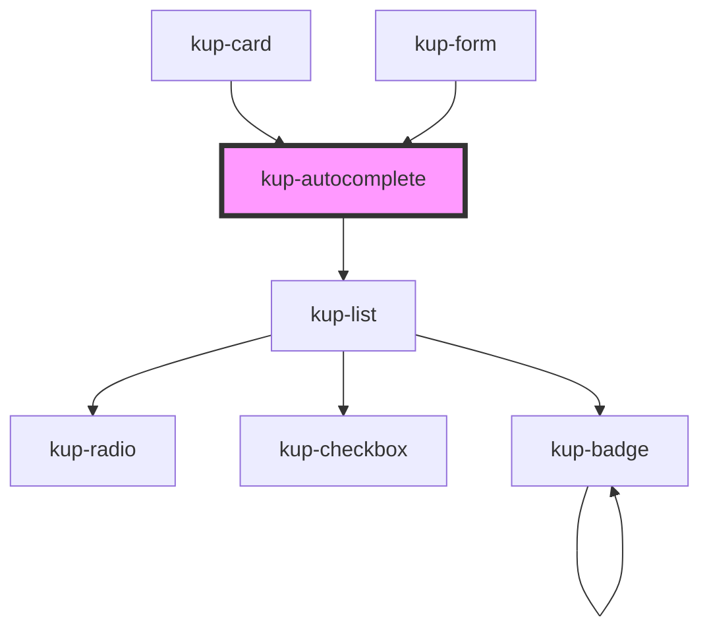

# kup-autocomplete

<!-- Auto Generated Below -->

## Properties

| Property                 | Attribute               | Description                                                                                                                                          | Type                                                                                                     | Default                        |
| ------------------------ | ----------------------- | ---------------------------------------------------------------------------------------------------------------------------------------------------- | -------------------------------------------------------------------------------------------------------- | ------------------------------ |
| `callBackOnFilterUpdate` | --                      | Function that can be invoked when the filter is updated, but only if in serverHandledFilter mode. It returns the items filtered.                     | `(detail: { filter: string; matchesMinimumCharsRequired: boolean; el: EventTarget; }) => Promise<any[]>` | `undefined`                    |
| `customStyle`            | `custom-style`          | Custom style of the component. For more information: https://ketchup.smeup.com/ketchup-showcase/#/customization                                      | `string`                                                                                                 | `''`                           |
| `data`                   | --                      | Props of the sub-components.                                                                                                                         | `Object`                                                                                                 | `undefined`                    |
| `disabled`               | `disabled`              | Defaults at false. When set to true, the component is disabled.                                                                                      | `boolean`                                                                                                | `false`                        |
| `displayMode`            | `display-mode`          | Sets how to show the selected item value. Suported values: "code", "description", "both".                                                            | `ItemsDisplayMode.CODE \| ItemsDisplayMode.DESCRIPTION \| ItemsDisplayMode.DESCRIPTION_AND_CODE`         | `ItemsDisplayMode.DESCRIPTION` |
| `initialValue`           | `initial-value`         | Sets the initial value of the component.                                                                                                             | `string`                                                                                                 | `''`                           |
| `minimumChars`           | `minimum-chars`         | The minimum number of chars to trigger the autocomplete                                                                                              | `number`                                                                                                 | `1`                            |
| `selectMode`             | `select-mode`           | Sets how to return the selected item value. Suported values: "code", "description", "both".                                                          | `ItemsDisplayMode.CODE \| ItemsDisplayMode.DESCRIPTION \| ItemsDisplayMode.DESCRIPTION_AND_CODE`         | `ItemsDisplayMode.CODE`        |
| `serverHandledFilter`    | `server-handled-filter` | When true, it will emit events to inform the listener of the change of the current filter value. Also the component builtin filter will be disabled. | `boolean`                                                                                                | `false`                        |

## Events

| Event                            | Description    | Type                                                                                            |
| -------------------------------- | -------------- | ----------------------------------------------------------------------------------------------- |
| `kupAutocompleteBlur`            | Event example. | `CustomEvent<{ value: any; id: string; comp: KupAutocomplete; }>`                               |
| `kupAutocompleteChange`          |                | `CustomEvent<{ value: any; id: string; comp: KupAutocomplete; }>`                               |
| `kupAutocompleteClick`           |                | `CustomEvent<{ value: any; id: string; comp: KupAutocomplete; }>`                               |
| `kupAutocompleteFilterChanged`   |                | `CustomEvent<{ filter: string; matchesMinimumCharsRequired: boolean; comp: KupAutocomplete; }>` |
| `kupAutocompleteFocus`           |                | `CustomEvent<{ value: any; id: string; comp: KupAutocomplete; }>`                               |
| `kupAutocompleteIconClick`       |                | `CustomEvent<{ value: any; id: string; comp: KupAutocomplete; }>`                               |
| `kupAutocompleteInput`           |                | `CustomEvent<{ value: any; id: string; comp: KupAutocomplete; }>`                               |
| `kupAutocompleteItemClick`       |                | `CustomEvent<{ value: any; id: string; comp: KupAutocomplete; }>`                               |
| `kupAutocompleteTextFieldSubmit` |                | `CustomEvent<{ value: any; id: string; comp: KupAutocomplete; }>`                               |

## Methods

### `getProps(descriptions?: boolean) => Promise<GenericObject>`

Used to retrieve component's props values.

#### Returns

Type: `Promise<GenericObject>`

### `getValue() => Promise<string>`

#### Returns

Type: `Promise<string>`

### `refresh() => Promise<void>`

This method is used to trigger a new render of the component.

#### Returns

Type: `Promise<void>`

### `setFocus() => Promise<void>`

#### Returns

Type: `Promise<void>`

### `setValue(value: string) => Promise<void>`

#### Returns

Type: `Promise<void>`

## Dependencies

### Used by

 - [kup-card](../kup-card)
 - [kup-form](../kup-form)

### Depends on

- [kup-list](../kup-list)

### Graph

----------------------------------------------

*Built with [StencilJS](https://stenciljs.com/)*
