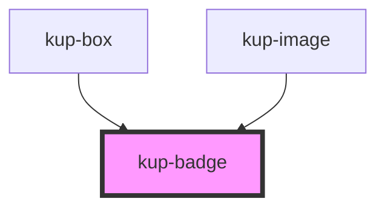

# kup-badge

<!-- Auto Generated Below -->

## Properties

| Property   | Attribute  | Description | Type                                                                                                           | Default                   |
| ---------- | ---------- | ----------- | -------------------------------------------------------------------------------------------------------------- | ------------------------- |
| `icon`     | `icon`     |             | `string`                                                                                                       | `undefined`               |
| `position` | `position` |             | `BadgePosition.BOTTOM_LEFT \| BadgePosition.BOTTOM_RIGHT \| BadgePosition.TOP_LEFT \| BadgePosition.TOP_RIGHT` | `BadgePosition.TOP_RIGHT` |
| `text`     | `text`     |             | `string`                                                                                                       | `undefined`               |

## CSS Custom Properties

| Name                                                   | Description            |
| ------------------------------------------------------ | ---------------------- |
| `--bdg-background-color, --kup-badge_background-color` | badge background color |
| `--bdg-color, --kup-badge_color`                       | badge text color       |

## Dependencies

### Used by

 - [kup-box](../kup-box)
 - [kup-image](../kup-image)

### Graph

----------------------------------------------

*Built with [StencilJS](https://stenciljs.com/)*
