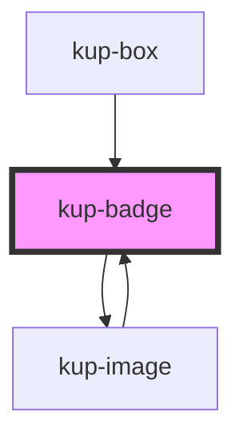

# kup-badge

<!-- Auto Generated Below -->

## Properties

| Property      | Attribute      | Description                                                                                                                                    | Type                                                                                                           | Default                  |
| ------------- | -------------- | ---------------------------------------------------------------------------------------------------------------------------------------------- | -------------------------------------------------------------------------------------------------------------- | ------------------------ |
| `customStyle` | `custom-style` | Custom style of the component. For more information: https://ketchup.smeup.com/ketchup-showcase/#/customization                                | `string`                                                                                                       | `undefined`              |
| `imageData`   | --             | The data of the image displayed inside the badge.                                                                                              | `{}`                                                                                                           | `undefined`              |
| `position`    | `position`     | The position of the badge relative to its parent. Supported values: "TL" (top left), "TR" (top right), "BL" (bottom left), "BR" (bottom left). | `BadgePosition.BOTTOM_LEFT \| BadgePosition.BOTTOM_RIGHT \| BadgePosition.TOP_LEFT \| BadgePosition.TOP_RIGHT` | `BadgePosition.TOP_LEFT` |
| `text`        | `text`         | The text displayed inside the badge.                                                                                                           | `string`                                                                                                       | `undefined`              |

## Events

| Event           | Description | Type                                |
| --------------- | ----------- | ----------------------------------- |
| `kupBadgeClick` |             | `CustomEvent<{ el: EventTarget; }>` |

## Methods

### `refreshCustomStyle(customStyleTheme: string) => Promise<void>`

#### Returns

Type: `Promise<void>`

## Dependencies

### Used by

 - [kup-box](../kup-box)
 - [kup-image](../kup-image)

### Depends on

- [kup-image](../kup-image)

### Graph

----------------------------------------------

*Built with [StencilJS](https://stenciljs.com/)*
