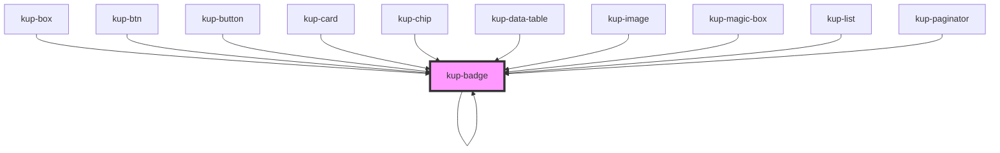

# kup-badge

<!-- Auto Generated Below -->

## Properties

| Property | Attribute | Description | Type | Default |
| --- | --- | --- | --- | --- |
| `customStyle` | `custom-style` | Custom style of the component. For more information: https://ketchup.smeup.com/ketchup-showcase/#/customization | `string` | `''` |
| `imageData` | -- | The data of the image displayed inside the badge. | `{}` | `undefined` |
| `text` | `text` | The text displayed inside the badge. | `string` | `undefined` |

## Events

| Event           | Description | Type                                |
| --------------- | ----------- | ----------------------------------- |
| `kupBadgeClick` |             | `CustomEvent<{ el: EventTarget; }>` |

## Methods

### `getProps(descriptions?: boolean) => Promise<GenericObject>`

Used to retrieve component's props values.

#### Returns

Type: `Promise<GenericObject>`

### `themeChangeCallback(customStyleTheme: string) => Promise<void>`

#### Returns

Type: `Promise<void>`

## Dependencies

### Used by

-   [kup-badge](.)
-   [kup-box](../kup-box)
-   [kup-btn](../kup-btn)
-   [kup-button](../kup-button)
-   [kup-card](../kup-card)
-   [kup-chip](../kup-chip)
-   [kup-data-table](../kup-data-table)
-   [kup-image](../kup-image)
-   [kup-magic-box](../kup-magic-box)
-   [kup-list](../kup-list)
-   [kup-paginator](../kup-paginator)

### Depends on

-   [kup-badge](.)

### Graph

---

_Built with [StencilJS](https://stenciljs.com/)_
