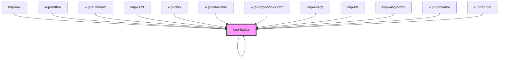

# kup-badge

<!-- Auto Generated Below -->

## Properties

| Property      | Attribute      | Description                                                                                                     | Type     | Default     |
| ------------- | -------------- | --------------------------------------------------------------------------------------------------------------- | -------- | ----------- |
| `customStyle` | `custom-style` | Custom style of the component. For more information: https://ketchup.smeup.com/ketchup-showcase/#/customization | `string` | `''`        |
| `imageData`   | --             | The data of the image displayed inside the badge.                                                               | `{}`     | `undefined` |
| `text`        | `text`         | The text displayed inside the badge.                                                                            | `string` | `undefined` |

## Events

| Event             | Description | Type                                |
| ----------------- | ----------- | ----------------------------------- |
| `kup-badge-click` |             | `CustomEvent<KupBadgeEventPayload>` |

## Methods

### `getProps(descriptions?: boolean) => Promise<GenericObject>`

Used to retrieve component's props values.

#### Returns

Type: `Promise<GenericObject>`

### `refresh() => Promise<void>`

This method is used to trigger a new render of the component.

#### Returns

Type: `Promise<void>`

### `setProps(props: GenericObject) => Promise<void>`

Sets the props to the component.

#### Returns

Type: `Promise<void>`

## Dependencies

### Used by

 - [kup-badge](.)
 - [kup-box](../kup-box)
 - [kup-button](../kup-button)
 - [kup-button-list](../kup-button-list)
 - [kup-card](../kup-card)
 - [kup-chip](../kup-chip)
 - [kup-data-table](../kup-data-table)
 - [kup-dropdown-button](../kup-dropdown-button)
 - [kup-image](../kup-image)
 - [kup-list](../kup-list)
 - [kup-magic-box](../kup-magic-box)
 - [kup-paginator](../kup-paginator)
 - [kup-tab-bar](../kup-tab-bar)

### Depends on

- [kup-badge](.)

### Graph

----------------------------------------------

*Built with [StencilJS](https://stenciljs.com/)*
