# kup-badge

<!-- Auto Generated Below -->

## Properties

| Property      | Attribute      | Description                                       | Type                                                                          | Default          |
| ------------- | -------------- | ------------------------------------------------- | ----------------------------------------------------------------------------- | ---------------- |
| `customStyle` | `custom-style` | Custom style of the component.                    | `string`                                                                      | `''`             |
| `imageData`   | --             | The data of the image displayed inside the badge. | `GenericObject`                                                               | `null`           |
| `text`        | `text`         | The text displayed inside the badge.              | `string`                                                                      | `null`           |
| `type`        | `type`         | The gravity of the badge.                         | `BadgeType.ERROR \| BadgeType.INFO \| BadgeType.SUCCESS \| BadgeType.WARNING` | `BadgeType.INFO` |

## Events

| Event             | Description | Type                           |
| ----------------- | ----------- | ------------------------------ |
| `kup-badge-click` |             | `CustomEvent<KupEventPayload>` |

## Methods

### `getProps(descriptions?: boolean) => Promise<GenericObject>`

Used to retrieve component's props values.

#### Parameters

| Name           | Type      | Description                                                                            |
| -------------- | --------- | -------------------------------------------------------------------------------------- |
| `descriptions` | `boolean` | - When provided and true, the result will be the list of props with their description. |

#### Returns

Type: `Promise<GenericObject>`

List of props as object, each key will be a prop.

### `refresh() => Promise<void>`

This method is used to trigger a new render of the component.

#### Returns

Type: `Promise<void>`

### `setProps(props: GenericObject) => Promise<void>`

Sets the props to the component.

#### Parameters

| Name    | Type            | Description                                                  |
| ------- | --------------- | ------------------------------------------------------------ |
| `props` | `GenericObject` | - Object containing props that will be set to the component. |

#### Returns

Type: `Promise<void>`

## CSS Custom Properties

| Name                                | Description                              |
| ----------------------------------- | ---------------------------------------- |
| `--kup-badge-border-radius`         | Sets border radius of the badge.         |
| `--kup-badge-font-family`           | Sets font family of the badge.           |
| `--kup-badge-font-size`             | Sets font size of the badge.             |
| `--kup-badge-min-size`              | Sets minimum size of the badge.          |
| `--kup-badge-padding`               | Sets padding of the badge.               |
| `--kup-badge-primary-color`         | Sets primary color of the badge.         |
| `--kup-badge-text-on-primary-color` | Sets text on primary color of the badge. |

## Dependencies

### Used by

 - [kup-accordion](../kup-accordion)
 - [kup-badge](.)
 - [kup-box](../kup-box)
 - [kup-button](../kup-button)
 - [kup-button-list](../kup-button-list)
 - [kup-calendar](../kup-calendar)
 - [kup-card](../kup-card)
 - [kup-cell](../kup-cell)
 - [kup-chip](../kup-chip)
 - [kup-dashboard](../kup-dashboard)
 - [kup-data-table](../kup-data-table)
 - [kup-dialog](../kup-dialog)
 - [kup-dropdown-button](../kup-dropdown-button)
 - [kup-family-tree](../kup-family-tree)
 - [kup-form](../kup-form)
 - [kup-image](../kup-image)
 - [kup-image-list](../kup-image-list)
 - [kup-input-panel](../kup-input-panel)
 - [kup-list](../kup-list)
 - [kup-magic-box](../kup-magic-box)
 - [kup-snackbar](../kup-snackbar)
 - [kup-tab-bar](../kup-tab-bar)
 - [kup-tree](../kup-tree)

### Depends on

- [kup-badge](.)
- [kup-card](../kup-card)
- [kup-dialog](../kup-dialog)

### Graph

```mermaid
graph TD;
  kup-badge --> kup-badge
  kup-card --> kup-badge
  kup-autocomplete --> kup-list
  kup-autocomplete --> kup-card
  kup-autocomplete --> kup-dialog
  kup-list --> kup-badge
  kup-radio --> kup-card
  kup-radio --> kup-dialog
  kup-dialog --> kup-badge
  kup-chip --> kup-badge
  kup-text-field --> kup-card
  kup-text-field --> kup-dialog
  kup-color-picker --> kup-card
  kup-color-picker --> kup-dialog
  kup-combobox --> kup-list
  kup-combobox --> kup-card
  kup-combobox --> kup-dialog
  kup-date-picker --> kup-card
  kup-date-picker --> kup-dialog
  kup-rating --> kup-card
  kup-rating --> kup-dialog
  kup-time-picker --> kup-card
  kup-time-picker --> kup-list
  kup-time-picker --> kup-dialog
  kup-image --> kup-badge
  kup-spinner --> kup-card
  kup-spinner --> kup-dialog
  kup-button-list --> kup-badge
  kup-dropdown-button --> kup-badge
  kup-chart --> kup-card
  kup-chart --> kup-dialog
  kup-gauge --> kup-card
  kup-gauge --> kup-dialog
  kup-progress-bar --> kup-card
  kup-progress-bar --> kup-dialog
  kup-button --> kup-badge
  kup-checkbox --> kup-card
  kup-checkbox --> kup-dialog
  kup-data-table --> kup-badge
  kup-switch --> kup-card
  kup-switch --> kup-dialog
  kup-form --> kup-badge
  kup-tab-bar --> kup-badge
  kup-tree --> kup-badge
  kup-accordion --> kup-badge
  kup-box --> kup-badge
  kup-calendar --> kup-badge
  kup-cell --> kup-badge
  kup-dashboard --> kup-badge
  kup-family-tree --> kup-badge
  kup-image-list --> kup-badge
  kup-input-panel --> kup-badge
  kup-magic-box --> kup-badge
  kup-snackbar --> kup-badge
  style kup-badge fill:#f9f,stroke:#333,stroke-width:4px
```

----------------------------------------------

*Built with [StencilJS](https://stenciljs.com/)*
