# kup-box

<!-- Auto Generated Below -->

## Properties

| Property            | Attribute             | Description                                                                                                                                             | Type                                                                                             | Default                              |
| ------------------- | --------------------- | ------------------------------------------------------------------------------------------------------------------------------------------------------- | ------------------------------------------------------------------------------------------------ | ------------------------------------ |
| `cardData`          | --                    | Data of the card linked to the box when the latter's layout must be a premade template.                                                                 | `GenericObject`                                                                                  | `null`                               |
| `columns`           | `columns`             | Number of columns                                                                                                                                       | `number`                                                                                         | `1`                                  |
| `customStyle`       | `custom-style`        | Custom style of the component.                                                                                                                          | `string`                                                                                         | `''`                                 |
| `data`              | --                    | Actual data of the box.                                                                                                                                 | `KupBoxData`                                                                                     | `null`                               |
| `dragEnabled`       | `drag-enabled`        | Enable dragging                                                                                                                                         | `boolean`                                                                                        | `false`                              |
| `dropEnabled`       | `drop-enabled`        | Enable dropping                                                                                                                                         | `boolean`                                                                                        | `false`                              |
| `dropOnSection`     | `drop-on-section`     | Drop can be done in section                                                                                                                             | `boolean`                                                                                        | `false`                              |
| `editableData`      | `editable-data`       | When set to true, editable cells will be rendered using input components.                                                                               | `boolean`                                                                                        | `false`                              |
| `enableRowActions`  | `enable-row-actions`  | If enabled, a button to load / display the row actions will be displayed on the right of every box                                                      | `boolean`                                                                                        | `false`                              |
| `globalFilter`      | `global-filter`       | When set to true it activates the global filter.                                                                                                        | `boolean`                                                                                        | `false`                              |
| `globalFilterValue` | `global-filter-value` | The value of the global filter.                                                                                                                         | `string`                                                                                         | `''`                                 |
| `kanban`            | --                    | Displays the boxlist as a Kanban.                                                                                                                       | `KupBoxKanban`                                                                                   | `null`                               |
| `layout`            | --                    | How the field will be displayed. If not present, a default one will be created.                                                                         | `KupBoxLayout`                                                                                   | `undefined`                          |
| `lazyLoadRows`      | `lazy-load-rows`      | When set to true, extra rows will be automatically loaded once the last row enters the viewport.                                                        | `boolean`                                                                                        | `false`                              |
| `loadMoreLimit`     | `load-more-limit`     | Sets a maximum limit of new records which can be required by the load more functionality.                                                               | `number`                                                                                         | `1000`                               |
| `loadMoreMode`      | `load-more-mode`      | Establish the modality of how many new records will be downloaded.  This property is regulated also by loadMoreStep.                                    | `LoadMoreMode.CONSTANT \| LoadMoreMode.CONSTANT_INCREMENT \| LoadMoreMode.PROGRESSIVE_THRESHOLD` | `LoadMoreMode.PROGRESSIVE_THRESHOLD` |
| `loadMoreStep`      | `load-more-step`      | The number of records which will be requested to be downloaded when clicking on the load more button.  This property is regulated also by loadMoreMode. | `number`                                                                                         | `60`                                 |
| `multiSelection`    | `multi-selection`     | Enable multi selection                                                                                                                                  | `boolean`                                                                                        | `false`                              |
| `pageSelected`      | `page-selected`       | Current page number                                                                                                                                     | `number`                                                                                         | `1`                                  |
| `pagination`        | `pagination`          | Enables pagination                                                                                                                                      | `boolean`                                                                                        | `false`                              |
| `rowsPerPage`       | `rows-per-page`       | Number of current rows per page                                                                                                                         | `number`                                                                                         | `undefined`                          |
| `scrollOnHover`     | `scroll-on-hover`     | Activates the scroll on hover function.                                                                                                                 | `boolean`                                                                                        | `false`                              |
| `selectBox`         | `select-box`          | Automatically selects the box at the specified index                                                                                                    | `number`                                                                                         | `undefined`                          |
| `selectedRowsState` | `selected-rows-state` | Multiple selection                                                                                                                                      | `string`                                                                                         | `undefined`                          |
| `showLoadMore`      | `show-load-more`      | If set to true, displays the button to load more records.                                                                                               | `boolean`                                                                                        | `false`                              |
| `showSelection`     | `show-selection`      | If enabled, highlights the selected box/boxes                                                                                                           | `boolean`                                                                                        | `true`                               |
| `sortBy`            | `sort-by`             | If sorting is enabled, specifies which column to sort                                                                                                   | `string`                                                                                         | `undefined`                          |
| `sortEnabled`       | `sort-enabled`        | Enable sorting                                                                                                                                          | `boolean`                                                                                        | `false`                              |
| `stateId`           | `state-id`            |                                                                                                                                                         | `string`                                                                                         | `''`                                 |
| `store`             | --                    |                                                                                                                                                         | `KupStore`                                                                                       | `undefined`                          |
| `swipeDisabled`     | `swipe-disabled`      | Disable swipe                                                                                                                                           | `boolean`                                                                                        | `false`                              |

## Events

| Event                        | Description                                               | Type                                            |
| ---------------------------- | --------------------------------------------------------- | ----------------------------------------------- |
| `kup-box-autoselect`         | Triggered when a box is auto selected via selectBox prop  | `CustomEvent<KupBoxAutoSelectEventPayload>`     |
| `kup-box-click`              | Triggered when a box is clicked                           | `CustomEvent<KupBoxClickEventPayload>`          |
| `kup-box-contextmenu`        | Generic right click event on box.                         | `CustomEvent<KupBoxContextMenuEventPayload>`    |
| `kup-box-didload`            |                                                           | `CustomEvent<KupEventPayload>`                  |
| `kup-box-didunload`          | Triggered when stop propagation event                     | `CustomEvent<KupEventPayload>`                  |
| `kup-box-loadmoreclick`      |                                                           | `CustomEvent<KupBoxLoadMoreClickEventPayload>`  |
| `kup-box-rowactionclick`     | When the row menu action icon is click                    | `CustomEvent<KupBoxRowActionClickEventPayload>` |
| `kup-box-rowactionmenuclick` | When the row menu action icon is click                    | `CustomEvent<KupBoxAutoSelectEventPayload>`     |
| `kup-box-selected`           | Triggered when the multi selection checkbox changes value | `CustomEvent<KupBoxSelectedEventPayload>`       |

## Methods

### `getProps(descriptions?: boolean) => Promise<GenericObject>`

Used to retrieve component's props values.

#### Parameters

| Name           | Type      | Description                                                                            |
| -------------- | --------- | -------------------------------------------------------------------------------------- |
| `descriptions` | `boolean` | - When provided and true, the result will be the list of props with their description. |

#### Returns

Type: `Promise<GenericObject>`

List of props as object, each key will be a prop.

### `loadRowActions(row: KupBoxRow, actions: KupDataRowAction[]) => Promise<void>`

#### Parameters

| Name      | Type                 | Description |
| --------- | -------------------- | ----------- |
| `row`     | `KupBoxRow`          |             |
| `actions` | `KupDataRowAction[]` |             |

#### Returns

Type: `Promise<void>`

### `refresh() => Promise<void>`

This method is used to trigger a new render of the component.

#### Returns

Type: `Promise<void>`

### `setProps(props: GenericObject) => Promise<void>`

Sets the props to the component.

#### Parameters

| Name    | Type            | Description                                                  |
| ------- | --------------- | ------------------------------------------------------------ |
| `props` | `GenericObject` | - Object containing props that will be set to the component. |

#### Returns

Type: `Promise<void>`

## CSS Custom Properties

| Name                          | Description                                                   |
| ----------------------------- | ------------------------------------------------------------- |
| `--kup-box-background-color`  | Sets background of the component.                             |
| `--kup-box-color`             | Sets text color of the component.                             |
| `--kup-box-font-family`       | Sets font family of the component.                            |
| `--kup-box-font-size`         | Sets font size of the component.                              |
| `--kup-box-grid-gap`          | Sets gap between each box.                                    |
| `--kup-box-hover-box-shadow`  | Sets box shadow for the hover effect.                         |
| `--kup-box-primary-color-rgb` | Sets RGB values of primary color (used for box selection) .   |
| `--kup-box-transition`        | Sets transition duration for box-shadow and background-color. |

## Dependencies

### Used by

 - [kup-family-tree](../kup-family-tree)
 - [kup-magic-box](../kup-magic-box)

### Depends on

- [kup-card](../kup-card)
- [kup-checkbox](../kup-checkbox)
- [kup-badge](../kup-badge)
- [kup-combobox](../kup-combobox)
- [kup-text-field](../kup-text-field)
- [kup-dialog](../kup-dialog)
- [kup-image](../kup-image)
- [kup-autocomplete](../kup-autocomplete)
- [kup-chip](../kup-chip)
- [kup-color-picker](../kup-color-picker)
- [kup-date-picker](../kup-date-picker)
- [kup-file-upload](../kup-file-upload)
- [kup-rating](../kup-rating)
- [kup-time-picker](../kup-time-picker)
- [kup-button-list](../kup-button-list)
- [kup-chart](../kup-chart)
- [kup-gauge](../kup-gauge)
- [kup-progress-bar](../kup-progress-bar)
- [kup-toolbar](../kup-toolbar)

### Graph

```mermaid
graph TD;
  kup-box --> kup-card
  kup-box --> kup-checkbox
  kup-box --> kup-badge
  kup-box --> kup-combobox
  kup-box --> kup-text-field
  kup-box --> kup-dialog
  kup-box --> kup-image
  kup-box --> kup-autocomplete
  kup-box --> kup-chip
  kup-box --> kup-color-picker
  kup-box --> kup-date-picker
  kup-box --> kup-file-upload
  kup-box --> kup-rating
  kup-box --> kup-time-picker
  kup-box --> kup-button-list
  kup-box --> kup-chart
  kup-box --> kup-gauge
  kup-box --> kup-progress-bar
  kup-box --> kup-toolbar
  kup-card --> kup-image
  kup-card --> kup-autocomplete
  kup-card --> kup-chip
  kup-card --> kup-text-field
  kup-card --> kup-color-picker
  kup-card --> kup-combobox
  kup-card --> kup-date-picker
  kup-card --> kup-file-upload
  kup-card --> kup-rating
  kup-card --> kup-time-picker
  kup-card --> kup-button-list
  kup-card --> kup-chart
  kup-card --> kup-gauge
  kup-card --> kup-progress-bar
  kup-card --> kup-badge
  kup-card --> kup-toolbar
  kup-card --> kup-card
  kup-card --> kup-dialog
  kup-card --> kup-button
  kup-card --> kup-list
  kup-card --> kup-spinner
  kup-card --> kup-checkbox
  kup-card --> kup-data-table
  kup-card --> kup-tab-bar
  kup-card --> kup-tree
  kup-card --> kup-switch
  kup-card --> kup-dropdown-button
  kup-image --> kup-card
  kup-image --> kup-image
  kup-image --> kup-dialog
  kup-image --> kup-spinner
  kup-image --> kup-badge
  kup-dialog --> kup-badge
  kup-dialog --> kup-card
  kup-dialog --> kup-dialog
  kup-badge --> kup-badge
  kup-badge --> kup-card
  kup-badge --> kup-dialog
  kup-spinner --> kup-card
  kup-spinner --> kup-dialog
  kup-autocomplete --> kup-list
  kup-autocomplete --> kup-card
  kup-autocomplete --> kup-dialog
  kup-autocomplete --> kup-badge
  kup-list --> kup-list
  kup-list --> kup-radio
  kup-list --> kup-card
  kup-list --> kup-dialog
  kup-list --> kup-badge
  kup-radio --> kup-card
  kup-radio --> kup-dialog
  kup-radio --> kup-badge
  kup-chip --> kup-card
  kup-chip --> kup-dialog
  kup-chip --> kup-badge
  kup-text-field --> kup-card
  kup-text-field --> kup-dialog
  kup-text-field --> kup-badge
  kup-color-picker --> kup-card
  kup-color-picker --> kup-dialog
  kup-color-picker --> kup-badge
  kup-combobox --> kup-list
  kup-combobox --> kup-card
  kup-combobox --> kup-dialog
  kup-combobox --> kup-badge
  kup-date-picker --> kup-card
  kup-date-picker --> kup-dialog
  kup-date-picker --> kup-badge
  kup-file-upload --> kup-spinner
  kup-file-upload --> kup-card
  kup-file-upload --> kup-dialog
  kup-file-upload --> kup-badge
  kup-rating --> kup-card
  kup-rating --> kup-dialog
  kup-time-picker --> kup-card
  kup-time-picker --> kup-list
  kup-time-picker --> kup-dialog
  kup-time-picker --> kup-badge
  kup-button-list --> kup-dropdown-button
  kup-button-list --> kup-card
  kup-button-list --> kup-dialog
  kup-button-list --> kup-badge
  kup-dropdown-button --> kup-list
  kup-dropdown-button --> kup-card
  kup-dropdown-button --> kup-dialog
  kup-dropdown-button --> kup-badge
  kup-chart --> kup-card
  kup-chart --> kup-dialog
  kup-gauge --> kup-card
  kup-gauge --> kup-dialog
  kup-progress-bar --> kup-card
  kup-progress-bar --> kup-dialog
  kup-toolbar --> kup-card
  kup-toolbar --> kup-dialog
  kup-toolbar --> kup-badge
  kup-toolbar --> kup-image
  kup-toolbar --> kup-autocomplete
  kup-toolbar --> kup-chip
  kup-toolbar --> kup-text-field
  kup-toolbar --> kup-color-picker
  kup-toolbar --> kup-combobox
  kup-toolbar --> kup-date-picker
  kup-toolbar --> kup-file-upload
  kup-toolbar --> kup-rating
  kup-toolbar --> kup-time-picker
  kup-toolbar --> kup-button-list
  kup-toolbar --> kup-chart
  kup-toolbar --> kup-gauge
  kup-toolbar --> kup-progress-bar
  kup-toolbar --> kup-toolbar
  kup-button --> kup-card
  kup-button --> kup-dialog
  kup-button --> kup-badge
  kup-checkbox --> kup-card
  kup-checkbox --> kup-dialog
  kup-checkbox --> kup-badge
  kup-data-table --> kup-card
  kup-data-table --> kup-list
  kup-data-table --> kup-switch
  kup-data-table --> kup-button
  kup-data-table --> kup-spinner
  kup-data-table --> kup-form
  kup-data-table --> kup-image
  kup-data-table --> kup-dialog
  kup-data-table --> kup-checkbox
  kup-data-table --> kup-combobox
  kup-data-table --> kup-dropdown-button
  kup-data-table --> kup-badge
  kup-data-table --> kup-autocomplete
  kup-data-table --> kup-chip
  kup-data-table --> kup-text-field
  kup-data-table --> kup-color-picker
  kup-data-table --> kup-date-picker
  kup-data-table --> kup-file-upload
  kup-data-table --> kup-rating
  kup-data-table --> kup-time-picker
  kup-data-table --> kup-button-list
  kup-data-table --> kup-chart
  kup-data-table --> kup-gauge
  kup-data-table --> kup-progress-bar
  kup-data-table --> kup-toolbar
  kup-switch --> kup-card
  kup-switch --> kup-dialog
  kup-form --> kup-card
  kup-form --> kup-dialog
  kup-form --> kup-image
  kup-form --> kup-autocomplete
  kup-form --> kup-chip
  kup-form --> kup-text-field
  kup-form --> kup-color-picker
  kup-form --> kup-combobox
  kup-form --> kup-date-picker
  kup-form --> kup-file-upload
  kup-form --> kup-rating
  kup-form --> kup-time-picker
  kup-form --> kup-button-list
  kup-form --> kup-chart
  kup-form --> kup-gauge
  kup-form --> kup-progress-bar
  kup-form --> kup-badge
  kup-form --> kup-toolbar
  kup-tab-bar --> kup-toolbar
  kup-tab-bar --> kup-list
  kup-tab-bar --> kup-card
  kup-tab-bar --> kup-dialog
  kup-tab-bar --> kup-badge
  kup-tree --> kup-card
  kup-tree --> kup-list
  kup-tree --> kup-text-field
  kup-tree --> kup-dialog
  kup-tree --> kup-image
  kup-tree --> kup-autocomplete
  kup-tree --> kup-chip
  kup-tree --> kup-color-picker
  kup-tree --> kup-combobox
  kup-tree --> kup-date-picker
  kup-tree --> kup-file-upload
  kup-tree --> kup-rating
  kup-tree --> kup-time-picker
  kup-tree --> kup-button-list
  kup-tree --> kup-chart
  kup-tree --> kup-gauge
  kup-tree --> kup-progress-bar
  kup-tree --> kup-badge
  kup-tree --> kup-toolbar
  kup-family-tree --> kup-box
  kup-magic-box --> kup-box
  style kup-box fill:#f9f,stroke:#333,stroke-width:4px
```

----------------------------------------------

*Built with [StencilJS](https://stenciljs.com/)*
