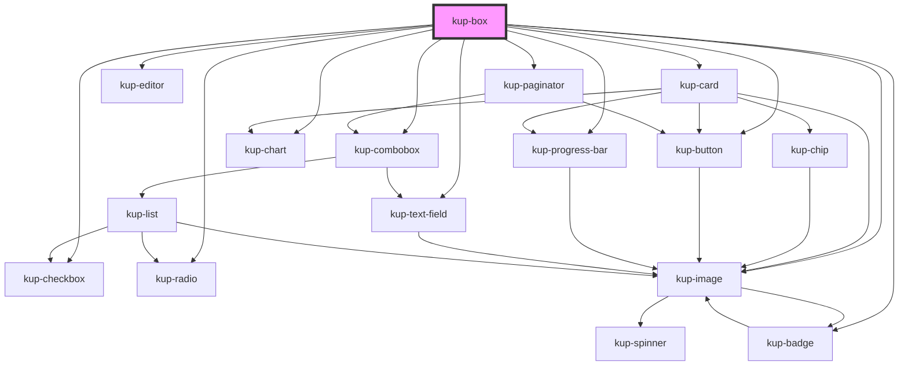

# kup-box

<!-- Auto Generated Below -->

## Properties

| Property           | Attribute            | Description                                                                                                     | Type                                       | Default     |
| ------------------ | -------------------- | --------------------------------------------------------------------------------------------------------------- | ------------------------------------------ | ----------- |
| `cardData`         | --                   | Number of columns                                                                                               | `ComponentCardElement`                     | `undefined` |
| `columns`          | `columns`            | Number of columns                                                                                               | `number`                                   | `1`         |
| `contentAlign`     | `content-align`      | Alignment of the content. Can be set to left, right or center.                                                  | `string`                                   | `'center'`  |
| `customStyle`      | `custom-style`       | Custom style of the component. For more information: https://ketchup.smeup.com/ketchup-showcase/#/customization | `string`                                   | `undefined` |
| `data`             | --                   | Data                                                                                                            | `{ columns?: Column[]; rows?: BoxRow[]; }` | `undefined` |
| `dragEnabled`      | `drag-enabled`       | Enable dragging                                                                                                 | `boolean`                                  | `false`     |
| `dropEnabled`      | `drop-enabled`       | Enable dropping                                                                                                 | `boolean`                                  | `false`     |
| `dropOnSection`    | `drop-on-section`    | Drop can be done in section                                                                                     | `boolean`                                  | `undefined` |
| `enableRowActions` | `enable-row-actions` | If enabled, a button to load / display the row actions will be displayed on the right of every box              | `boolean`                                  | `false`     |
| `filterEnabled`    | `filter-enabled`     | Enable filtering                                                                                                | `boolean`                                  | `false`     |
| `layout`           | --                   | How the field will be displayed. If not present, a default one will be created.                                 | `Layout`                                   | `undefined` |
| `multiSelection`   | `multi-selection`    | Enable multi selection                                                                                          | `boolean`                                  | `false`     |
| `noBorder`         | `no-border`          | Removes border                                                                                                  | `boolean`                                  | `false`     |
| `noPadding`        | `no-padding`         | Removes padding                                                                                                 | `boolean`                                  | `false`     |
| `pageSize`         | `page-size`          | Number of boxes per page                                                                                        | `number`                                   | `10`        |
| `pagination`       | `pagination`         | Enables pagination                                                                                              | `boolean`                                  | `false`     |
| `selectBox`        | `select-box`         | Automatically selects the box at the specified index                                                            | `number`                                   | `undefined` |
| `showSelection`    | `show-selection`     | If enabled, highlights the selected box/boxes                                                                   | `boolean`                                  | `true`      |
| `sortBy`           | `sort-by`            | If sorting is enabled, specifies which column to sort                                                           | `string`                                   | `undefined` |
| `sortEnabled`      | `sort-enabled`       | Enable sorting                                                                                                  | `boolean`                                  | `false`     |

## Events

| Event                     | Description                                               | Type                                                                                                                                     |
| ------------------------- | --------------------------------------------------------- | ---------------------------------------------------------------------------------------------------------------------------------------- |
| `kupAutoBoxSelect`        | Triggered when a box is auto selected via selectBox prop  | `CustomEvent<{ row: BoxRow; }>`                                                                                                          |
| `kupBoxClicked`           | Triggered when a box is clicked                           | `CustomEvent<{ row: BoxRow; column?: string; }>`                                                                                         |
| `kupBoxDragEnded`         | Triggered when a box dragging is ended                    | `CustomEvent<{ fromId: string; fromRow: BoxRow; fromSelectedRows?: BoxRow[]; }>`                                                         |
| `kupBoxDragStarted`       | Triggered when a box dragging is started                  | `CustomEvent<{ fromId: string; fromRow: BoxRow; fromSelectedRows?: BoxRow[]; }>`                                                         |
| `kupBoxDropped`           | Triggered when a box is dropped                           | `CustomEvent<{ fromId: string; fromRow: BoxRow; fromSelectedRows?: BoxRow[]; toId: string; toRow: BoxRow; toSelectedRows?: BoxRow[]; }>` |
| `kupBoxSelected`          | Triggered when the multi selection checkbox changes value | `CustomEvent<{ rows: BoxRow[]; }>`                                                                                                       |
| `kupRowActionClicked`     | When the row menu action icon is clicked                  | `CustomEvent<{ row: BoxRow; action: RowAction; index: number; }>`                                                                        |
| `kupRowActionMenuClicked` | When the row menu action icon is clicked                  | `CustomEvent<{ row: BoxRow; }>`                                                                                                          |

## Methods

### `loadRowActions(row: BoxRow, actions: RowAction[]) => Promise<void>`

#### Returns

Type: `Promise<void>`

### `refreshCustomStyle(customStyleTheme: string) => Promise<void>`

#### Returns

Type: `Promise<void>`

## CSS Custom Properties

| Name                                                                 | Description                          |
| -------------------------------------------------------------------- | ------------------------------------ |
| `--box_badge-background, --kup-box_badge-background`                 | badge background color               |
| `--box_badge-border-radius, --kup-box_badge-border-radius`           | badge border radius                  |
| `--box_badge-dimension, --kup-box_badge-dimension`                   | badge dimension                      |
| `--box_badge-text, --kup-box_badge-text`                             | badge text color                     |
| `--box_border-color, --kup-box_border-color`                         | single box border color              |
| `--box_border-radius, --kup-box_border-radius`                       | single box border radius             |
| `--box_color, --kup-box_color`                                       | text color                           |
| `--box_expand-panel-color, --kup-box_expand-panel-color`             | text color for collapse header panel |
| `--box_hover-box-shadow, --kup-box_hover-box-shadow`                 | shadow when hovering on a box        |
| `--box_img-border-radius, --kup-box_img-border-radius`               | box image border radius              |
| `--box_titled-section-bg-color, --kup-box_titled-section-bg-color`   | background color for section title   |
| `--box_titled-section-font-size, --kup-box_titled-section-font-size` | font size for section title          |
| `--box_titled-section-top, --kup-box_titled-section-top`             | top position for section title       |

## Dependencies

### Depends on

- [kup-card](../kup-card)
- [kup-checkbox](../kup-checkbox)
- [kup-badge](../kup-badge)
- [kup-button](../kup-button)
- [kup-radio](../kup-radio)
- [kup-text-field](../kup-text-field)
- [kup-progress-bar](../kup-progress-bar)
- [kup-chart](../kup-chart)
- [kup-image](../kup-image)
- [kup-editor](../kup-editor)
- [kup-combobox](../kup-combobox)
- [kup-paginator](../kup-paginator)

### Graph

----------------------------------------------

*Built with [StencilJS](https://stenciljs.com/)*
