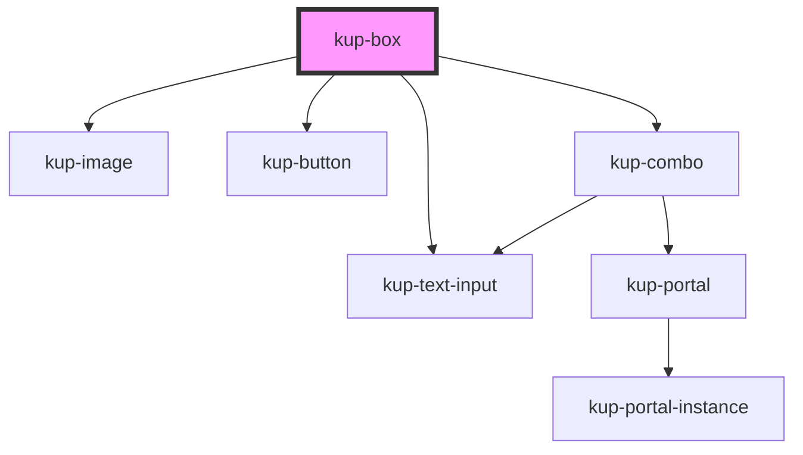

# kup-box

<!-- Auto Generated Below -->

## Properties

| Property         | Attribute         | Description | Type                                    | Default     |
| ---------------- | ----------------- | ----------- | --------------------------------------- | ----------- |
| `columns`        | `columns`         |             | `number`                                | `1`         |
| `data`           | --                |             | `{ columns?: Column[]; rows?: Row[]; }` | `undefined` |
| `filterEnabled`  | `filter-enabled`  |             | `boolean`                               | `false`     |
| `layout`         | --                |             | `Layout`                                | `undefined` |
| `multiSelection` | `multi-selection` |             | `boolean`                               | `false`     |
| `sortBy`         | `sort-by`         |             | `string`                                | `undefined` |
| `sortEnabled`    | `sort-enabled`    |             | `boolean`                               | `false`     |

## Events

| Event            | Description | Type                                          |
| ---------------- | ----------- | --------------------------------------------- |
| `kupBoxClicked`  |             | `CustomEvent<{ row: Row; column?: string; }>` |
| `kupBoxSelected` |             | `CustomEvent<{ rows: Row[]; }>`               |

## CSS Custom Properties

| Name                                                     | Description                          |
| -------------------------------------------------------- | ------------------------------------ |
| `--int_border-color, --kup-box_border-color`             | single box border color              |
| `--int_border-radius, --kup-box_border-radius`           | single box border radius             |
| `--int_color, --kup-box_color`                           | text color                           |
| `--int_expand-panel-color, --kup-box_expand-panel-color` | text color for collapse header panel |
| `--int_img-border-radius, --kup-box_img-border-radius`   | box image border radius              |

## Dependencies

### Depends on

- [kup-image](..\kup-image)
- [kup-button](..\kup-button)
- [kup-combo](..\kup-combo)
- [kup-text-input](..\kup-text-input)

### Graph

----------------------------------------------

*Built with [StencilJS](https://stenciljs.com/)*
