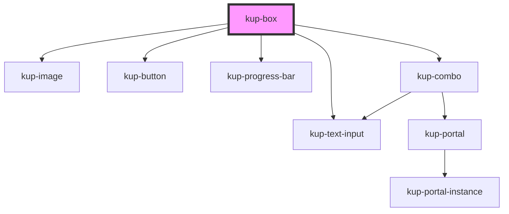

# kup-box

<!-- Auto Generated Below -->

## Properties

| Property         | Attribute         | Description                                                                     | Type                                       | Default     |
| ---------------- | ----------------- | ------------------------------------------------------------------------------- | ------------------------------------------ | ----------- |
| `columns`        | `columns`         | Number of columns                                                               | `number`                                   | `1`         |
| `data`           | --                | Data                                                                            | `{ columns?: Column[]; rows?: BoxRow[]; }` | `undefined` |
| `filterEnabled`  | `filter-enabled`  | Enable filtering                                                                | `boolean`                                  | `false`     |
| `layout`         | --                | How the field will be displayed. If not present, a default one will be created. | `Layout`                                   | `undefined` |
| `multiSelection` | `multi-selection` | Enable multi selection                                                          | `boolean`                                  | `false`     |
| `selectBox`      | `select-box`      | Automatically selects the box at the specified index                            | `number`                                   | `undefined` |
| `showSelection`  | `show-selection`  | If enabled, highlights the selected box/boxes                                   | `boolean`                                  | `true`      |
| `sortBy`         | `sort-by`         | If sorting is enabled, specifies which column to sort                           | `string`                                   | `undefined` |
| `sortEnabled`    | `sort-enabled`    | Enable sorting                                                                  | `boolean`                                  | `false`     |

## Events

| Event              | Description                                               | Type                                             |
| ------------------ | --------------------------------------------------------- | ------------------------------------------------ |
| `kupAutoBoxSelect` | Triggered when a box is auto selected via selectBox prop  | `CustomEvent<{ row: BoxRow; }>`                  |
| `kupBoxClicked`    | Triggered when a box is clicked                           | `CustomEvent<{ row: BoxRow; column?: string; }>` |
| `kupBoxSelected`   | Triggered when the multi selection checkbox changes value | `CustomEvent<{ rows: BoxRow[]; }>`               |

## CSS Custom Properties

| Name                                                                 | Description                          |
| -------------------------------------------------------------------- | ------------------------------------ |
| `--box_border-color, --kup-box_border-color`                         | single box border color              |
| `--box_border-radius, --kup-box_border-radius`                       | single box border radius             |
| `--box_color, --kup-box_color`                                       | text color                           |
| `--box_expand-panel-color, --kup-box_expand-panel-color`             | text color for collapse header panel |
| `--box_hover-box-shadow, --kup-box_hover-box-shadow`                 | shadow when hovering on a box        |
| `--box_img-border-radius, --kup-box_img-border-radius`               | box image border radius              |
| `--box_titled-section-bg-color, --kup-box_titled-section-bg-color`   | background color for section title   |
| `--box_titled-section-font-size, --kup-box_titled-section-font-size` | font size for section title          |
| `--box_titled-section-top, --kup-box_titled-section-top`             | top position for section title       |

## Dependencies

### Depends on

- [kup-image](../kup-image)
- [kup-button](../kup-button)
- [kup-progress-bar](../kup-progress-bar)
- [kup-combo](../kup-combo)
- [kup-text-input](../kup-text-input)

### Graph

----------------------------------------------

*Built with [StencilJS](https://stenciljs.com/)*
