# kup-box

<!-- Auto Generated Below -->

## Properties

| Property                  | Attribute                     | Description                                                                                                     | Type                                       | Default     |
| ------------------------- | ----------------------------- | --------------------------------------------------------------------------------------------------------------- | ------------------------------------------ | ----------- |
| `cardData`                | --                            | Data of the card linked to the box when the latter's layout must be a premade template.                         | `GenericObject`                            | `undefined` |
| `columns`                 | `columns`                     | Number of columns                                                                                               | `number`                                   | `1`         |
| `customStyle`             | `custom-style`                | Custom style of the component. For more information: https://ketchup.smeup.com/ketchup-showcase/#/customization | `string`                                   | `''`        |
| `data`                    | --                            | Data                                                                                                            | `{ columns?: Column[]; rows?: BoxRow[]; }` | `undefined` |
| `dragEnabled`             | `drag-enabled`                | Enable dragging                                                                                                 | `boolean`                                  | `false`     |
| `dropEnabled`             | `drop-enabled`                | Enable dropping                                                                                                 | `boolean`                                  | `false`     |
| `dropOnSection`           | `drop-on-section`             | Drop can be done in section                                                                                     | `boolean`                                  | `false`     |
| `enableRowActions`        | `enable-row-actions`          | If enabled, a button to load / display the row actions will be displayed on the right of every box              | `boolean`                                  | `false`     |
| `globalFilter`            | `global-filter`               | When set to true it activates the global filter.                                                                | `boolean`                                  | `false`     |
| `globalFilterValue`       | `global-filter-value`         | The value of the global filter.                                                                                 | `string`                                   | `''`        |
| `kanban`                  | --                            | Displays the boxlist as a Kanban.                                                                               | `BoxKanban`                                | `null`      |
| `layout`                  | --                            | How the field will be displayed. If not present, a default one will be created.                                 | `Layout`                                   | `undefined` |
| `multiSelection`          | `multi-selection`             | Enable multi selection                                                                                          | `boolean`                                  | `false`     |
| `pageSelected`            | `page-selected`               | Current page number                                                                                             | `number`                                   | `1`         |
| `pageSize`                | `page-size`                   | Number of boxes per page                                                                                        | `number`                                   | `10`        |
| `pagination`              | `pagination`                  | Enables pagination                                                                                              | `boolean`                                  | `false`     |
| `rowsPerPage`             | `rows-per-page`               | Number of current rows per page                                                                                 | `number`                                   | `undefined` |
| `scrollOnHover`           | `scroll-on-hover`             | Activates the scroll on hover function.                                                                         | `boolean`                                  | `false`     |
| `selectBox`               | `select-box`                  | Automatically selects the box at the specified index                                                            | `number`                                   | `undefined` |
| `selectedRowsState`       | `selected-rows-state`         | Multiple selection                                                                                              | `string`                                   | `undefined` |
| `showSelection`           | `show-selection`              | If enabled, highlights the selected box/boxes                                                                   | `boolean`                                  | `true`      |
| `showTooltipOnRightClick` | `show-tooltip-on-right-click` | If set to true, displays tooltip on right click; if set to false, displays tooltip on mouseOver.                | `boolean`                                  | `true`      |
| `sortBy`                  | `sort-by`                     | If sorting is enabled, specifies which column to sort                                                           | `string`                                   | `undefined` |
| `sortEnabled`             | `sort-enabled`                | Enable sorting                                                                                                  | `boolean`                                  | `false`     |
| `stateId`                 | `state-id`                    |                                                                                                                 | `string`                                   | `''`        |
| `store`                   | --                            |                                                                                                                 | `KupStore`                                 | `undefined` |
| `swipeDisabled`           | `swipe-disabled`              | Disable swipe                                                                                                   | `boolean`                                  | `false`     |
| `tooltipDetailTimeout`    | `tooltip-detail-timeout`      | Defines the timeout for tooltip detail                                                                          | `number`                                   | `undefined` |
| `tooltipEnabled`          | `tooltip-enabled`             | Enable show tooltip                                                                                             | `boolean`                                  | `true`      |
| `tooltipLoadTimeout`      | `tooltip-load-timeout`        | Defines the timeout for tooltip load                                                                            | `number`                                   | `undefined` |

## Events

| Event                     | Description                                               | Type                                                                             |
| ------------------------- | --------------------------------------------------------- | -------------------------------------------------------------------------------- |
| `kupAutoBoxSelect`        | Triggered when a box is auto selected via selectBox prop  | `CustomEvent<{ row: BoxRow; }>`                                                  |
| `kupBoxClicked`           | Triggered when a box is clicked                           | `CustomEvent<{ row: BoxRow; column?: string; }>`                                 |
| `kupBoxContextMenu`       | Generic right click event on box.                         | `CustomEvent<{ details: GenericObject; }>`                                       |
| `kupBoxDragEnded`         | Triggered when a box dragging is ended                    | `CustomEvent<{ fromId: string; fromRow: BoxRow; fromSelectedRows?: BoxRow[]; }>` |
| `kupBoxDragStarted`       | Triggered when a box dragging is started                  | `CustomEvent<{ fromId: string; fromRow: BoxRow; fromSelectedRows?: BoxRow[]; }>` |
| `kupBoxSelected`          | Triggered when the multi selection checkbox changes value | `CustomEvent<{ rows: BoxRow[]; }>`                                               |
| `kupDidLoad`              |                                                           | `CustomEvent<void>`                                                              |
| `kupDidUnload`            | Triggered when stop propagation event                     | `CustomEvent<void>`                                                              |
| `kupRowActionClicked`     | When the row menu action icon is clicked                  | `CustomEvent<{ row: BoxRow; action: RowAction; index: number; }>`                |
| `kupRowActionMenuClicked` | When the row menu action icon is clicked                  | `CustomEvent<{ row: BoxRow; }>`                                                  |

## Methods

### `getProps(descriptions?: boolean) => Promise<GenericObject>`

Used to retrieve component's props values.

#### Returns

Type: `Promise<GenericObject>`

### `loadRowActions(row: BoxRow, actions: RowAction[]) => Promise<void>`

#### Returns

Type: `Promise<void>`

### `refresh() => Promise<void>`

This method is used to trigger a new render of the component.

#### Returns

Type: `Promise<void>`

## Dependencies

### Used by

 - [kup-magic-box](../kup-magic-box)

### Depends on

- [kup-card](../kup-card)
- [kup-checkbox](../kup-checkbox)
- [kup-badge](../kup-badge)
- [kup-chart](../kup-chart)
- [kup-editor](../kup-editor)
- [kup-text-field](../kup-text-field)
- [kup-progress-bar](../kup-progress-bar)
- [kup-radio](../kup-radio)
- [kup-gauge](../kup-gauge)
- [kup-tooltip](../kup-tooltip)
- [kup-combobox](../kup-combobox)
- [kup-paginator](../kup-paginator)

### Graph

```mermaid
graph TD;
  kup-box --> kup-card
  kup-box --> kup-checkbox
  kup-box --> kup-badge
  kup-box --> kup-chart
  kup-box --> kup-editor
  kup-box --> kup-text-field
  kup-box --> kup-progress-bar
  kup-box --> kup-radio
  kup-box --> kup-gauge
  kup-box --> kup-tooltip
  kup-box --> kup-combobox
  kup-box --> kup-paginator
  kup-card --> kup-chip
  kup-card --> kup-badge
  kup-card --> kup-autocomplete
  kup-card --> kup-button
  kup-card --> kup-checkbox
  kup-card --> kup-combobox
  kup-card --> kup-date-picker
  kup-card --> kup-text-field
  kup-card --> kup-time-picker
  kup-card --> kup-data-table
  kup-card --> kup-list
  kup-card --> kup-progress-bar
  kup-card --> kup-chart
  kup-card --> kup-spinner
  kup-card --> kup-tab-bar
  kup-card --> kup-tree
  kup-card --> kup-switch
  kup-chip --> kup-badge
  kup-badge --> kup-badge
  kup-autocomplete --> kup-list
  kup-list --> kup-radio
  kup-list --> kup-checkbox
  kup-list --> kup-badge
  kup-button --> kup-badge
  kup-combobox --> kup-list
  kup-date-picker --> kup-text-field
  kup-date-picker --> kup-button
  kup-time-picker --> kup-text-field
  kup-time-picker --> kup-button
  kup-time-picker --> kup-list
  kup-data-table --> kup-card
  kup-data-table --> kup-checkbox
  kup-data-table --> kup-tooltip
  kup-data-table --> kup-list
  kup-data-table --> kup-date-picker
  kup-data-table --> kup-image
  kup-data-table --> kup-button
  kup-data-table --> kup-btn
  kup-data-table --> kup-chart
  kup-data-table --> kup-color-picker
  kup-data-table --> kup-gauge
  kup-data-table --> kup-progress-bar
  kup-data-table --> kup-rating
  kup-data-table --> kup-radio
  kup-data-table --> kup-paginator
  kup-data-table --> kup-switch
  kup-data-table --> kup-combobox
  kup-data-table --> kup-badge
  kup-tooltip --> kup-button
  kup-tooltip --> kup-card
  kup-tooltip --> kup-tree
  kup-tree --> kup-image
  kup-tree --> kup-button
  kup-tree --> kup-chart
  kup-tree --> kup-checkbox
  kup-tree --> kup-chip
  kup-tree --> kup-color-picker
  kup-tree --> kup-gauge
  kup-tree --> kup-progress-bar
  kup-tree --> kup-rating
  kup-tree --> kup-radio
  kup-tree --> kup-tooltip
  kup-tree --> kup-list
  kup-tree --> kup-text-field
  kup-tree --> kup-card
  kup-image --> kup-spinner
  kup-image --> kup-badge
  kup-color-picker --> kup-text-field
  kup-btn --> kup-dropdown-button
  kup-btn --> kup-badge
  kup-dropdown-button --> kup-list
  kup-paginator --> kup-combobox
  kup-paginator --> kup-badge
  kup-magic-box --> kup-box
  style kup-box fill:#f9f,stroke:#333,stroke-width:4px
```

----------------------------------------------

*Built with [StencilJS](https://stenciljs.com/)*
