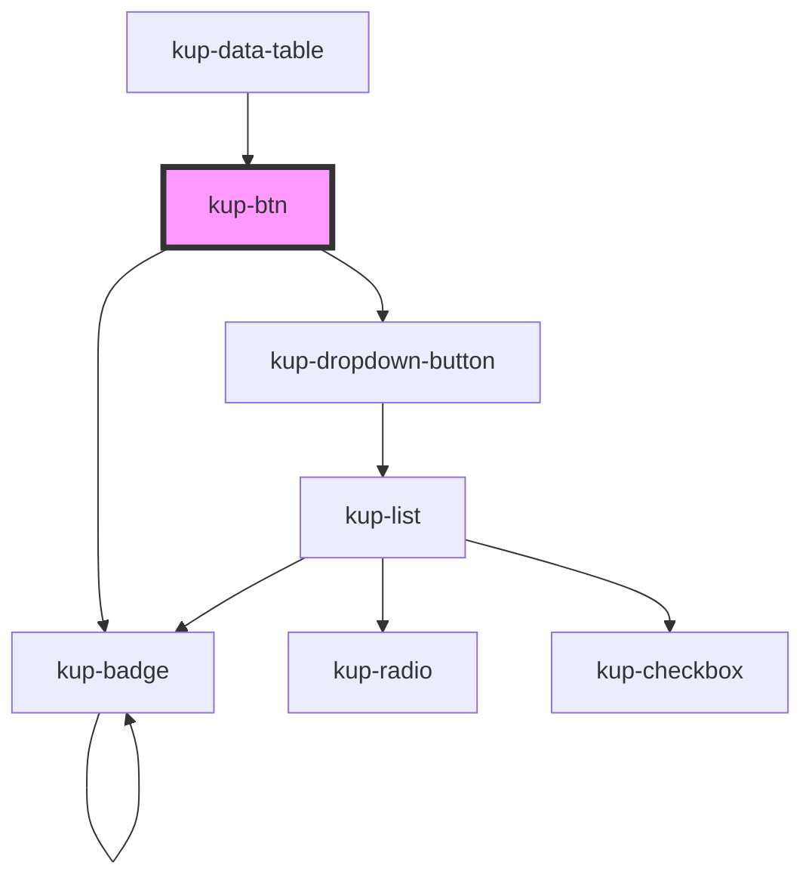

# ketchup-btn

<!-- Auto Generated Below -->

## Properties

| Property        | Attribute        | Description                                                                                                                                          | Type         | Default |
| --------------- | ---------------- | ---------------------------------------------------------------------------------------------------------------------------------------------------- | ------------ | ------- |
| `columns`       | `columns`        | Number of columns for draw sub-components.                                                                                                           | `number`     | `0`     |
| `customStyle`   | `custom-style`   | Custom style of the component. For more information: https://ketchup.smeup.com/ketchup-showcase/#/customization                                      | `string`     | `''`    |
| `data`          | --               | Props of the sub-components.                                                                                                                         | `TreeNode[]` | `[]`    |
| `disabled`      | `disabled`       | Default at false. When set to true, the sub-components are disabled.                                                                                 | `boolean`    | `false` |
| `showSelection` | `show-selection` | If enabled, highlights the selected button                                                                                                           | `boolean`    | `true`  |
| `styling`       | `styling`        | Defines the style of the buttons. Available styles are "flat" and "outlined", "raised" is the default. If set, will be valid for all sub-components. | `string`     | `''`    |

## Events

| Event         | Description | Type                                                                  |
| ------------- | ----------- | --------------------------------------------------------------------- |
| `kupBtnClick` |             | `CustomEvent<{ comp: KupBtn; id: string; subId: string; obj: any; }>` |

## Methods

### `getProps(descriptions?: boolean) => Promise<GenericObject>`

Used to retrieve component's props values.

#### Returns

Type: `Promise<GenericObject>`

### `refresh() => Promise<void>`

This method is used to trigger a new render of the component.

#### Returns

Type: `Promise<void>`

## Dependencies

### Used by

 - [kup-data-table](../kup-data-table)

### Depends on

- [kup-dropdown-button](../kup-dropdown-button)
- [kup-badge](../kup-badge)

### Graph

----------------------------------------------

*Built with [StencilJS](https://stenciljs.com/)*
