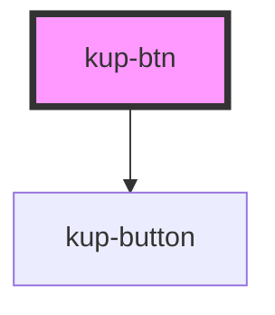

# ketchup-btn

<!-- Auto Generated Below -->

## Properties

| Property  | Attribute | Description | Type           | Default     |
| --------- | --------- | ----------- | -------------- | ----------- |
| `buttons` | --        |             | `any[]`        | `undefined` |
| `config`  | --        |             | `ButtonConfig` | `{}`        |

## Events

| Event         | Description | Type                           |
| ------------- | ----------- | ------------------------------ |
| `kupBtnClick` |             | `CustomEvent<{ id: number; }>` |

## Dependencies

### Depends on

- [kup-button](../kup-button)

### Graph

----------------------------------------------

*Built with [StencilJS](https://stenciljs.com/)*
