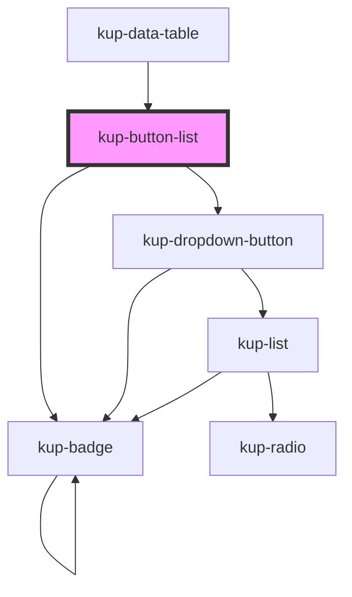

# ketchup-btn

<!-- Auto Generated Below -->

## Properties

| Property        | Attribute        | Description                                                                                                    | Type                                                                                                                        | Default                 |
| --------------- | ---------------- | -------------------------------------------------------------------------------------------------------------- | --------------------------------------------------------------------------------------------------------------------------- | ----------------------- |
| `columns`       | `columns`        | Number of columns.                                                                                             | `number`                                                                                                                    | `0`                     |
| `customStyle`   | `custom-style`   | Custom style of the component.                                                                                 | `string`                                                                                                                    | `''`                    |
| `data`          | --               | Props of the sub-components.                                                                                   | `TreeNode[]`                                                                                                                | `[]`                    |
| `disabled`      | `disabled`       | When set to true, the sub-components are disabled.                                                             | `boolean`                                                                                                                   | `false`                 |
| `showSelection` | `show-selection` | When set to true, highlights the selected button with the secondary color of KupTheme.                         | `boolean`                                                                                                                   | `true`                  |
| `styling`       | `styling`        | Defines the style of the buttons. Available styles are "flat", "outlined" and "raised" (which is the default). | `FButtonStyling.FLAT \| FButtonStyling.FLOATING \| FButtonStyling.ICON \| FButtonStyling.OUTLINED \| FButtonStyling.RAISED` | `FButtonStyling.RAISED` |

## Events

| Event                  | Description | Type                                          |
| ---------------------- | ----------- | --------------------------------------------- |
| `kup-buttonlist-click` |             | `CustomEvent<KupButtonListClickEventPayload>` |

## Methods

### `getProps(descriptions?: boolean) => Promise<GenericObject>`

Used to retrieve component's props values.

#### Returns

Type: `Promise<GenericObject>`

### `refresh() => Promise<void>`

This method is used to trigger a new render of the component.

#### Returns

Type: `Promise<void>`

### `setProps(props: GenericObject) => Promise<void>`

Sets the props to the component.

#### Returns

Type: `Promise<void>`

## Dependencies

### Used by

 - [kup-data-table](../kup-data-table)

### Depends on

- [kup-dropdown-button](../kup-dropdown-button)
- [kup-badge](../kup-badge)

### Graph

----------------------------------------------

*Built with [StencilJS](https://stenciljs.com/)*
