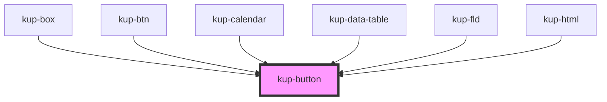

# kup-button

<!-- Auto Generated Below -->

## Properties

| Property      | Attribute      | Description | Type      | Default                                                                        |
| ------------- | -------------- | ----------- | --------- | ------------------------------------------------------------------------------ |
| `align`       | `align`        |             | `string`  | `undefined`                                                                    |
| `buttonClass` | `button-class` |             | `string`  | `undefined`                                                                    |
| `fillspace`   | `fillspace`    |             | `boolean` | `false`                                                                        |
| `flat`        | `flat`         |             | `boolean` | `false`                                                                        |
| `iconClass`   | `icon-class`   |             | `string`  | `undefined`                                                                    |
| `iconUrl`     | `icon-url`     |             | `string`  | `'https://cdn.materialdesignicons.com/3.2.89/css/materialdesignicons.min.css'` |
| `label`       | `label`        |             | `string`  | `undefined`                                                                    |
| `rounded`     | `rounded`      |             | `boolean` | `false`                                                                        |
| `showicon`    | `showicon`     |             | `boolean` | `true`                                                                         |
| `showtext`    | `showtext`     |             | `boolean` | `true`                                                                         |
| `textmode`    | `textmode`     |             | `string`  | `undefined`                                                                    |
| `transparent` | `transparent`  |             | `boolean` | `false`                                                                        |

## Events

| Event              | Description | Type                           |
| ------------------ | ----------- | ------------------------------ |
| `kupButtonClicked` |             | `CustomEvent<{ id: string; }>` |

## CSS Custom Properties

| Name                                                                  | Description                                                   |
| --------------------------------------------------------------------- | ------------------------------------------------------------- |
| `--btn_animation-duration, --kup-button_animation-duration`           | Sets duration of all transitions of the component.            |
| `--btn_border, --kup-button_border`                                   | Sets border of the button.                                    |
| `--btn_border-color, --kup-button_border-color`                       | Sets border color of the button only when it is transparent.  |
| `--btn_box-shadow, --kup-button_box-shadow`                           | Sets hover box shadow of the button.                          |
| `--btn_color-danger`                                                  | Background color of the button when danger state is set       |
| `--btn_color-danger--hover`                                           | Background color of the button when danger:hover state is set |
| `--btn_color-info`                                                    | Background color of the button when info state is set         |
| `--btn_color-selected`                                                | Background color of the button when selected state is set     |
| `--btn_color-warning`                                                 | Background color of the button when warning state is set      |
| `--btn_font-family, --kup-button_font-family`                         | sets the font family of the button                            |
| `--btn_font-size, --kup-button_font-size`                             | Sets button font size.                                        |
| `--btn_font-style, --kup-button_font-style`                           | Sets button font style.                                       |
| `--btn_font-weight, --kup-button_font-weight`                         | Sets the font weight of the button                            |
| `--btn_icon--transparent, --kup-button_icon-color--transparent`       | Sets icon color when button is transparent.                   |
| `--btn_icon-color, --kup-button_icon-color`                           | Sets icon color.                                              |
| `--btn_icon-size, --kup-button_icon-size`                             | Set icon size.                                                |
| `--btn_main-color, --kup-button_main-color`                           | Sets the main color of the button.                            |
| `--btn_opacity, --kup-button_opacity`                                 | Sets opacity of the button.                                   |
| `--btn_text-color, --kup-button_text-color`                           | Sets color of the button text.                                |
| `--btn_text-color--transparent, --kup-button_text-color--transparent` | Sets text color when button is transparent.                   |

## Dependencies

### Used by

 - [kup-box](../kup-box)
 - [kup-btn](../kup-btn)
 - [kup-calendar](../kup-calendar)
 - [kup-data-table](../kup-data-table)
 - [kup-fld](../kup-fld)
 - [kup-html](../kup-html)

### Graph

----------------------------------------------

*Built with [StencilJS](https://stenciljs.com/)*
