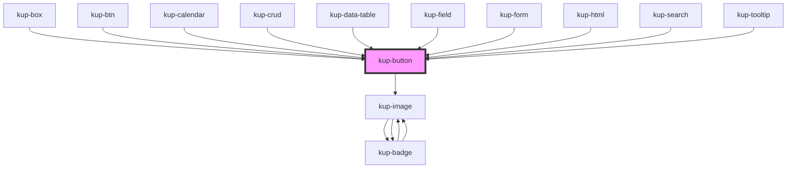

# kup-button

<!-- Auto Generated Below -->

## Properties

| Property       | Attribute       | Description                                                                                                                                   | Type      | Default     |
| -------------- | --------------- | --------------------------------------------------------------------------------------------------------------------------------------------- | --------- | ----------- |
| `checked`      | `checked`       | Defaults at false. When set to true, the icon button state will be on.                                                                        | `boolean` | `false`     |
| `customStyle`  | `custom-style`  | Custom style to be passed to the component.                                                                                                   | `string`  | `undefined` |
| `disabled`     | `disabled`      | Defaults at false. When set to true, the component is disabled.                                                                               | `boolean` | `false`     |
| `flat`         | `flat`          | Defaults at false. When set to true, the button will be rendered flat.                                                                        | `boolean` | `false`     |
| `fullHeight`   | `full-height`   | Defaults at false. When set to true fill all the available horizontal space.                                                                  | `boolean` | `false`     |
| `fullWidth`    | `full-width`    | Defaults at false. When set to true fill all the available horizontal space.                                                                  | `boolean` | `false`     |
| `icon`         | `icon`          | Defaults at null. When set, the button will show this icon.                                                                                   | `string`  | `null`      |
| `iconColor`    | `icon-color`    | If not set, it will be managed by the component.                                                                                              | `string`  | `null`      |
| `iconOff`      | `icon-off`      | Defaults at null. When set, the icon button off state will show this icon. Otherwise, an outlined version of the icon prop will be displayed. | `string`  | `null`      |
| `label`        | `label`         | Defaults at null. When set, the button will show this text.                                                                                   | `string`  | `null`      |
| `outlined`     | `outlined`      | Defaults at false. When set to true, the button will be rendered with a colored outline.                                                      | `boolean` | `false`     |
| `shaped`       | `shaped`        | Defaults at false. When set to true, the button will be rendered with rounded edges.                                                          | `boolean` | `false`     |
| `toggable`     | `toggable`      | Defaults at false. When set to true, the icon button will be toggable on/off.                                                                 | `boolean` | `false`     |
| `tooltip`      | `tooltip`       | When set, this tooltip will be displayed on mouse over (using the HTML attribute title).                                                      | `string`  | `undefined` |
| `trailingIcon` | `trailing-icon` | Defaults at null. When set, the icon will be shown after the text.                                                                            | `boolean` | `false`     |

## Events

| Event            | Description | Type                           |
| ---------------- | ----------- | ------------------------------ |
| `kupButtonBlur`  |             | `CustomEvent<{ value: any; }>` |
| `kupButtonClick` |             | `CustomEvent<{ value: any; }>` |
| `kupButtonFocus` |             | `CustomEvent<{ value: any; }>` |

## Dependencies

### Used by

 - [kup-box](../kup-box)
 - [kup-btn](../kup-btn)
 - [kup-calendar](../kup-calendar)
 - [kup-crud](../kup-crud)
 - [kup-data-table](../kup-data-table)
 - [kup-field](../kup-field)
 - [kup-form](../kup-form)
 - [kup-html](../kup-html)
 - [kup-search](../kup-search)
 - [kup-tooltip](../kup-tooltip)

### Depends on

- [kup-image](../kup-image)

### Graph

----------------------------------------------

*Built with [StencilJS](https://stenciljs.com/)*
