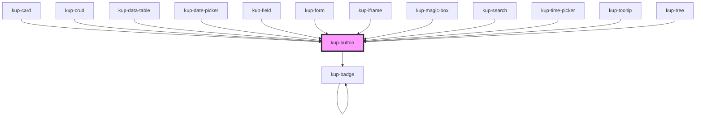

# kup-button

<!-- Auto Generated Below -->

## Properties

| Property       | Attribute       | Description                                                                                                                 | Type                                                                                                                        | Default                 |
| -------------- | --------------- | --------------------------------------------------------------------------------------------------------------------------- | --------------------------------------------------------------------------------------------------------------------------- | ----------------------- |
| `checked`      | `checked`       | When set to true, the icon button state will be on.                                                                         | `boolean`                                                                                                                   | `false`                 |
| `customStyle`  | `custom-style`  | Custom style of the component.                                                                                              | `string`                                                                                                                    | `''`                    |
| `disabled`     | `disabled`      | Defaults at false. When set to true, the component is disabled.                                                             | `boolean`                                                                                                                   | `false`                 |
| `icon`         | `icon`          | When set, the button will show this icon.                                                                                   | `string`                                                                                                                    | `null`                  |
| `iconOff`      | `icon-off`      | When set, the icon button off state will show this icon. Otherwise, an outlined version of the icon prop will be displayed. | `string`                                                                                                                    | `null`                  |
| `label`        | `label`         | When set, the button will show this text.                                                                                   | `string`                                                                                                                    | `null`                  |
| `styling`      | `styling`       | Defines the style of the button. Styles available: "flat", "outlined" and "raised" which is also the default.               | `FButtonStyling.FLAT \| FButtonStyling.FLOATING \| FButtonStyling.ICON \| FButtonStyling.OUTLINED \| FButtonStyling.RAISED` | `FButtonStyling.RAISED` |
| `toggable`     | `toggable`      | When set to true, the icon button will be toggable on/off.                                                                  | `boolean`                                                                                                                   | `false`                 |
| `trailingIcon` | `trailing-icon` | When set, the icon will be shown after the text.                                                                            | `boolean`                                                                                                                   | `false`                 |

## Events

| Event              | Description                            | Type                                      |
| ------------------ | -------------------------------------- | ----------------------------------------- |
| `kup-button-blur`  | Triggered when the button loses focus. | `CustomEvent<KupButtonClickEventPayload>` |
| `kup-button-click` | Triggered when the button is clicked.  | `CustomEvent<KupButtonClickEventPayload>` |
| `kup-button-focus` | Triggered when the button is focused.  | `CustomEvent<KupButtonClickEventPayload>` |

## Methods

### `getProps(descriptions?: boolean) => Promise<GenericObject>`

Used to retrieve component's props values.

#### Returns

Type: `Promise<GenericObject>`

### `refresh() => Promise<void>`

This method is used to trigger a new render of the component.

#### Returns

Type: `Promise<void>`

### `setProps(props: GenericObject) => Promise<void>`

Sets the props to the component.

#### Returns

Type: `Promise<void>`

## CSS Custom Properties

| Name                             | Description                                                                                                                                                                                                              |
| -------------------------------- | ------------------------------------------------------------------------------------------------------------------------------------------------------------------------------------------------------------------------ |
| `--kup-button_border-radius`     | Sets border radius of the button.                                                                                                                                                                                        |
| `--kup-button_font-family`       | Sets font family of the button.                                                                                                                                                                                          |
| `--kup-button_font-size`         | Sets font size of the button.                                                                                                                                                                                            |
| `--kup-button_font-weight`       | Sets font weight of the button.                                                                                                                                                                                          |
| `--kup-button_height`            | Sets height of the button.                                                                                                                                                                                               |
| `--kup-button_padding`           | Sets padding of the button.                                                                                                                                                                                              |
| `--kup-button_primary-color`     | Sets the primary color of the button.                                                                                                                                                                                    |
| `--kup-button_primary-color-h`   | Sets the primary color Hue value of the button (used for focus/hover effects).                                                                                                                                           |
| `--kup-button_primary-color-l`   | Sets the primary color Lightness value of the button (used for focus/hover effects).                                                                                                                                     |
| `--kup-button_primary-color-rgb` | Sets the primary color RGB values of the button (used for shaders). NOTE: These variables are defined in the "_variables.scss" file, because they must work even without the kup component (it's a functional component) |
| `--kup-button_primary-color-s`   | Sets the primary color Saturation value of the button (used for focus/hover effects).                                                                                                                                    |

## Dependencies

### Used by

 - [kup-card](../kup-card)
 - [kup-crud](../kup-crud)
 - [kup-data-table](../kup-data-table)
 - [kup-date-picker](../kup-date-picker)
 - [kup-field](../kup-field)
 - [kup-form](../kup-form)
 - [kup-iframe](../kup-iframe)
 - [kup-magic-box](../kup-magic-box)
 - [kup-search](../kup-search)
 - [kup-time-picker](../kup-time-picker)
 - [kup-tooltip](../kup-tooltip)
 - [kup-tree](../kup-tree)

### Depends on

- [kup-badge](../kup-badge)

### Graph

----------------------------------------------

*Built with [StencilJS](https://stenciljs.com/)*
