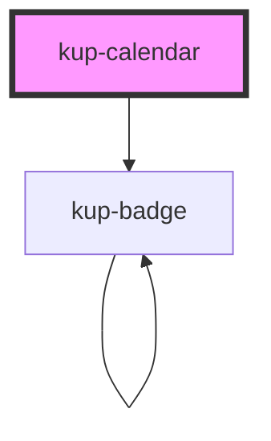

# kup-calendar

<!-- Auto Generated Below -->

## Properties

| Property         | Attribute         | Description                                                                     | Type                                                                                                               | Default                      |
| ---------------- | ----------------- | ------------------------------------------------------------------------------- | ------------------------------------------------------------------------------------------------------------------ | ---------------------------- |
| `customStyle`    | `custom-style`    | Custom style of the component.                                                  | `string`                                                                                                           | `''`                         |
| `data`           | --                | Actual data of the calendar.                                                    | `TableData`                                                                                                        | `null`                       |
| `dateCol`        | `date-col`        | Column containing events' dates.                                                | `string`                                                                                                           | `null`                       |
| `descrCol`       | `descr-col`       | Column containing events' descriptions.                                         | `string`                                                                                                           | `null`                       |
| `endCol`         | `end-col`         | Column containing events' ending time.                                          | `string`                                                                                                           | `null`                       |
| `hideNavigation` | `hide-navigation` | When disabled, the navigation toolbar won't be displayed.                       | `boolean`                                                                                                          | `false`                      |
| `iconCol`        | `icon-col`        | Column containing events' icons. There can be multiple icons, divided by ";".   | `string`                                                                                                           | `null`                       |
| `imageCol`       | `image-col`       | Column containing events' images. There can be multiple images, divided by ";". | `string`                                                                                                           | `null`                       |
| `initialDate`    | `initial-date`    | Sets the initial date of the calendar. Must be in ISO format (YYYY-MM-DD).      | `string`                                                                                                           | `null`                       |
| `startCol`       | `start-col`       | Column containing events' starting time.                                        | `string`                                                                                                           | `null`                       |
| `styleCol`       | `style-col`       | Column containing events' CSS styles.                                           | `string`                                                                                                           | `null`                       |
| `viewType`       | `view-type`       | Type of the view.                                                               | `KupCalendarViewTypes.DAY \| KupCalendarViewTypes.LIST \| KupCalendarViewTypes.MONTH \| KupCalendarViewTypes.WEEK` | `KupCalendarViewTypes.MONTH` |

## Events

| Event                     | Description                | Type                                                                                           |
| ------------------------- | -------------------------- | ---------------------------------------------------------------------------------------------- |
| `kup-calendar-dateclick`  | When a date is clicked.    | `CustomEvent<Date>`                                                                            |
| `kup-calendar-eventclick` | When an event is clicked.  | `CustomEvent<Row>`                                                                             |
| `kup-calendar-eventdrop`  | When a date is dropped.    | `CustomEvent<{ fromDate: { start: Date; end: Date; }; toDate: { start: Date; end: Date; }; }>` |
| `kup-calendar-viewchange` | When the navigation change | `CustomEvent<{ from: Date; to: Date; }>`                                                       |

## Methods

### `getProps(descriptions?: boolean) => Promise<GenericObject>`

Used to retrieve component's props values.

#### Returns

Type: `Promise<GenericObject>`

### `refresh() => Promise<void>`

This method is used to trigger a new render of the component.

#### Returns

Type: `Promise<void>`

### `setProps(props: GenericObject) => Promise<void>`

Sets the props to the component.

#### Returns

Type: `Promise<void>`

## CSS Custom Properties

| Name                                          | Description                                         |
| --------------------------------------------- | --------------------------------------------------- |
| `--kup-calendar_background-color`             | Background of the component.                        |
| `--kup-calendar_border-color`                 | Sets borders color of the calendar.                 |
| `--kup-calendar_event-background-color`       | Sets background color of events.                    |
| `--kup-calendar_event-border-color`           | Sets border color of events.                        |
| `--kup-calendar_event-border-radius`          | Sets border radius of events.                       |
| `--kup-calendar_event-color`                  | Sets text color of events.                          |
| `--kup-calendar_font-family`                  | Sets the font family of the component.              |
| `--kup-calendar_font-size`                    | Sets the font size of the component.                |
| `--kup-calendar_header-background-color`      | Sets background color of the header cell.           |
| `--kup-calendar_header-color`                 | Sets text color of the header cell.                 |
| `--kup-calendar_navigator-border`             | Sets the border of the navigator.                   |
| `--kup-calendar_no-work-day-background-color` | Sets background color of sunday and saturday cells. |
| `--kup-calendar_no-work-day-color`            | Sets text color of sunday and saturday cells.       |
| `--kup-calendar_today-background-color`       | Sets background color of today's cell.              |

## Dependencies

### Depends on

- [kup-badge](../kup-badge)

### Graph

----------------------------------------------

*Built with [StencilJS](https://stenciljs.com/)*
