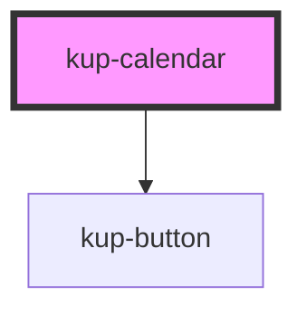

# kup-calendar

<!-- Auto Generated Below -->

## Properties

| Property         | Attribute         | Description | Type        | Default     |
| ---------------- | ----------------- | ----------- | ----------- | ----------- |
| `data`           | --                |             | `DataTable` | `undefined` |
| `dateCol`        | `date-col`        |             | `string`    | `undefined` |
| `descrCol`       | `descr-col`       |             | `string`    | `undefined` |
| `endCol`         | `end-col`         |             | `string`    | `undefined` |
| `hideNavigation` | `hide-navigation` |             | `boolean`   | `false`     |
| `iconCol`        | `icon-col`        |             | `string`    | `undefined` |
| `imageCol`       | `image-col`       |             | `string`    | `undefined` |
| `initialDate`    | `initial-date`    |             | `string`    | `undefined` |
| `startCol`       | `start-col`       |             | `string`    | `undefined` |
| `styleCol`       | `style-col`       |             | `string`    | `undefined` |
| `weekView`       | `week-view`       |             | `boolean`   | `false`     |

## Events

| Event                     | Description                | Type                                                                                           |
| ------------------------- | -------------------------- | ---------------------------------------------------------------------------------------------- |
| `kupCalendarDateClicked`  | When a date is clicked     | `CustomEvent<Date>`                                                                            |
| `kupCalendarEventClicked` | When an event is clicked   | `CustomEvent<Row>`                                                                             |
| `kupCalendarEventDropped` | When a date is dropped     | `CustomEvent<{ fromDate: { start: Date; end: Date; }; toDate: { start: Date; end: Date; }; }>` |
| `kupCalendarViewChanged`  | When the navigation change | `CustomEvent<{ from: Date; to: Date; }>`                                                       |

## Dependencies

### Depends on

- [kup-button](../kup-button)

### Graph

----------------------------------------------

*Built with [StencilJS](https://stenciljs.com/)*
